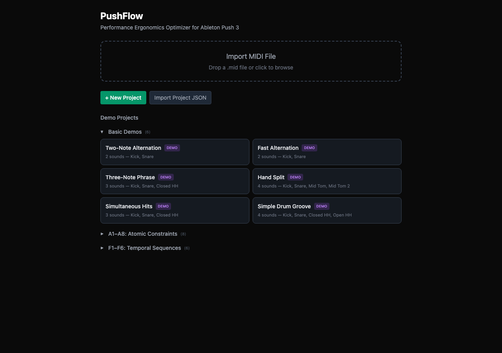
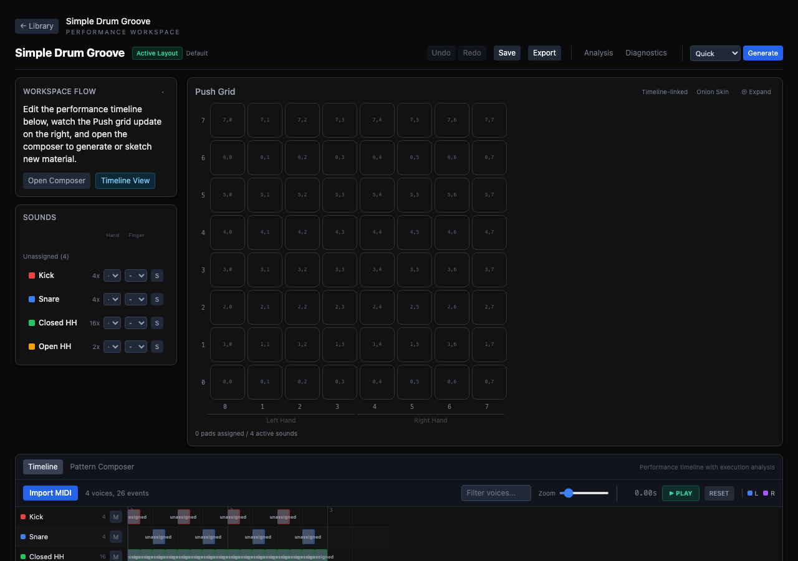
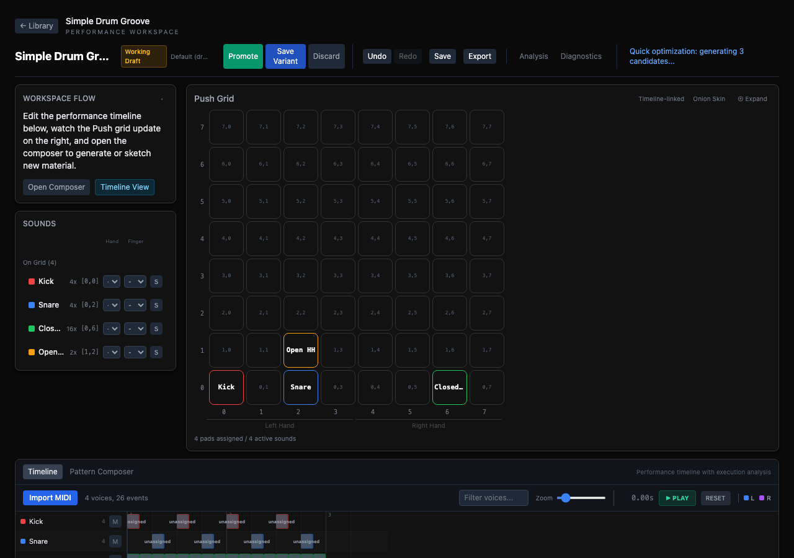

# PushFlow V3

**Performance-Mapping and Playability-Analysis Tool for Ableton Push 3**

PushFlow helps you map sounds onto the Push 3's 8x8 pad grid and analyze whether the result is playable. It models real-world biomechanical constraints — finger spans, hand speed, fatigue — to evaluate layouts and generate alternatives that are physically comfortable and performable.

The product promise is: **converge on a Layout plus Execution Plan that is playable, understandable, and worth keeping.**



---

## Features

### MIDI Import & Sound Identity
- Import `.mid` files — each unique MIDI pitch becomes a **Sound** with stable identity
- Sounds persist across all layout operations: cloning, promotion, variant saving, and discard
- Color-coded sounds panel with hit count, grid position, hand/finger preference controls

### Interactive 8x8 Push Grid
- Drag-and-drop sound assignment to the 64-pad grid
- Left Hand / Right Hand zone visualization
- Timeline-linked mode: grid highlights active pads during playback
- Onion skin overlay for comparing transitions visually
- Placement lock icons on locked pads
- Finger assignment overlay per event



### Layout Workflow
PushFlow uses a three-tier layout lifecycle:

| State | Purpose | Persistence |
|-------|---------|-------------|
| **Active Layout** | Committed baseline — the "real" layout | Durable (saved to project) |
| **Working/Test Layout** | Session-scoped draft for exploration | Ephemeral (discarded on close) |
| **Saved Layout Variant** | Named alternative preserved for later | Durable (named, timestamped) |

**Workflow actions:**
- **Promote** — Working layout becomes the new Active Layout; old Active auto-saved as variant
- **Save Variant** — Preserve current working state as a named variant without changing Active
- **Discard** — Abandon Working layout and revert to Active
- **Undo/Redo** — Full operation history within the working session

### Multi-Method Optimization
- **Greedy Solver** — Step-by-step local hill-climbing with human-readable move explanations
- **Beam Solver** — K-best beam search for finger assignment across events
- **Annealing Solver** — Global optimization using simulated annealing for deep layout exploration
- **Cost Toggles** — Selectively enable/disable cost families for diagnostic auditing
- **Calculate Cost** — Instantly evaluate any layout against the cost model



### Analysis & Diagnostics
- **Three-layer cost breakdown** — Feasibility verdict, ergonomic factor bars, difficulty summary
- **Five canonical factors** — Transition, Grip Naturalness, Alternation, Hand Balance, Constraint Penalty
- **Per-event difficulty chart** — Cost contributions per event with difficulty classification
- **Difficulty heatmap** — Easy / Moderate / Hard / Extreme per event
- **Optimization trace** — Step-by-step history of moves made by the Greedy solver
- **Actionable suggestions** — Context-aware recommendations
- **Staleness indicator** — Warns when analysis is outdated relative to current layout
- **Distinct Analyze/Generate phases** — Visual distinction between auto-analysis and manual generation

### Performance Timeline
- Horizontal event timeline showing all sounds as swim lanes
- Finger assignment annotations per event (L1-L5, R1-R5)
- Difficulty-colored event pills (amber for Hard, red for Unplayable)
- Playback with real-time cursor and pad highlighting
- All sound streams shown, including unplayable events

### Layout Candidates
- Generated candidate list with tradeoff profile summaries
- Compare mode for side-by-side layout inspection (read-only)
- Promote or save-as-variant from any candidate
- Diversity enforcement — trivial duplicates rejected

### Pattern Composer
- Generative pattern pipeline: motif sampling, phrase building, two-hand coordination
- Rudiment library with standard drumming patterns
- Pattern-based event generation for testing layouts against musical material

### Constraint System
- **Placement Locks** — Pin a sound to a specific pad. Locks are preserved across cloning, generation, and promotion. Lock state is visually indicated on grid pads and in the sounds panel.
- **Finger Constraints** — Per-pad hand/finger preferences. Soft by default (optimizer biases toward them but may override).
- **Grip Feasibility** — Binary validation against biomechanical limits. Grips that violate hard constraints are rejected.

---

## Cost Model

PushFlow evaluates layouts using a physics-informed cost model with five canonical diagnostic factors:

| Factor | Description |
|--------|-------------|
| **Transition** | Fitts's Law movement cost between consecutive pads |
| **Grip Naturalness** | Combined finger preference + hand shape deviation cost |
| **Alternation** | Same-finger rapid repetition penalty |
| **Hand Balance** | Left/right hand distribution imbalance |
| **Constraint Penalty** | Hard penalty for constraint violations |

### Three-Layer Presentation
1. **Feasibility Verdict** — Can this layout be played? (Feasible / Degraded / Infeasible)
2. **Ergonomic Cost Breakdown** — Which factors contribute most to difficulty?
3. **Difficulty Summary** — How many hard or unplayable events exist?

### Difficulty Classification
| Classification | Meaning |
|----------------|---------|
| Easy | Comfortable, no strain |
| Moderate | Requires attention but playable |
| Hard | Challenging, may need practice |
| Extreme | Physically demanding or high-speed |

---

## Biomechanical Model

### Physical Limits
| Parameter | Value | Description |
|-----------|-------|-------------|
| `MAX_HAND_SPAN` | 5.5 units | Maximum comfortable multi-finger spread |
| `MAX_SPEED` | 12.0 units/sec | Maximum hand movement speed |
| `TARGET_LR_SPLIT`| 0.45 / 0.55 | Optimal left-hand share |

### Finger Selection Costs
| Finger | Cost | Rationale |
|--------|------|-----------|
| Index | 0 | Strongest, most dexterous |
| Middle | 0 | Strong, good reach |
| Ring | 1 | Reduced independence |
| Pinky | 3 | Weakest, limited reach |
| Thumb | 5 | Limited lateral movement on pads |

---

## Architecture

```
src/
  engine/
    solvers/           # Beam solver (finger assignment)
    optimization/      # Annealing solver, greedy optimizer, multi-candidate generator
    evaluation/        # Canonical evaluator, cost functions, difficulty scoring
    analysis/          # Baseline compare, candidate comparison, constraint explainer
    prior/             # Biomechanical model, feasibility checking
    mapping/           # Pad-to-finger resolution
    structure/         # Performance structure analysis, moment builder
    rudiment/          # Drumming rudiment library
    pattern/           # Pattern generation pipeline
    diagnostics/       # Fatigue model
    surface/           # Hand zone, pad grid
    debug/             # Debug utilities, sanity checks
  types/
    layout.ts          # Layout, LayoutRole, cloneLayout, hashLayout
    voice.ts           # Voice (Sound identity)
    executionPlan.ts   # ExecutionPlan, FingerAssignment
    candidateSolution.ts  # CandidateSolution, TradeoffProfile
    diagnostics.ts     # DiagnosticFactors, FeasibilityVerdict, DiagnosticsPayload
    engineConfig.ts    # EngineConfiguration, AnnealingPreset
    performance.ts     # Performance, PerformanceEvent
  ui/
    components/        # React components (Grid, Timeline, Panels, Candidates, etc.)
    pages/             # ProjectLibraryPage, ProjectEditorPage
    state/             # ProjectContext, reducer, actions, undo/redo
    hooks/             # useAutoAnalysis, useKeyboardShortcuts, useLaneImport
    persistence/       # localStorage with migration support
    fixtures/          # Demo projects
  import/              # MIDI file import
  utils/               # ID generation, MIDI note names, seeded RNG
test/
  types/               # Voice identity round-trip, layout role validation
  engine/              # Solver, optimization, evaluation, feasibility tests
  ui/state/            # Lanes reducer, streams conversion
  golden/              # End-to-end golden scenario tests
```

### Pipeline and Dataflow

For a code-level graph, see [docs/dataflow-diagram.md](docs/dataflow-diagram.md). The runtime pipeline breaks down into these stages:

| Stage | Main entrypoints | What happens | Models / functions called | Artifacts created |
|-------|------------------|--------------|----------------------------|-------------------|
| **1. Source ingestion** | `src/import/midiImport.ts`, Pattern Composer / loop editor surfaces | MIDI notes or composed patterns are converted into canonical musical data | `@tonejs/midi`, `parseMidiProject()`, composer preset + loop editors | `Performance`, `PerformanceEvent[]`, `PerformanceMoment[]`, `Voice[]`, empty `Layout` |
| **2. Project state normalization** | `ProjectContext`, `projectReducer`, serializer | Imported or loaded data is normalized into the editor's single state model | `projectSerializer.ts`, `projectState.ts`, `lanesReducer.ts` | `ProjectState`, `SoundStream[]`, `activeLayout`, `workingLayout`, `savedVariants` |
| **3. Derived-performance build** | `getActivePerformance()`, `getDisplayedLayout()` | Muted streams are filtered out, current layout context is selected, and solver-facing performance data is rebuilt on demand | `getActiveStreams()`, `getActivePerformance()`, layout/display selectors in `projectState.ts` | current `Performance`, displayed `Layout`, displayed `ExecutionPlanResult` context |
| **4. Constraint projection** | `useAutoAnalysis.ts` | User intent is projected from UI state onto solver inputs | `buildSolverConstraints()`, `constraintsToManualAssignments()`, `computeInitialOwnership()` | `SolverConstraints`, legacy manual assignments, initial pad ownership |
| **5. Solver / optimizer execution** | auto-analysis or manual Generate | PushFlow computes either a single fast analysis plan or a multi-candidate search result | `createBeamSolver()`, `generateCandidates()`, `generateGreedyCandidates()`, optimizer registry, `BeamSolver`, `AnnealingSolver`, `GreedyOptimizer` | `ExecutionPlanResult`, `OptimizerOutput`, candidate `Layout`s, greedy move trace |
| **6. Canonical evaluation and ranking** | post-solve engine pipeline | Layouts and assignments are rescored with the canonical evaluator, then ranked and filtered | `evaluatePerformance()`, `difficultyScoring.ts`, `candidateRanker.ts`, `diversityMeasurement.ts`, `baselineCompare.ts` | `PerformanceCostBreakdown`, `DiagnosticsPayload`, `DifficultyAnalysis`, `TradeoffProfile`, filtered `CandidateSolution[]` |
| **7. Workflow materialization** | reducer promotion / save actions | Results are committed into workflow artifacts the user can keep | `PROMOTE_WORKING_LAYOUT`, `PROMOTE_CANDIDATE`, `SAVE_AS_VARIANT`, `LOAD_SAVED_VARIANT` | new `activeLayout`, `workingLayout`, durable `savedVariants` |
| **8. Persistence** | autosave + explicit save | Durable state is serialized and written to browser storage | `useAutoSave.ts`, `projectStorage.ts`, `indexedDbStore.ts`, `projectSerializer.ts` | persisted `ProjectState` snapshot |

### Runtime Paths

#### Auto-analysis path
This is the fast, always-available inspection path.

1. UI changes mark the project `analysisStale`.
2. `useAutoAnalysis()` debounces a rerun.
3. The hook builds a displayed `Layout`, active `Performance`, and projected solver constraints.
4. `createBeamSolver()` runs a single-candidate beam search.
5. The returned `ExecutionPlanResult` is wrapped into a `CandidateSolution` with `DifficultyAnalysis` and `TradeoffProfile`.
6. The reducer stores it in `analysisResult`, which drives the grid, timeline, costs panel, and summaries.

#### Manual Generate path
This is the exploration path for alternative layouts.

1. The toolbar dispatches `generateFull()`.
2. The selected optimizer method decides the branch:
   - `greedy` -> `generateGreedyCandidates()`
   - `beam` / `annealing` -> `generateCandidates()`
3. Candidate generation produces one or more `Layout` seeds.
4. A solver/optimizer computes assignments and normalized execution plans.
5. PushFlow re-evaluates each result with `evaluatePerformance()`.
6. Difficulty scoring, tradeoff scoring, baseline diffing, and duplicate filtering produce the final `CandidateSolution[]`.
7. The reducer stores candidates and selects one for inspection.

#### Pattern / composer path
This is the authoring/testing path for creating playable material, not just importing it.

1. Composer and loop-editor surfaces create pattern/preset data.
2. Rudiment and pattern utilities convert those structures into event timelines.
3. Those events feed the exact same `Performance` -> solver -> evaluation -> candidate pipeline as imported MIDI.

### Core Artifacts

| Artifact | Type definition | Created by | Consumed by |
|---------|------------------|------------|-------------|
| **Sound identity** | `SoundStream`, `Voice` | MIDI import, project load, composer preset placement | grid, sounds panel, layout models, solver mapping |
| **Performance timeline** | `Performance`, `PerformanceEvent`, `PerformanceMoment` | import, composer generation, `buildPerformanceMoments()` | solvers, evaluator, timeline UI |
| **Static pad mapping** | `Layout` | import bootstrap, manual editing, seeding, optimization, workflow promotion | grid, candidate previews, solver mapping, persistence |
| **Execution artifact** | `ExecutionPlanResult` | beam / annealing / greedy solver paths | timeline, costs panel, summaries, compare surfaces |
| **Canonical scoring artifact** | `PerformanceCostBreakdown` | `evaluatePerformance()` | diagnostics, ranking, manual cost calculation |
| **User-facing candidate** | `CandidateSolution` | auto-analysis wrapper or candidate generation | layouts panel, compare mode, promotion flow |
| **Workflow state** | `ProjectState` | serializer + reducer | the entire UI shell and persistence layer |

### Models Called

PushFlow does not call remote AI/LLM services. The "models" in this repo are local computational models:

| Model | Purpose | Primary code |
|------|---------|--------------|
| **MIDI parse model** | turn `.mid` bytes into canonical note events | `@tonejs/midi`, `src/import/midiImport.ts` |
| **Biomechanical feasibility model** | reject impossible grips and pad combinations | `src/engine/prior/feasibility.ts`, `src/engine/prior/biomechanicalModel.ts` |
| **Hand-zone / surface model** | reason about left/right zones and pad distances | `src/engine/surface/handZone.ts`, `src/engine/surface/padGrid.ts` |
| **Beam search model** | compute hand/finger assignments for a fixed layout | `src/engine/solvers/beamSolver.ts` |
| **Annealing model** | globally optimize layouts and assignments | `src/engine/optimization/annealingSolver.ts` |
| **Greedy hill-climb model** | interpretable local optimization with move traces | `src/engine/optimization/greedyOptimizer.ts` |
| **Canonical evaluation model** | compute cost dimensions for events, transitions, and full performances | `src/engine/evaluation/canonicalEvaluator.ts`, `src/engine/evaluation/costFunction.ts` |
| **Difficulty / ranking model** | turn raw plans into user-facing candidate scores and tradeoffs | `src/engine/evaluation/difficultyScoring.ts`, `src/engine/optimization/candidateRanker.ts` |
| **Diversity / baseline compare model** | keep generated candidates meaningfully different from the baseline | `src/engine/analysis/diversityMeasurement.ts`, `src/engine/analysis/baselineCompare.ts` |

### Artifact Lifecycle

The intended artifact progression is:

`MIDI / Composer Input`
-> `SoundStream[] + Performance`
-> `Layout`
-> `ExecutionPlanResult`
-> `PerformanceCostBreakdown + DiagnosticsPayload`
-> `CandidateSolution`
-> `Active Layout / Working Layout / Saved Variant`

That progression is the core contract of the product: PushFlow starts with musical material, creates a pad mapping, evaluates whether that mapping is physically playable, and then turns the best outcomes into durable workflow artifacts the user can inspect, promote, save, or discard.

---

## Development

### Prerequisites
- Node.js 18+
- npm

### Commands
```bash
npm install              # Install dependencies
npm run dev              # Dev server at http://localhost:5173
npm run build            # TypeScript check + Vite production build
npm run typecheck        # TypeScript type checking only
npm test                 # Run Vitest in watch mode
npm run test:run         # Run tests once (CI mode)
npm run test:coverage    # Run tests with coverage report
```

---

## Test Suite

The test suite validates critical invariants:

- **Sound Identity Round-Trip** — IDs survive clone, promote, variant save, and discard
- **Layout State Transitions** — Active/Working/Variant lifecycle correctness
- **Execution Plan Binding** — Plans are layout-bound, staleness detection works
- **Baseline Compare** — Candidate comparison produces correct diffs
- **Event Explainer** — Per-event difficulty explanations are accurate
- **Constraint Explanation** — Constraint violations produce meaningful diagnostics
- **Solver Determinism** — Same input produces consistent output
- **Feasibility Boundaries** — Strict feasibility boundaries are correct
- **Candidate Diversity** — Generated candidates differ meaningfully from baseline

---

## Canonical Documents

PushFlow's product canon lives in `docs/canonical/`:

1. `PUSHFLOW_CANON.md` — Product canon (workflow and state truths)
2. `PUSHFLOW_ENGINE_CONTRACT.md` — Workflow-facing engine contract
3. `PUSHFLOW_SURFACE_FEATURES.md` — Concrete feature specs per surface
4. `PUSHFLOW_TERMINOLOGY.md` — Stable term definitions

These four files are the only planning source of truth.

---

## License

Private — All rights reserved.
