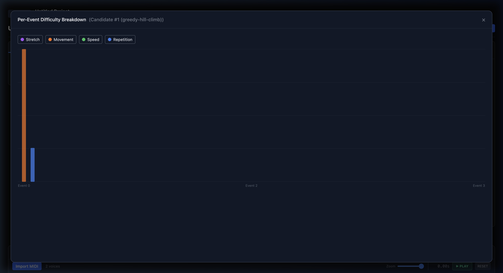

# PushFlow V3

**Performance Ergonomics Optimizer for Ableton Push 3**

PushFlow analyzes MIDI performances and optimizes pad layouts on the Ableton Push 3's 8x8 grid for playability, ergonomics, and musical coherence. It models real-world biomechanical constraints — finger spans, hand speed, fatigue accumulation — to produce layouts that are physically comfortable and performable.

The product promise is not "generate a layout." The product promise is: **converge on a Layout plus Execution Plan that is playable, understandable, and worth keeping.**


---

## Features

### MIDI Import & Sound Identity
- Import `.mid` files — each unique MIDI pitch becomes a **Voice** (Sound) with stable identity
- Voices persist across all layout operations: cloning, promotion, variant saving, and discard
- Color-coded voice palette with hit count, grid position, hand/finger preference controls

### Interactive 8x8 Push Grid
- Drag-and-drop sound assignment to the 64-pad grid
- Left Hand (columns 0-3) / Right Hand (columns 4-7) zone visualization
- Timeline-linked mode: grid highlights active pads during playback
- Onion skin overlay for comparing layouts visually


### Layout Workflow (V3 State Model)
PushFlow uses a three-tier layout lifecycle:

| State | Purpose | Persistence |
|-------|---------|-------------|
| **Active Layout** | Committed baseline — the "real" layout | Durable (saved to project) |
| **Working/Test Layout** | Session-scoped draft for exploration | Ephemeral (discarded on close) |
| **Saved Layout Variant** | Named alternative preserved for later | Durable (named, timestamped) |

**Workflow actions:**
- **Promote** — Working layout becomes the new Active Layout; old Active auto-saved as a variant
- **Save Variant** — Preserve the current working state as a named variant without changing Active
- **Discard** — Abandon Working layout and revert to Active
- **Undo/Redo** — Full operation history within the working session

### Multi-Method Optimization
PushFlow V3 introduces a **Pluggable Optimization Architecture**:
- **Greedy Solver** — Step-by-step local hill-climbing with human-readable move explanations ("Moved Snare to (3,3) because cost reduced by 2.4").
- **Annealing Solver** — Global optimization using simulated annealing + beam search for deep layout exploration.
- **Cost Toggles** — Selectively enable/disable cost families (static vs. temporal) for diagnostic auditing.
- **Calculate Cost** — Instantly evaluate any manual layout or assignment against the cost model.


### Analysis & Diagnostics
- **Per-Event Difficulty Breakdown** — Visualization of cost contributions per event (Stretch, Movement, Speed, Repetition).
- **Difficulty Heatmap** — per-event difficulty classification (Easy / Moderate / Hard / Extreme).
- **Optimization Trace** — Step-by-step history of moves made by the Greedy solver.
- **Hand balance** — left/right distribution with visual bar.
- **Actionable suggestions** — context-aware recommendations (e.g. "Infeasible chord — pads are beyond maximum finger span").
- **Staleness indicator** — warns when analysis is outdated relative to current layout.



### Performance Timeline
- Horizontal event timeline showing all MIDI events per voice.
- Finger assignment annotations per event (L1-L5, R1-R5).
- Playback with real-time cursor and pad highlighting.

### Pattern Composer
- Generative pattern pipeline: motif sampling, phrase building, two-hand coordination
- Rudiment library with standard drumming patterns
- Pattern-based event generation for testing layouts against musical material

---

## Cost Model & Scoring

PushFlow's engine uses a physics-informed cost model to evaluate how difficult a layout is to perform. The V1 refactor unifies the objective function and diagnostics into a single schema.

### V1 Unified Cost Schema

The solver and diagnostics use four core cost components:

| Component | Description | Mapping to UI Label |
|-----------|-------------|---------------------|
| **Finger Preference** | Penalizes anatomically suboptimal fingers (Index: 0, Middle: 0, Ring: 1, Pinky: 3, Thumb: 5) | **Stretch** |
| **Hand Shape Deviation** | Measures deviation from natural finger spread (translation-invariant) | **Movement (Positional)** |
| **Transition Cost** | Fitts's Law model: `distance + speed * 0.5` | **Movement (Temporal)** |
| **Hand Balance** | Quadratic penalty for deviation from 45/55 L/R split | **Hand Balance** |

### Hard Constraints (Binary Feasibility)

PushFlow now uses a binary feasibility system. Grips that violate hard constraints are rejected entirely:

- **Zone Enforcement**: Left hand restricted to columns 0-4; Right hand to columns 3-7.
- **Physical Span**: Finger pairs must stay within strict biomechanical limits (e.g., Index-Middle: 2.0 units).
- **Topology**: Fingers cannot cross over each other (e.g., Pinky must be leftmost on Right hand).
- **Collision**: No two fingers on the same pad.
- **Speed Limit**: Hand movement speed cannot exceed `MAX_HAND_SPEED` (12.0 units/sec).

### Difficulty Classification Thresholds

Events and overall layouts are classified into tiers based on the cumulative cost:

| Classification | Score Range | Meaning |
|----------------|-------------|---------|
| Easy | 0 - 0.2 | Comfortable, no strain |
| Moderate | 0.2 - 0.45 | Requires attention but playable |
| Hard | 0.45 - 0.7 | Challenging, may need practice |
| Extreme | > 0.7 | Physically demanding or high-speed |

---

## Optimization Engine

### Beam Solver (Finger Assignment)

The beam solver assigns fingers to performance events using **K-best beam search**:
- Explores multiple assignment paths simultaneously (configurable beam width, default 50).
- At each event, generates candidate next-states by testing all valid finger assignments against hard constraints.
- Produces the globally best finger assignment sequence based on the unified cost schema.

### Pluggable Optimization Methods

1. **Greedy / Hill-Climbing**:
   - Start from an initial setup and repeatedly make the single best local move (pad move or swap).
   - Highly interpretable: provides a full trace of "why" every change was made.
   - Ideal for fine-tuning existing layouts.

2. **Simulated Annealing**:
   - Global search that accepts occasional "worse" moves to escape local minima.
   - Uses mutation operators: swap pads, move to empty, cluster swap, row/column shift.
   - Presets for **Quick** (3,000 iter) and **Deep** (8,000 iter, 3 restarts).

3. **Baseline-Aware Mode**:
   - Compares candidates against the "Active Layout" to ensure diversity.
   - A candidate is rejected if it doesn't show at least one unlocked placement change or a materially different tradeoff profile.

---

## Biomechanical Model

PushFlow models human hand biomechanics with calibrated constants:

### Physical Limits
| Parameter | Value | Description |
|-----------|-------|-------------|
| `MAX_HAND_SPAN` | 5.5 units | Maximum comfortable hand multi-finger spread |
| `MAX_SPEED` | 12.0 units/sec | Maximum hand movement speed |
| `TARGET_LR_SPLIT`| 0.45 / 0.55 | Optimal left-hand share (slight right-hand bias) |

### Finger Selection Costs
| Finger | Cost | Rationale |
|--------|------|-----------|
| Index | 0 | Strongest, most dexterous |
| Middle | 0 | Strong, good reach |
| Ring | 1 | Reduced independence |
| Pinky | 3 | Weakest, limited reach |
| Thumb | 5 | Limited lateral movement on pads |

### Inter-Finger Span Limits
| Finger Pair | Max Span |
|-------------|----------|
| Index-Middle | 2.0 units |
| Middle-Ring | 2.0 units |
| Ring-Pinky | 1.5 units |
| Index-Pinky | 4.0 units |
| Index-Thumb | 3.5 units |
| (others) | 5.5 units |

### Timing Constants
| Parameter | Value | Description |
|-----------|-------|-------------|
| `ALTERNATION_DT_THRESHOLD` | 0.25 sec | Same-finger reuse within this window gets penalized |
| `ALTERNATION_PENALTY` | 1.5 | Multiplier for rapid same-finger alternation |
| `HAND_BALANCE_TARGET_LEFT` | 0.45 | Optimal left-hand share (slight right-hand bias) |

### Voice Role Multipliers
When computing role-weighted difficulty, backbone sounds matter more than fills:

| Role | Multiplier | Rationale |
|------|-----------|-----------|
| Backbone | 1.5x | Must be easy — forms the rhythmic foundation |
| Lead | 1.3x | Prominent, needs reliable execution |
| Fill | 0.8x | Occasional, can tolerate more difficulty |
| Texture | 0.7x | Background element, lower priority |
| Accent | 0.6x | Sparse, least critical |

---

## Constraint System

### Placement Locks
Users can **lock** a voice to a specific pad position. Locked placements are preserved across:
- Layout cloning
- Candidate generation (optimizer respects locks)
- Promotion (locks carry forward to the new Active Layout)

### Finger Constraints
Users can assign preferred hand/finger combinations per pad:
- Hand preference: Left / Right / Any
- Finger preference: specific finger or Any
- Soft constraints by default (optimizer considers but may override)

### Grip Feasibility
Every finger assignment is validated against the biomechanical model:
- All fingers must be within their pairwise span limits
- Hand position must be reachable given the previous position and available time
- Three tiers of feasibility with escalating penalties

---

## Architecture

```
src/
  engine/
    solvers/           # Beam solver (finger assignment)
    optimization/      # Annealing solver, multi-candidate generator
    evaluation/        # PerformabilityObjective, scoring
    analysis/          # Difficulty analysis, constraint explanation
    prior/             # Biomechanical model, feasibility checking
    mapping/           # Pad-to-finger resolution
    structure/         # Performance structure analysis
    rudiment/          # Drumming rudiment library
    pattern/           # Pattern generation pipeline
  types/
    layout.ts          # Layout, LayoutRole, cloneLayout, hashLayout
    voice.ts           # Voice (Sound identity)
    executionPlan.ts   # ExecutionPlan, FingerAssignment, DiagnosticFactors
    candidateSolution.ts  # CandidateSolution, TradeoffProfile
    diagnostics.ts     # DifficultyBreakdown, DifficultyAnalysis
    engineConfig.ts    # EngineConfiguration, AnnealingPreset
    performanceStructure.ts  # Performance, PerformanceEvent
  ui/
    components/        # React components (Grid, Palette, Toolbar, Panels)
    state/             # ProjectContext, reducer, actions
    hooks/             # Custom React hooks
    persistence/       # localStorage with migration support
  test/
    types/             # Type contract tests (voice identity, layout invariants)
    engine/            # Solver and optimization tests
    integration/       # End-to-end workflow tests
```

---

## Development

### Prerequisites
- Node.js 18+
- npm

### Setup
```bash
cd product-reconciliation/v2/v2\ repo
npm install
```

### Run Dev Server
```bash
npm run dev
# Opens at http://localhost:5173
```

### Run Tests
```bash
npm test
# 437 tests across type contracts, engine, and integration suites
```

### Build
```bash
npm run build
```

---

## Test Suite

The test suite validates critical invariants:

- **Voice Identity Round-Trip** — Voice IDs survive clone, promote, variant save, and discard
- **Layout State Transitions** — Active/Working/Variant lifecycle correctness
- **Execution Plan Validation** — Plans are layout-bound, staleness detection works
- **Baseline Compare** — Candidate comparison produces correct diffs
- **Event Explainer** — Per-event difficulty explanations are accurate
- **Constraint Explanation** — Constraint violations produce meaningful diagnostics
- **Solver Determinism** — Same input produces consistent output
- **Feasibility Tiers** — Strict/Relaxed/Fallback boundaries are correct
- **Candidate Diversity** — Generated candidates differ meaningfully from baseline

---

## Project Status

PushFlow V3 is under active development. The canonical workflow contract and implementation sequence are defined in:

- `product-reconciliation/output/PUSHFLOW_WORKFLOW_AND_PRODUCT_CONTRACT.md`
- `product-reconciliation/output/PUSHFLOW_DECISIONS_AND_OPEN_QUESTIONS.md`
- `product-reconciliation/output/PUSHFLOW_ENGINE_TOUCHPOINTS_AND_IMPLEMENTATION_SEQUENCE.md`

### Completed Phases
1. V3 Workflow State Model (Layout lifecycle, role transitions)
2. Execution Plan Layout Binding (Plans track which layout they belong to)
3. Staleness Detection (Analysis invalidation on layout changes)
4. Candidate Diversity Enforcement (Meaningful differences from baseline)
5. Constraint Explainer (Human-readable constraint violation explanations)
6. Event-Level Analysis (Per-event difficulty breakdown)
7. Baseline Compare Improvements (Tradeoff profile diffing)

---

## License

Private — All rights reserved.
