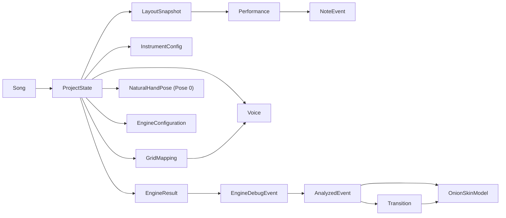

# Domain Model

## Canonical Domain Layers

Durable stored objects:

- `Song`
- `ProjectState`
- `LayoutSnapshot`
- `Performance`
- `NoteEvent`
- `InstrumentConfig`
- `GridMapping`
- `Voice`
- `NaturalHandPose`
- `EngineConfiguration`

Stored computed objects:

- `EngineResult`
- `EngineDebugEvent`

Derived analysis objects:

- `AnalyzedEvent`
- `Transition`
- `OnionSkinModel`

Dormant or weakly active objects:

- `SectionMap`
- `LayoutTemplate`

## Canonical Relationship Diagram

## Durable Objects

| Object | Key fields | Relationships | Lifecycle |
|---|---|---|---|
| `Song` | `metadata`, `sections`, `projectStateId`, `midiData`, `midiFileName` | Owns a reference to one persisted `ProjectState` | Created from dashboard or MIDI import, updated via metadata edits and MIDI linking, deleted from dashboard |
| `SongMetadata` | `id`, `title`, `artist`, `bpm`, `key`, `duration`, `lastPracticed`, `performanceRating`, `difficulty` | Embedded in `Song` | Created with song, lightly edited in dashboard, updated on auto-save or MIDI link |
| `ProjectState` | `layouts`, `instrumentConfigs`, `instrumentConfig`, `activeLayoutId`, `activeMappingId`, `parkedSounds`, `mappings`, `ignoredNoteNumbers`, `manualAssignments`, `engineConfiguration`, `solverResults`, `activeSolverId`, `naturalHandPoses` | Central hub tying together imported material, authored mappings, solver output, and personalization | Created on MIDI link/import, hydrated into context, mutated during editing, serialized to local storage and JSON |
| `LayoutSnapshot` | `id`, `name`, `performance`, `createdAt` | Owned by `ProjectState`; wraps one imported `Performance` | Created on MIDI import or full project load; remains the anchor for active performance selection |
| `Performance` | `events`, `tempo`, `name` | Owned by `LayoutSnapshot`; composed of `NoteEvent[]` | Created from MIDI parsing, filtered for analysis by selectors, may be destructively edited when notes are deleted |
| `NoteEvent` | `noteNumber`, `startTime`, `duration`, `velocity`, `channel`, `eventKey` | Member of `Performance.events`; solver input unit | Created by MIDI parser, used for mapping coverage and solver analysis, survives as raw musical truth |
| `InstrumentConfig` | `id`, `name`, `rows`, `cols`, `bottomLeftNote`, `layoutMode` | Used by mapping resolution, grid labeling, and solver geometry | Created or derived during import, generally treated as single active config |
| `Voice` | `id`, `name`, `sourceType`, `sourceFile`, `originalMidiNote`, `color` | Stored in `parkedSounds` and referenced by `GridMapping.cells` | Created from unique notes during import or seeded mapping creation, then edited, placed, hidden, or deleted |
| `GridMapping` | `id`, `name`, `cells`, `fingerConstraints`, `scoreCache`, `notes`, `layoutMode`, `version`, `savedAt` | Maps pads to `Voice`; used by timeline, event analysis, and solvers | Starts empty on import, then filled manually or by helper, duplicated, optimized, cleared, and persisted |
| `NaturalHandPose` | `version`, `name`, `positionIndex`, `fingerToPad`, `maxUpShiftRows`, `updatedAt` | Stored in `ProjectState.naturalHandPoses`; feeds seeding and neutral pad override | Defaulted on import, edited in workbench, validated and normalized, then reused by solver and auto-layout flows |
| `EngineConfiguration` | `beamWidth`, `stiffness`, `restingPose` | Used when running solver strategies | Created from defaults, carried in `ProjectState`, applied at analysis time |
| `SectionMap` | `id`, `name`, `startMeasure`, `lengthInMeasures`, `instrumentConfig` | Present in type system and project state | Imported or stored, but largely dormant in the current UI |

## Computed and Stored Analysis Objects

| Object | Key fields | Relationships | Lifecycle |
|---|---|---|---|
| `EngineResult` | `score`, `unplayableCount`, `hardCount`, `debugEvents`, `fingerUsageStats`, `fatigueMap`, `averageDrift`, `averageMetrics`, optional `evolutionLog`, `optimizationLog`, `annealingTrace`, `metadata` | Stored under `ProjectState.solverResults`; selected via `activeSolverId` | Produced by beam, genetic, or annealing flows; persisted with project state; reused across routes |
| `EngineDebugEvent` | `noteNumber`, `startTime`, `assignedHand`, `finger`, `cost`, `costBreakdown`, `difficulty`, `row`, `col`, `eventIndex`, `padId`, `eventKey` | Member of `EngineResult.debugEvents`; basis for deeper analysis | Created by solver execution; used by workbench coloring, timeline labels, event log, and debug pages |
| `ManualAssignment` | `eventKey -> { hand, finger }` within `manualAssignments[layoutId]` | Overrides a specific event's solver assignment | Created from Event Analysis or neutral-pose seeding, then read back during future solver runs and UI coloring |

## Derived Analysis Objects

| Object | Key fields | Relationships | Lifecycle |
|---|---|---|---|
| `AnalyzedEvent` | `eventIndex`, `timestamp`, `notes`, `pads`, `eventMetrics` | Derived by grouping `EngineDebugEvent`s with near-identical timestamps | Recomputed on Event Analysis page from the current engine result |
| `Transition` | `fromIndex`, `toIndex`, `fromEvent`, `toEvent`, `metrics` | Connects consecutive `AnalyzedEvent`s | Recomputed whenever analyzed events change |
| `TransitionMetrics` | `timeDeltaMs`, `gridDistance`, `handSwitch`, `fingerChange`, `speedPressure`, `anatomicalStretchScore`, `compositeDifficultyScore` | Embedded in `Transition` | Computed during transition analysis; displayed in panels and heatmaps |
| `OnionSkinModel` | `currentEventIndex`, `currentEvent`, `previousEvent`, `nextEvent`, `sharedPads`, `currentOnlyPads`, `nextOnlyPads`, `fingerMoves` | Built from `AnalyzedEvent[]` and `Transition[]` | Recomputed for the focused event in Event Analysis |
| `FingerMove` | `finger`, `hand`, `fromPad`, `toPad`, `isHold`, `isImpossible`, `rawDistance`, `anatomicalStretchScore` | Embedded in `OnionSkinModel` | Derived for visualization vectors between current and next event |

## State Ownership

Primary ownership:

- `ProjectState` is the canonical source of truth for editable product state.

Secondary durable ownership:

- `Song` is the portfolio shell and persistence anchor.

Derived ownership:

- `engineResult` is a convenience selector, not an independent domain object.
- filtered performance is a view over `Performance` plus `ignoredNoteNumbers`.

## Lifecycle Narrative

1. A `Song` is created or selected.
2. MIDI import generates a `Performance`, `Voice[]`, `InstrumentConfig`, and empty `GridMapping`.
3. Those objects are packed into a fresh `ProjectState`.
4. The user edits `GridMapping`, `ignoredNoteNumbers`, and `NaturalHandPose`.
5. Solver execution produces an `EngineResult`.
6. Event-analysis pages derive `AnalyzedEvent`, `Transition`, and `OnionSkinModel` from that result.
7. The full project state is auto-saved back to the song and can be exported as JSON.

## Canonical Domain Invariants

- `ProjectState.activeLayoutId` should point to the performance being analyzed.
- `ProjectState.activeMappingId` should point to the mapping being visualized across routes.
- `GridMapping.cells` keys must remain `"row,col"`.
- `Performance.events` must remain sorted by `startTime`.
- `naturalHandPoses[0]` is the app's Pose 0 contract.
- Optimization requires full note coverage in the active mapping.
