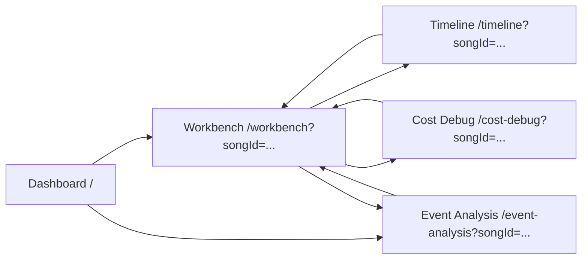

# Screen Architecture

## Route Inventory

| Route | Screen | Primary responsibility |
|---|---|---|
| `/` | Dashboard | Song portfolio, MIDI linking, and navigation into editing/analysis |
| `/workbench` | Workbench | Main layout authoring, pose editing, solver orchestration, and summary analysis |
| `/timeline` | Timeline | Chronological inspection of mapped voices and finger labels |
| `/event-analysis` | Event Analysis | Deep event-by-event and transition inspection |
| `/cost-debug` | Cost Debug | Developer-only diagnostic surface for cost internals |

## Navigation Model

## Dashboard

Purpose:

- Portfolio-level home screen.
- Entry point for selecting, creating, linking, and deleting songs.

Key panels/components:

- Header bar with product title and placeholder account/settings icons.
- Song grid of `SongCard` components.
- "Add New Song" card.

Primary user actions:

- Add song.
- Edit song title and BPM.
- Delete song.
- Link or re-link MIDI.
- Open workbench.
- Open event analysis directly.

Data dependencies:

- `SongService.getAllSongs()`
- `SongService.hasMidiData(songId)`
- default test-song seeding

## Workbench

Purpose:

- Operational core of the application.
- Combines editing, personalization, analysis, optimization, and persistence in one workspace.

High-level layout:

- Top global header
- Middle toolbar
- Main body with:
  - left work surface inside `LayoutDesigner`
  - center grid editor inside `LayoutDesigner`
  - right `AnalysisPanel`

### Workbench Header

Purpose:

- Establishes song context and app-level actions.

Key panels/components:

- Product title and subtitle.
- Current song auto-save pill.
- Route links to Dashboard, Timeline, Event Analysis, and Cost Debug.
- Settings menu.
- Theme toggle.
- Undo/redo and project save/load controls.

Primary user actions:

- Navigate to other screens.
- Toggle display options and layout options.
- Toggle theme.
- Undo/redo.
- Save/load project JSON.

Data dependencies:

- `songId`, `songName`
- `canUndo`, `canRedo`
- `projectState`
- theme state

### Workbench Toolbar

Purpose:

- Exposes the main authoring and solver actions for the active mapping.

Key panels/components:

- Clear Grid
- Seed
- Natural
- Auto-Arrange
- Random
- Run Analysis
- Advanced solver controls

Primary user actions:

- Clear mapping.
- Generate a starting mapping.
- Optimize a mapping.
- Run or compare solver outputs.

Data dependencies:

- active mapping
- filtered performance
- Pose 0 validity
- current solver results

### LayoutDesigner: Left Panel

Purpose:

- Handles source-material management and pose editing.

Key panels/components:

- Tab strip: Library | Pose
- `VoiceLibrary`
- `NaturalHandPosePanel`

Primary user actions:

- Select, rename, recolor, hide, or delete voices.
- Edit Pose 0.
- Toggle pose edit mode and choose active finger tools.

Data dependencies:

- `parkedSounds`
- `activeMapping`
- `projectState.ignoredNoteNumbers`
- `projectState.naturalHandPoses`
- raw and filtered performance

### LayoutDesigner: Center Grid

Purpose:

- Physical mapping canvas for the 8x8 pad layout.

Key panels/components:

- 8x8 `DroppableCell` matrix
- layout mode indicator
- context menu
- reachability overlay
- pose ghost markers
- `FingerLegend`

Primary user actions:

- Drag/drop assign, move, swap, or unassign sounds.
- Double-click rename placed sounds.
- Right-click for finger locks, reachability, and remove actions.
- Click pads during pose edit mode to assign fingers.

Data dependencies:

- `GridMapping.cells`
- `fingerConstraints`
- `engineResult`
- manual assignments
- pose ghost markers
- instrument config for note labeling

### AnalysisPanel: Right Panel

Purpose:

- Summarizes the currently selected solver output without leaving the workbench.

Key panels/components:

- Tab strip: Performance Summary | Model Comparison | Optimization Process
- ergonomic score cards
- hand-balance bar
- average metric list
- `SoundAssignmentTable`
- solver comparison table
- evolution and annealing graphs

Primary user actions:

- Inspect summary metrics.
- Compare solver outputs.
- Review optimization progress.

Data dependencies:

- `engineResult`
- `activeMapping`
- filtered `Performance`
- stored solver results from context

## Timeline

Purpose:

- Shows the mapped performance as a time-based lane chart for review rather than editing.

Key panels/components:

- Header with back link, song pill, and zoom slider.
- Ruler.
- Left lane header for voices.
- Scrollable note lanes.
- now-bar / seek indicator.

Primary user actions:

- Adjust zoom.
- Click to seek.
- Visually inspect which voices occur when and which finger label was assigned.

Data dependencies:

- hydrated song state
- active layout
- active mapping
- derived `voices`
- `engineResult.debugEvents` for finger labels

## Event Analysis

Purpose:

- Deep-dive inspection surface for moments, transitions, and manual event overrides.

High-level layout:

- Header
- Export bar
- Three-column body

### Left Column

Purpose:

- Event navigation and event-level editing entry point.

Key panels/components:

- tab strip: Timeline | Event Log
- `EventTimelinePanel`
- `EventLogTable`

Primary user actions:

- Select the focused transition.
- Use arrow keys to move across events.
- Change hand/finger overrides from the event log.

Data dependencies:

- `AnalyzedEvent[]`
- `Transition[]`
- `engineResult.debugEvents`

### Center Column

Purpose:

- Spatial visualization of current/previous/next event relationships.

Key panels/components:

- `OnionSkinGrid`

Primary user actions:

- Inspect current pads, next pads, shared pads, and movement vectors.

Data dependencies:

- `OnionSkinModel`

### Right Column

Purpose:

- Focused transition metrics and practice-loop controls.

Key panels/components:

- `PracticeLoopControls`
- `TransitionMetricsPanel`

Primary user actions:

- Start/stop visual practice loop.
- Inspect distance, speed, stretch, hand switch, and finger change.

Data dependencies:

- selected event index
- current analyzed event
- current transition

## Cost Debug

Purpose:

- Developer-only diagnostic screen for solver internals and annealing telemetry.

Key panels/components:

- Header with route links.
- Mode toggle:
  - Event Costs
  - Annealing Trajectory
  - Annealing Metrics

Primary user actions:

- Sort by time or cost.
- Inspect per-event cost breakdowns.
- Inspect annealing trajectory and acceptance behavior.

Data dependencies:

- `engineResult.debugEvents`
- `engineResult.annealingTrace`
- song name from `SongService`

## Screen Responsibility Summary

| Screen | Owns editing? | Owns solver execution? | Owns deep analysis? |
|---|---|---|---|
| Dashboard | No | No | No |
| Workbench | Yes | Yes | Summary only |
| Timeline | No | No | Chronological inspection only |
| Event Analysis | Limited manual overrides only | No | Yes |
| Cost Debug | No | No | Developer-only internals |
