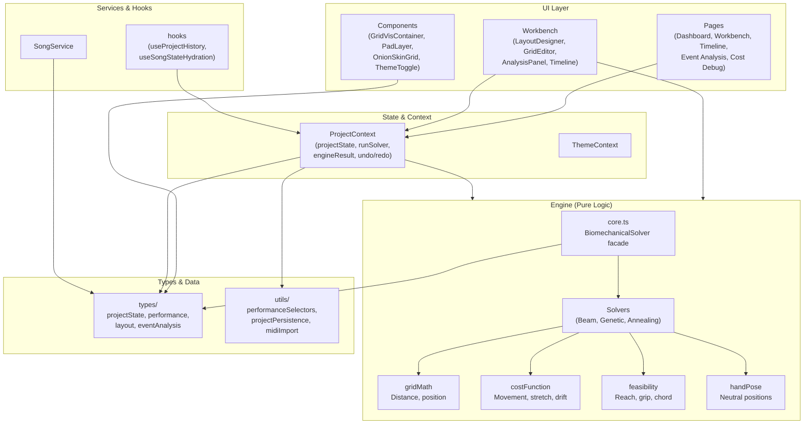
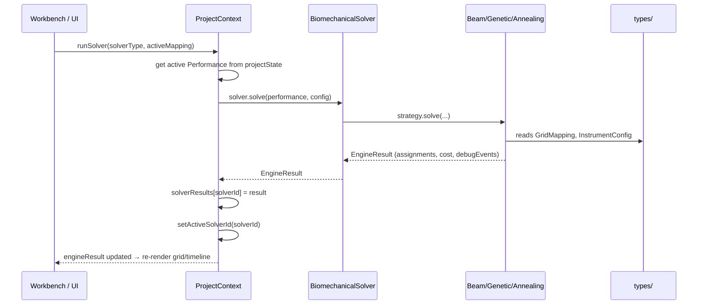
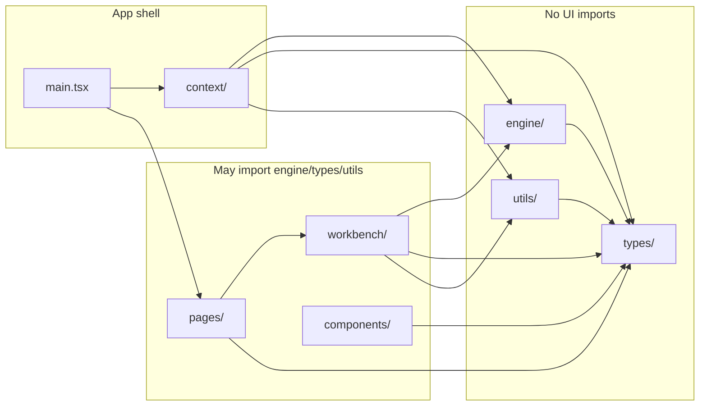
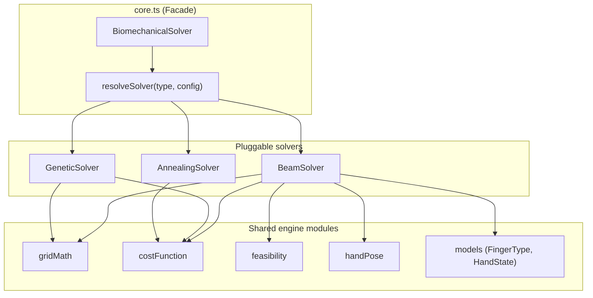

# Ableton Push 3 Performability Tool — Architecture Diagram

High-level architecture: layers, data flow, and main modules.

## System overview



## Layer responsibilities

| Layer | Responsibility |
|-------|----------------|
| **UI** | React pages and workbench; layout designer, grid editor, timeline, analysis panels. No engine logic. |
| **Context** | Single source of truth: `ProjectState`, solver orchestration (`runSolver`), `engineResult`, history (undo/redo). |
| **Engine** | Pure logic: solver facade, beam/genetic/annealing strategies, grid math, cost model, feasibility, hand pose. No UI. |
| **Types** | Shared interfaces: `ProjectState`, `Performance`, `GridMapping`, `EngineResult`, etc. |
| **Utils** | Selectors, persistence, MIDI import/export, formatting. |
| **Services/Hooks** | Song portfolio, project history, state hydration. |

## Data flow (solver run)



## Module dependency (simplified)



## Engine internals (solver strategy)



## File layout (key areas)

```
src/
├── main.tsx              # Router, ThemeProvider, ProjectProvider
├── context/              # ProjectContext, ThemeContext
├── types/                # projectState, performance, layout, eventAnalysis, …
├── engine/               # core, solvers/, gridMath, costFunction, feasibility, handPose
├── workbench/            # Workbench, LayoutDesigner, GridEditor, AnalysisPanel, Timeline
├── pages/                # Dashboard, TimelinePage, EventAnalysisPage, CostDebugPage
├── components/           # ui/, grid-v3/, vis/, dashboard/
├── utils/                # performanceSelectors, projectPersistence, midiImport, …
├── services/             # SongService
└── hooks/                # useProjectHistory, useSongStateHydration, usePracticeLoop
```

---

*See [ARCHITECTURE.md](./ARCHITECTURE.md) for domain concepts, grid constraints, and workflow details.*
