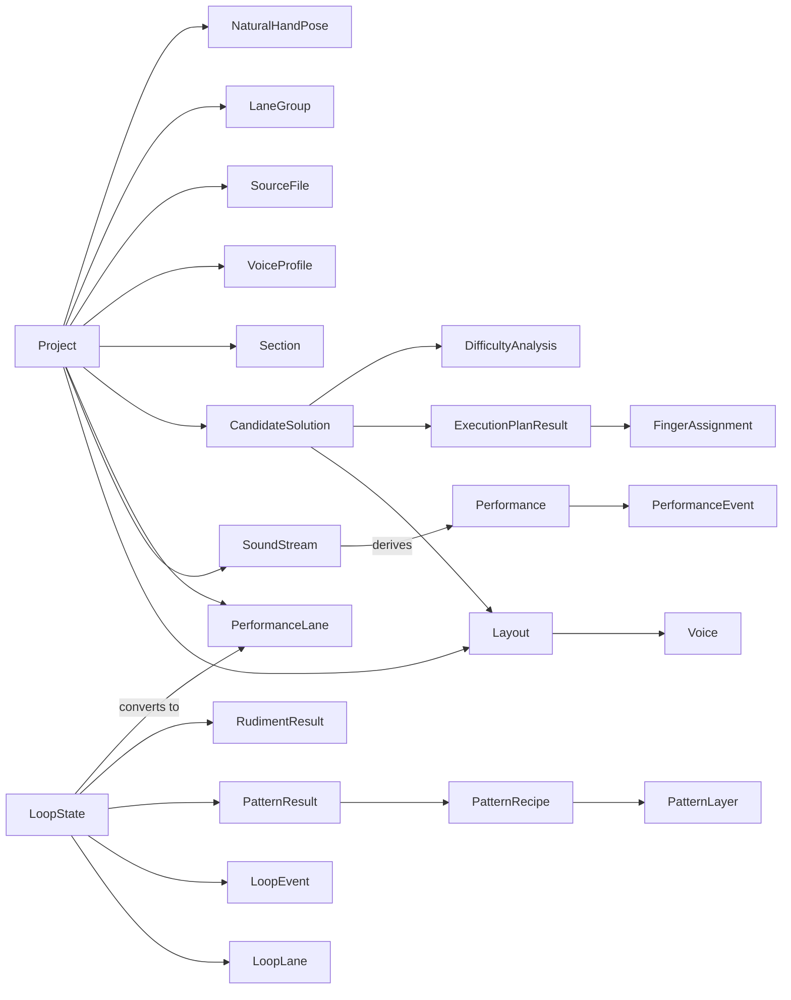

# Domain Model

## Scope Note

- This is the canonical model reconstructed from the current runtime.
- Where the repo carries duplicate representations, the diagram shows both the canonical relationship and the duplicated runtime model.

## Canonical Relationship Diagram

## Product Containers

### `Project`

| Item | Detail |
|---|---|
| Fields | `id`, `name`, timestamps, `isDemo`, `soundStreams`, `tempo`, `instrumentConfig`, `sections`, `voiceProfiles`, `layouts`, `activeLayoutId`, `analysisResult`, `candidates`, `selectedCandidateId`, `voiceConstraints`, `performanceLanes`, `laneGroups`, `sourceFiles`, transport and ephemeral UI state |
| Relationships | Owns all editor-visible data; contains multiple layouts, candidate solutions, streams, lanes, and structural metadata |
| Lifecycle | Created from blank project, MIDI import, demo copy, or JSON import; persisted in localStorage; reopened into `ProjectProvider` |

### `Song` (`Version1` only)

| Item | Detail |
|---|---|
| Fields | song metadata, sections, `projectStateId`, optional encoded MIDI |
| Relationships | Wrapper around a saved `ProjectState` in the old portfolio model |
| Lifecycle | Created in `SongService`, linked to MIDI, loaded into `Workbench` |

## Time Model Objects

### `Performance`

| Item | Detail |
|---|---|
| Fields | `events`, optional `tempo`, optional `name` |
| Relationships | Derived from `soundStreams`; consumed by solvers and structure analyzers |
| Lifecycle | Created during MIDI import or pattern-to-pipeline conversion; regenerated when active streams change |

### `PerformanceEvent`

| Item | Detail |
|---|---|
| Fields | `noteNumber`, `startTime`, optional `duration`, optional `velocity`, optional `channel`, optional `eventKey` |
| Relationships | Belongs to one `Performance`; resolved through a `Layout` into a pad position during solving |
| Lifecycle | Parsed from MIDI, generated from patterns, then fed into structure analysis and solver pipelines |

### `SoundStream`

| Item | Detail |
|---|---|
| Fields | `id`, `name`, `color`, `originalMidiNote`, `events`, `muted` |
| Relationships | Current runtime sound-centric representation; many streams derive one `Performance` |
| Lifecycle | Created from library import or regenerated from lanes; muted/unmuted in editor; solver input is derived from unmuted streams |

### `PerformanceLane`

| Item | Detail |
|---|---|
| Fields | `id`, `name`, `sourceFileId`, `sourceFileName`, `groupId`, `orderIndex`, `color`, `colorMode`, `events`, `isHidden`, `isMuted`, `isSolo` |
| Relationships | Authoring-oriented timeline object; grouped by `LaneGroup`; tied to `SourceFile`; can regenerate `soundStreams` |
| Lifecycle | Imported from timeline MIDI, generated from composer output, reordered and grouped in editor |

### `LaneEvent`

| Item | Detail |
|---|---|
| Fields | `eventId`, `laneId`, `startTime`, `duration`, `velocity`, optional raw pitch/channel |
| Relationships | Child of `PerformanceLane` |
| Lifecycle | Imported from MIDI or derived from loop editor steps |

### `Section`

| Item | Detail |
|---|---|
| Fields | `id`, `name`, `startTime`, `endTime`, `density`, `densityLevel` |
| Relationships | Structural segment of a `Performance`; used by difficulty analysis |
| Lifecycle | Derived mostly at import time by `analyzePerformance()` |

### `VoiceProfile`

| Item | Detail |
|---|---|
| Fields | `noteNumber`, `eventCount`, `frequency`, `regularity`, `averageVelocity`, `role` |
| Relationships | Derived statistics for a note/voice identity |
| Lifecycle | Derived at import time by structure analysis |

## Spatial Model Objects

### `Layout`

| Item | Detail |
|---|---|
| Fields | `id`, `name`, `padToVoice`, `fingerConstraints`, `scoreCache`, optional `layoutMode`, optional version metadata |
| Relationships | Static spatial artifact; maps pad keys to `Voice`; owned by `Project`; embedded in `CandidateSolution` |
| Lifecycle | Created empty, cloned, manually edited, auto-seeded, or optimized; mutations invalidate analysis |

### `Voice`

| Item | Detail |
|---|---|
| Fields | `id`, `name`, `sourceType`, `sourceFile`, `originalMidiNote`, `color` |
| Relationships | Assigned into `Layout.padToVoice`; mirrors `SoundStream` identity for grid use |
| Lifecycle | Created during MIDI import or pattern conversion; copied into layouts |

### `PadCoord`

| Item | Detail |
|---|---|
| Fields | `row`, `col` |
| Relationships | Used by layouts, feasibility, natural hand pose, finger assignments, and pad assignment results |
| Lifecycle | Value object only |

### `NaturalHandPose`

| Item | Detail |
|---|---|
| Fields | `version`, `name`, `positionIndex`, `fingerToPad`, `maxUpShiftRows`, `updatedAt` |
| Relationships | Prior model for neutral finger positions; used by mapping seeding and ergonomic reasoning |
| Lifecycle | Default pose exists by default; can be edited or replaced in legacy systems and retained docs |

## Optimization and Analysis Objects

### `ExecutionPlanResult`

| Item | Detail |
|---|---|
| Fields | `score`, `unplayableCount`, `hardCount`, `fingerAssignments`, `fingerUsageStats`, `fatigueMap`, `averageDrift`, `averageMetrics`, optional annealing trace and metadata |
| Relationships | Time-based realization of a `Performance` under a `Layout`; embedded in `CandidateSolution`; drives event and transition inspection |
| Lifecycle | Generated by `BeamSolver` directly or by candidate/annealing pipelines |

### `FingerAssignment`

| Item | Detail |
|---|---|
| Fields | `noteNumber`, `startTime`, `assignedHand`, `finger`, `cost`, optional breakdown, difficulty, row/col, event index, pad id, event key |
| Relationships | Child of `ExecutionPlanResult`; linked back to one event and one resolved pad |
| Lifecycle | Generated during solving; later used by UI selection, diagnostics, and comparison |

### `DifficultyAnalysis`

| Item | Detail |
|---|---|
| Fields | `overallScore`, `passages`, `bindingConstraints` |
| Relationships | Embedded in `CandidateSolution`; references `Section`-like passage ranges |
| Lifecycle | Derived after solving by `analyzeDifficulty()` |

### `TradeoffProfile`

| Item | Detail |
|---|---|
| Fields | `playability`, `compactness`, `handBalance`, `transitionEfficiency`, `learnability`, `robustness` |
| Relationships | Embedded in `CandidateSolution` |
| Lifecycle | Derived from `ExecutionPlanResult` and `DifficultyAnalysis` |

### `CandidateSolution`

| Item | Detail |
|---|---|
| Fields | `id`, `layout`, `executionPlan`, `difficultyAnalysis`, `tradeoffProfile`, `metadata` |
| Relationships | First-class optimization artifact; one project can hold several |
| Lifecycle | Produced by auto-analysis or candidate generation; one candidate becomes the active `analysisResult` |

## Composer Model Objects

### `LoopState`

| Item | Detail |
|---|---|
| Fields | `config`, `lanes`, `events`, `isPlaying`, `playheadStep`, optional `rudimentResult`, optional `patternResult` |
| Relationships | Local authoring model inside `WorkspacePatternStudio`; converts into `PerformanceLane[]` and, indirectly, `soundStreams` |
| Lifecycle | Created locally when composer mounts; optionally saved as presets; changes are synced into the project |

### `LoopLane`

| Item | Detail |
|---|---|
| Fields | `id`, `name`, `color`, `midiNote`, `orderIndex`, `isMuted`, `isSolo` |
| Relationships | Child of `LoopState`; converted into `PerformanceLane` |
| Lifecycle | Added, renamed, recolored, reordered, muted, or soloed in composer |

### `LoopEvent`

| Item | Detail |
|---|---|
| Fields | `laneId`, `stepIndex`, `velocity` |
| Relationships | Child of `LoopState.events` map; converted into `LaneEvent` |
| Lifecycle | Toggled in composer grid or generated from patterns/rudiments |

### `PatternRecipe`

| Item | Detail |
|---|---|
| Fields | `id`, `name`, `description`, `layers`, `variation`, `isPreset`, `tags` |
| Relationships | Input to pattern engine; stored in pattern presets |
| Lifecycle | Loaded from presets, edited in recipe modal, or generated randomly |

### `PatternResult`

| Item | Detail |
|---|---|
| Fields | `source`, `recipe`, `padAssignments`, `fingerAssignments`, `complexity` |
| Relationships | Stored on `LoopState`; drives composer stepper and bulk layout sync |
| Lifecycle | Generated from a recipe or random recipe |

### `RudimentResult`

| Item | Detail |
|---|---|
| Fields | `rudimentType`, `padAssignments`, `fingerAssignments`, `complexity` |
| Relationships | Composer-local alternative to `PatternResult` |
| Lifecycle | Generated from rudiment templates |

## Supporting Organizational Objects

### `LaneGroup`

| Item | Detail |
|---|---|
| Fields | `groupId`, `name`, `color`, `orderIndex`, `isCollapsed` |
| Relationships | Organizes `PerformanceLane[]` |
| Lifecycle | Created from file import or project editing |

### `SourceFile`

| Item | Detail |
|---|---|
| Fields | `id`, `fileName`, `importedAt`, `laneCount` |
| Relationships | Parent metadata for imported `PerformanceLane[]` |
| Lifecycle | Created on lane import or loop conversion |

## Canonical Reading

The cleanest canonical product model is:

- `Project`
  - owns one or more `Layout`s
  - owns a canonical time sequence (`Performance`)
  - generates one or more `CandidateSolution`s

The current runtime complicates that by representing the time sequence as:

- `soundStreams`
- `performanceLanes`
- local composer `LoopState`

That duplication is the most important domain-model issue carried by the repository.
