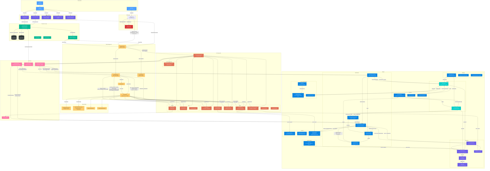

# PushFlow Codebase Dataflow Diagram

```mermaid
flowchart TD

    %% ── Entry Points ──────────────────────────────────────────
    subgraph Entry["Entry Points"]
        MAIN["main.tsx\n(React root)"]
        ROUTER["App.tsx\n(BrowserRouter)"]
        MIDI_FILE["MIDI File\n(drag-drop / file picker)"]
    end

    MAIN --> ROUTER

    %% ── Pages / Routes ────────────────────────────────────────
    subgraph Pages["Pages (Routes)"]
        LIBRARY["ProjectLibraryPage\n/ "]
        EDITOR["ProjectEditorPage\n/project/:id"]
        DEBUG["OptimizerDebugPage\n/optimizer-debug"]
        VALIDATOR["ConstraintValidatorPage\n/validator"]
        TEMPORAL["TemporalEvaluatorPage\n/temporal-evaluator"]
    end

    ROUTER -->|"route match"| LIBRARY
    ROUTER -->|"route match"| EDITOR
    ROUTER -->|"route match"| DEBUG
    ROUTER -->|"route match"| VALIDATOR
    ROUTER -->|"route match"| TEMPORAL

    %% ── Persistence Layer ─────────────────────────────────────
    subgraph Persistence["Persistence Layer"]
        STORAGE["projectStorage.ts\nsaveProjectAsync / loadProjectAsync"]
        IDB[("IndexedDB\n(primary store)")]
        LS[("localStorage\n(fallback mirror)")]
        SERIALIZER["projectSerializer.ts\nserialize / deserialize"]
        LOOP_STORE["loopStorage.ts"]
        PRESET_STORE["presetStorage.ts"]
    end

    LIBRARY -->|"listProjectsAsync()"| STORAGE
    EDITOR -->|"loadProjectAsync(id)"| STORAGE
    STORAGE -->|"putProject / getFullProject"| IDB
    STORAGE -->|"JSON read/write"| LS
    STORAGE <-->|"PersistedProject"| SERIALIZER

    %% ── State Management ──────────────────────────────────────
    subgraph State["State Management"]
        CTX["ProjectContext\n(React Context)"]
        REDUCER["projectReducer\n(40+ action types)"]
        UNDO["useUndoRedo\n(max 50 states)"]
        PSTATE["ProjectState\n(single source of truth)"]
        LANES_R["lanesReducer"]
    end

    EDITOR -->|"ProjectProvider wraps"| CTX
    CTX -->|"dispatch(action)"| REDUCER
    REDUCER -->|"updated state"| PSTATE
    REDUCER -->|"LaneActions"| LANES_R
    LANES_R -->|"lanes state"| PSTATE
    CTX <-->|"state snapshots"| UNDO
    SERIALIZER -->|"ProjectState"| CTX
    CTX -->|"state on save"| SERIALIZER

    %% ── Derived State Helpers ─────────────────────────────────
    subgraph Derived["Derived State"]
        DISPLAYED["getDisplayedLayout()\nworking ?? active"]
        ACTIVE_PERF["getActivePerformance()\nunmuted streams → Performance"]
        ACTIVE_STREAMS["getActiveStreams()"]
        HAS_CHANGES["hasWorkingChanges()"]
    end

    PSTATE -->|"ProjectState"| DISPLAYED
    PSTATE -->|"SoundStream[]"| ACTIVE_PERF
    PSTATE --> ACTIVE_STREAMS
    PSTATE --> HAS_CHANGES

    %% ── MIDI Import ───────────────────────────────────────────
    subgraph MidiImport["MIDI Import"]
        PARSER["midiImport.ts\nparseMidiProject()"]
        TONEJS["@tonejs/midi\n(3rd-party parser)"]
    end

    MIDI_FILE -->|"ArrayBuffer"| PARSER
    PARSER -->|"raw MIDI bytes"| TONEJS
    TONEJS -->|"parsed tracks/notes"| PARSER
    PARSER -->|"MidiProjectData\n(SoundStreams + Layout + Performance)"| CTX

    %% ── UI Components ─────────────────────────────────────────
    subgraph UI["UI Components"]
        WORKSPACE["PerformanceWorkspace\n(3-column hub)"]

        subgraph GridLayer["Grid"]
            GRID["InteractiveGrid\n(8×8 pad grid)"]
            COMPARE_GRID["CompareGridView"]
        end

        subgraph TimelineLayer["Timeline"]
            TIMELINE["UnifiedTimeline\n(swim lanes)"]
        end

        subgraph PanelsLayer["Panels"]
            VOICE_PAL["VoicePalette\n(sound list + constraints)"]
            ANALYSIS_P["PerformanceAnalysisPanel\n(feasibility + difficulty)"]
            TRACE_P["MoveTracePanel\n(optimizer step trace)"]
            CANDIDATE_C["CandidateCard\n(preview + Use button)"]
            COMPARE_M["CompareModal\n(side-by-side diff)"]
            EVENT_DETAIL["EventDetailPanel"]
            LEARN_MORE["LearnMoreModal"]
        end

        subgraph ComposerLayer["Pattern Composer"]
            COMPOSER["WorkspacePatternStudio\n(bottom drawer)"]
        end
    end

    CTX -->|"useProject() hook\n{state, dispatch}"| WORKSPACE
    WORKSPACE --> GRID
    WORKSPACE --> TIMELINE
    WORKSPACE --> VOICE_PAL
    WORKSPACE --> ANALYSIS_P
    WORKSPACE --> TRACE_P
    WORKSPACE --> CANDIDATE_C
    WORKSPACE --> COMPARE_M
    WORKSPACE --> COMPOSER

    %% ── UI → State dispatches ─────────────────────────────────
    GRID -->|"ASSIGN_VOICE_TO_PAD\nSWAP_PADS\nTOGGLE_PLACEMENT_LOCK\nSET_FINGER_CONSTRAINT"| REDUCER
    VOICE_PAL -->|"SET_VOICE_CONSTRAINT\nTOGGLE_MUTE\nSELECT_STREAM"| REDUCER
    TIMELINE -->|"SELECT_EVENT\nSYNC_STREAMS_FROM_LANES"| REDUCER
    CANDIDATE_C -->|"PROMOTE_CANDIDATE"| REDUCER

    %% ── UI Hooks ──────────────────────────────────────────────
    subgraph Hooks["UI Hooks"]
        AUTO_ANALYSIS["useAutoAnalysis\n(debounced solver trigger)"]
        AUTO_SAVE["useAutoSave\n(debounced persist)"]
        SHORTCUTS["useKeyboardShortcuts\n(undo/redo + editing)"]
        LANE_IMPORT["useLaneImport"]
    end

    WORKSPACE --> AUTO_ANALYSIS
    WORKSPACE --> AUTO_SAVE
    WORKSPACE --> SHORTCUTS
    TIMELINE --> LANE_IMPORT

    AUTO_SAVE -->|"saveProjectAsync(state)"| STORAGE
    SHORTCUTS -->|"undo / redo"| UNDO

    %% ── Engine Pipeline ───────────────────────────────────────
    subgraph Engine["Engine"]

        subgraph Optimization["Optimization"]
            REGISTRY["optimizerRegistry\ngetOptimizer(key)"]
            BEAM_ADAPT["beamOptimizerAdapter\n(finger assignment only)"]
            ANNEAL_ADAPT["annealingOptimizerAdapter\n(layout + fingers)"]
            GREEDY["greedyOptimizer\n(hill-climb + trace)"]
            MULTI_GEN["multiCandidateGenerator\ngenerateCandidates()"]
        end

        subgraph Solvers["Solvers"]
            BEAM_S["BeamSolver\n(beam search K-best)"]
            ANNEAL_S["AnnealingSolver\n(simulated annealing)"]
        end

        subgraph Evaluation["Evaluation"]
            CANON_EVAL["canonicalEvaluator\nevaluatePerformance()"]
            COST_FN["costFunction.ts\n(atomic cost computations)"]
            OBJECTIVE["objective.ts\nPerformabilityObjective"]
            COST_TOGGLE["costToggles.ts\napplyToggles()"]
            DIFFICULTY["difficultyScoring.ts"]
        end

        subgraph Mapping["Mapping"]
            MAP_RESOLVER["mappingResolver\nresolveEventToPad()"]
            VOICE_PAD_IDX["buildVoiceIdToPadIndex()"]
            COVERAGE["computeMappingCoverage()"]
        end

        subgraph Analysis["Analysis"]
            BASELINE_CMP["baselineCompare\ncompareWithDiagnostics()"]
            DIVERSITY["diversityMeasurement\nfilterTrivialDuplicates()"]
            EXPLAINER["eventExplainer\nexplainEvent() / identifyHardMoments()"]
        end

        subgraph Structure["Structure"]
            MOMENTS["momentBuilder\nbuildPerformanceMoments()"]
            ROLES["inferVoiceRoles()"]
            GROUPING["groupEventsByTime()"]
        end

        subgraph Prior["Prior / Biomechanics"]
            FEASIBILITY["feasibilityCheck\n(Strict/Relaxed/Fallback tiers)"]
            ERGONOMICS["ergonomicConstants"]
            HAND_ZONE["handZone\ngetPreferredHand()"]
        end

        subgraph Surface["Surface Model"]
            PAD_GRID["padGrid\n(8×8 coords, adjacency, distance)"]
        end
    end

    %% ── Hook → Engine flows ───────────────────────────────────
    AUTO_ANALYSIS -->|"analysisStale=true\n(Layout + Performance)"| BEAM_ADAPT
    AUTO_ANALYSIS -->|"generateFull(mode)\n(OptimizerInput)"| MULTI_GEN

    MULTI_GEN -->|"OptimizerInput per seed"| REGISTRY
    REGISTRY -->|"beam"| BEAM_ADAPT
    REGISTRY -->|"annealing"| ANNEAL_ADAPT
    REGISTRY -->|"greedy"| GREEDY

    BEAM_ADAPT -->|"Performance + Layout"| BEAM_S
    ANNEAL_ADAPT -->|"Performance + Layout"| ANNEAL_S

    %% ── Solver internals ──────────────────────────────────────
    BEAM_S -->|"events"| MOMENTS
    ANNEAL_S -->|"events"| MOMENTS
    GREEDY -->|"events"| MOMENTS

    MOMENTS -->|"PerformanceMoment[]"| BEAM_S
    MOMENTS -->|"PerformanceMoment[]"| ANNEAL_S

    BEAM_S -->|"candidate grips"| FEASIBILITY
    FEASIBILITY -->|"valid grips"| BEAM_S

    BEAM_S -->|"grip pairs"| COST_FN
    ANNEAL_S -->|"grip pairs"| COST_FN
    GREEDY -->|"layout states"| COST_FN

    COST_FN -->|"raw costs"| COST_TOGGLE
    COST_TOGGLE -->|"toggled costs"| OBJECTIVE

    MAP_RESOLVER -->|"padId lookup"| BEAM_S
    MAP_RESOLVER -->|"padId lookup"| ANNEAL_S
    PAD_GRID -->|"coords + distance"| COST_FN
    HAND_ZONE -->|"hand preference"| FEASIBILITY

    %% ── Solver → Output ───────────────────────────────────────
    BEAM_S -->|"ExecutionPlanResult"| BEAM_ADAPT
    ANNEAL_S -->|"Layout + Assignments"| ANNEAL_ADAPT
    GREEDY -->|"OptimizerOutput\n(layout + plan + moveHistory)"| MULTI_GEN

    BEAM_ADAPT -->|"OptimizerOutput"| MULTI_GEN
    ANNEAL_ADAPT -->|"OptimizerOutput"| MULTI_GEN

    %% ── Post-optimization evaluation ─────────────────────────
    MULTI_GEN -->|"layout + assignments"| CANON_EVAL
    CANON_EVAL -->|"PerformanceCostBreakdown"| MULTI_GEN
    CANON_EVAL --> COST_FN
    CANON_EVAL --> DIFFICULTY

    %% ── Diversity filtering ───────────────────────────────────
    MULTI_GEN -->|"raw candidates"| DIVERSITY
    DIVERSITY -->|"filtered CandidateSolution[]"| MULTI_GEN

    %% ── Results back to state ─────────────────────────────────
    MULTI_GEN -->|"CandidateSolution[]"| AUTO_ANALYSIS
    AUTO_ANALYSIS -->|"SET_CANDIDATES\nSET_ANALYSIS_RESULT"| REDUCER

    BEAM_ADAPT -->|"single CandidateSolution\n(auto-analysis path)"| AUTO_ANALYSIS

    %% ── Analysis panels consume engine ────────────────────────
    ANALYSIS_P -->|"plan + layout"| EXPLAINER
    ANALYSIS_P -->|"plan + layout"| DIFFICULTY
    COMPARE_M -->|"layoutA, layoutB"| BASELINE_CMP
    TRACE_P -->|"reads moveHistory\nfrom state"| PSTATE
    CANDIDATE_C -->|"reads candidates\nfrom state"| PSTATE

    %% ── State → UI render ─────────────────────────────────────
    PSTATE -->|"displayed layout"| GRID
    PSTATE -->|"soundStreams"| TIMELINE
    PSTATE -->|"soundStreams"| VOICE_PAL
    PSTATE -->|"analysisResult"| ANALYSIS_P
    PSTATE -->|"candidates[]"| CANDIDATE_C
    PSTATE -->|"moveHistory"| TRACE_P

    %% ── Styling ───────────────────────────────────────────────
    classDef entry fill:#4a9eff,color:#fff,stroke:#2b7de9
    classDef page fill:#6c5ce7,color:#fff,stroke:#5a4bd1
    classDef persist fill:#00b894,color:#fff,stroke:#00a381
    classDef state fill:#fdcb6e,color:#333,stroke:#e0b050
    classDef ui fill:#e17055,color:#fff,stroke:#c9604a
    classDef hook fill:#fd79a8,color:#fff,stroke:#e06090
    classDef engine fill:#0984e3,color:#fff,stroke:#0770c2
    classDef solver fill:#00cec9,color:#fff,stroke:#00b5b0
    classDef eval fill:#6c5ce7,color:#fff,stroke:#5a4bd1
    classDef db fill:#2d3436,color:#fff,stroke:#636e72
    classDef external fill:#d63031,color:#fff,stroke:#b71c1c

    class MAIN,ROUTER,MIDI_FILE entry
    class LIBRARY,EDITOR,DEBUG,VALIDATOR,TEMPORAL page
    class STORAGE,SERIALIZER,LOOP_STORE,PRESET_STORE persist
    class IDB,LS db
    class CTX,REDUCER,UNDO,PSTATE,LANES_R,DISPLAYED,ACTIVE_PERF,ACTIVE_STREAMS,HAS_CHANGES state
    class WORKSPACE,GRID,COMPARE_GRID,TIMELINE,VOICE_PAL,ANALYSIS_P,TRACE_P,CANDIDATE_C,COMPARE_M,EVENT_DETAIL,LEARN_MORE,COMPOSER ui
    class AUTO_ANALYSIS,AUTO_SAVE,SHORTCUTS,LANE_IMPORT hook
    class REGISTRY,BEAM_ADAPT,ANNEAL_ADAPT,GREEDY,MULTI_GEN engine
    class BEAM_S,ANNEAL_S solver
    class CANON_EVAL,COST_FN,OBJECTIVE,COST_TOGGLE,DIFFICULTY eval
    class MAP_RESOLVER,VOICE_PAD_IDX,COVERAGE,BASELINE_CMP,DIVERSITY,EXPLAINER,MOMENTS,ROLES,GROUPING,FEASIBILITY,ERGONOMICS,HAND_ZONE,PAD_GRID engine
    class TONEJS external
```
