# PushFlow UI Critique — Core User Flows

*Date: 2026-09-23 · Scope: the live app at `main` (2070ae4), desktop Chromium, screenshots at 1600×1000 and 1366×768 with spot measurements at 1280×800, 1440×900 and 1920×1080, using TEST MIDI 1 (7 sounds, 48 notes, 32 events).*

Companion documents: **[UI_ENHANCEMENT_ROADMAP.md](UI_ENHANCEMENT_ROADMAP.md)** (the full, implementation-level plan) and **[UI_ISSUE_REGISTER.md](UI_ISSUE_REGISTER.md)** (all 70 problems and the 307 verified findings behind them).

## At a glance

PushFlow's foundations are right: the canon's Active / Working-Test / Candidate model exists, import never touches the grid, the analysis is layered the way the canon asks (feasibility → ergonomics → difficulty), and the rehearsal transport already speaks musician. What undermines it is **trust**. Today PushFlow behaves like a DAW where auditioning a take silently records over your comp, Undo often does nothing, and a meter shows green whenever you solo a channel. Each problem is fixable on its own, but together they make experimenting feel risky — and experimenting is the point of the product.

The review found **307 verified findings**, which consolidate into **70 distinct problems**: 9 critical, 38 high, 23 medium. **All 9 critical problems were reproduced a second time, independently, in the live app** (the reproducers rated two of them critical and seven high; the register shows both ratings). Many fixes are small: a third of the 70 problems, and most of the 307 individual findings, are one-file or one-rule changes, and each critical problem gets a small stop-gap first. A few need one new shared concept — a read-only "inspected layout" — that several flows are missing.

| # | Flow | Health | Verdict |
|---|------|--------|---------|
| F1 | Importing a song as MIDI | **Rough** | The notes get in and the grid is left alone, but the result is hard to read, easy to corrupt and hard to undo. |
| F2 | Manually arranging sounds on the grid | **Rough** | Dragging and swapping sounds works. The things that make experimenting safe do not: Undo, locks, and protection for the draft. |
| F3 | Automatically arranging sounds on the grid | **Broken** | Suggest and Greedy produce sensible layouts, but Generate overwrites the user's draft without asking, Beam and Annealing ignore locks, and Undo can't recover the lost work. |
| F4 | Viewing the performance on a layout | **Rough** | You can step through moments and see which finger strikes which pad, but onion skin does nothing, "what comes next" is barely visible, and several inspector numbers are wrong. |
| F5 | Analyzing costs and comparing layouts | **Rough** | The analysis is layered well, but two key answers are wrong in common cases: the verdict turns green when you inspect a moment, and Compare shows the Active Layout as empty and zero-scored after every Generate. |
| F6 | Saving and loading performances | **Rough** | Autosave keeps work safe in normal use, but the Library misrepresents what's saved, every project is "Untitled", and there's no safety net when a save fails, Undo misfires or a project is deleted. |
| F7 | Rehearsing a performance | **Rough** | Play, click, speed and loop exist, but the grid often shows the wrong moment, the toggles fall off-screen on a laptop, and nothing links a hard passage to practising it. |
| F8 | Defining and managing Sound identity | **Rough** | Rename, recolor and select-to-highlight work. But identity isn't stable: every imported sound looks the same, muting changes what gets analyzed, sounds that share a pitch get merged, and finger preferences drift out of sync. |
| F9 | Composing patterns in-app | **Broken** | You can sketch a simple groove, but dropping a saved preset on the grid does nothing, and composed work is easy to lose. |
| F10 | Layout state and lifecycle | **Broken** | The Active-vs-draft split exists, but looking at a suggestion silently replaces your draft, Undo can't get it back at normal speed, and Compare misreports the Active Layout. |
| X1 | Visual design, layout & information architecture *(cross-cutting)* | **Rough** | The layout is sound in principle, but the grid gets only leftover space (28px pads and cut-off rows at 1366x768), its state is rarely readable, and colours and names change meaning between panels. |
| X2 | Accessibility, keyboard, feedback & terminology *(cross-cutting)* | **Rough** | Mouse users can finish every flow, but feedback is often wrong or missing, labels use engine code names, and the keyboard barely works. |

*Health scale: Solid → Workable → Rough → Broken. "Broken" means the flow's main outcome can't be reached, or is lost, in normal use; "Rough" means the outcome is reachable but some answers along the way are wrong or costly.*

## 1. The core user flows

Your seven flows are F1–F7. Three more are added: two are steps of the canon's workflow spine that cut across yours (defining Sound identity, step 2; the layout lifecycle, steps 3–9: inspect Active, explore a draft, compare, save a variant, promote), and one is a surface CLAUDE.md protects (composing in the Pattern Composer). Two cross-cutting lenses (X1, X2) cover problems that show up in every flow.

| # | Flow | How the user does it today |
|---|------|----------------------------|
| F1 | **Importing a song as MIDI** | Library → New Project → **Import MIDI Files** (timeline toolbar) → Sounds list + timeline fill in |
| F2 | **Manually arranging sounds on the grid** | Drag a Sound onto a pad; drag pad-to-pad to move/swap; right-click a pad for lock / finger options; Undo |
| F3 | **Automatically arranging sounds on the grid** | **Suggest a starting layout** (empty grid) or **Generate** (method + strategy selects) → candidate cards → Preview / Promote |
| F4 | **Viewing the performance on a layout** | Events tab → select a moment → grid shows pads + fingers; onion-skin toggle; timeline note click; "Show Finger Assignment" |
| F5 | **Analyzing costs and comparing layouts** | Layout Summary + Costs tab (score, verdict, factor bars, difficulty chart) → tick 2 candidates → **Compare** → Learn More |
| F6 | **Saving and loading performances** | Autosave + **Save**; ← Library; the big top banner ("hero") with "Resume Session"; project cards; Export / Import project file |
| F7 | **Rehearsing a performance** | Timeline transport: PLAY/STOP/RESET, Speed, LOOP (drag ruler), CLICK (metronome), SOUND (hits); grid flashes pads |
| F8 | **Defining and managing Sound identity** *(added)* | Sounds tab rows: rename (double-click), colour swatch, group (Ctrl/Cmd+G), S/M, finger preference chip |
| F9 | **Composing patterns in-app** *(added)* | Bottom-drawer **Composer** tab (step sequencer) + left **Presets** tab (drag a preset onto the grid) |
| F10 | **Layout state and lifecycle** *(added)* | Active vs Working/Test vs Saved Variant vs Candidate; toolbar **Promote / Save Variant / Discard**; variants list |
| X1 | *Visual design, layout & information architecture* | How the whole workspace is composed and how it scales across laptop sizes |
| X2 | *Accessibility, keyboard, feedback & terminology* | Keyboard use, focus, contrast, error/success feedback, and whether labels use the canon's words |

The canonical journey strings these together: **import (F1) → name the sounds (F8) → place them (F2) or get a start (F3) → analyze (F5) → generate alternatives (F3) → compare (F5) → keep or promote (F10) → inspect hard moments (F4) → rehearse (F7) → come back tomorrow (F6).**

## 2. The problems that matter most

Ranked by harm to the user and by how many flows they touch. Theme IDs link to the full write-up in the register.

1. **Your draft gets overwritten without warning** — *Critical · affects F2, F3, F4, F5, F6, F10, X2 · [T01](UI_ISSUE_REGISTER.md#t01)*  
   Generate, Preview, a stray click on a candidate card, or Load Draft replaces your hand-built Working/Test Layout, and autosave makes the loss permanent within seconds. There is also no way to *look at* the Active Layout while a draft exists.  
   **Fix:** Looking is read-only; Generate only proposes; replacing a draft is an explicit, undoable action.

2. **Undo doesn't reliably undo** — *Critical · affects F1, F2, F3, F6, F8, F9, F10, X2 · [T02](UI_ISSUE_REGISTER.md#t02)*  
   Background analysis results are recorded as undo steps and re-recorded about a second after each Undo, so at a normal pace Undo never gets back past your last change (only a fast double-press does), and "Suggest a starting layout" is never recorded at all. Undo is the safety net for every other problem here, and today it has a hole in it.  
   **Fix:** Undo covers only your edits, exactly one step per action, and names what it will undo.

3. **A green "Feasible" on unplayable layouts** — *Critical · affects F2, F4, F5, X2 · [T07](UI_ISSUE_REGISTER.md#t07)*  
   Select any event and the verdict banner flips to "Feasible · All events playable", even on a layout with 22 unplayable events. The verdict is wrong at the exact moment you are investigating a problem.  
   **Fix:** Pin the whole-layout verdict; show the selected moment in its own card with its own verdict.

4. **Locks are ignored by two of the three optimizers** — *Critical · affects F2, F3 · [T11](UI_ISSUE_REGISTER.md#t11)*  
   Placement locks are the canon's one hard user rule. Beam and Annealing move locked sounds, delete the locks and say nothing; manual drags ignore locks too.  
   **Fix:** Every method starts from your current layout with locked sounds already in place and rejects any result that moves them; locked pads refuse drags.

5. **Compare misreports the Active Layout** — *Critical · affects F3, F5, F10 · [T08](UI_ISSUE_REGISTER.md#t08)*  
   Whenever the on-screen draft differs from Active (always the case after Generate), Compare draws the Active Layout as an empty grid scored 0, labels it "Easy", and names the wrong winner. Stale selections can also produce a self-compare or a screen with no close button.  
   **Fix:** Evaluate every side properly (cached per layout); never show a placeholder of zeros.

6. **Every sound looks the same** — *High · affects F1, F2, F8, X1, X2 · [T17](UI_ISSUE_REGISTER.md#t17)*  
   All imported sounds get the same amber colour and numbered names ("TEST MIDI 1 1"…"7") that truncate to identical "TEST M…" labels. The grid, timeline, candidate mini-grids and Compare become unreadable, so this one issue degrades almost every flow.  
   **Fix:** Distinct colour-blind-safe palette, sensible default names (track/file), easy rename.

7. **The grid, the "visual center", is clipped and starved of space** — *High · affects F1, F2, F4, F7, X1 · [T04](UI_ISSUE_REGISTER.md#t04)*  
   The grid is shrunk with a CSS scale against a wrong size constant, so the state badge and hand-zone labels are cut off at every tested size, and at 1366×768 the top and bottom pad rows are cut off too. There, pads are ~28 px while the timeline keeps a fixed 480 px.  
   **Fix:** Size the grid by measuring its container; timeline sized to its lanes with a resizable splitter.

8. **The pad right-click menu opens off-screen** — *Critical · affects F2, F5, X2 · [T06](UI_ISSUE_REGISTER.md#t06)*  
   It is the only way to set placement locks, and it renders hundreds of pixels from the cursor, often fully off-screen (0 of 12 items clickable on most pads tested at 1600×1000). It also takes two Escape presses to close.  
   **Fix:** One shared popover/dialog component that renders at page level, at the cursor, and closes on Escape.

9. **Nothing says which layout you're looking at** — *High · affects F2, F4, F5, F10, X1, X2 · [T03](UI_ISSUE_REGISTER.md#t03)*  
   The only on-grid badge is clipped (invisible at 1366×768) and knows no "Candidate" state; the Costs and Events panels never name the layout they describe. Canon §8 requires every analysis to name its subject.  
   **Fix:** A fixed layout-state bar above the grid (ACTIVE / WORKING-TEST / CANDIDATE B / VARIANT) with its diff and its actions.

10. **There is no single cost story** — *High · affects F3, F5, F9 · [T21](UI_ISSUE_REGISTER.md#t21)*  
   Four or more score systems with different scales and directions (Score %, raw cost, difficulty words, compare bars), and different evaluators before and after Generate, so part of each "improvement" is just a change of units.  
   **Fix:** One headline everywhere (e.g. "Playability 0–100, higher = easier") from one scoring engine.

11. **Mute quietly changes the analysis, and Generate deletes muted sounds** — *High · affects F3, F7, F8, X2 · [T15](UI_ISSUE_REGISTER.md#t15)*  
   Muting a sound to listen also removes it from analysis (which can turn a failing layout green), and Generating while it is muted removes it from the layout.  
   **Fix:** Mute/Solo become audio-only; a separate, visible "Exclude from analysis".

12. **Rehearsing and inspecting fight each other** — *Critical · affects F4, F7 · [T10](UI_ISSUE_REGISTER.md#t10)*  
   With an event selected, the grid freezes during playback and hides the pad flashes; the playhead ignores the selection; nothing links "this moment is hard" to "loop it slowly".  
   **Fix:** One "current moment" shared by selection and playhead; a Rehearse button that loops the passage.

Two more critical problems are narrower in reach: **onion skin has no visible effect** ([T09](UI_ISSUE_REGISTER.md#t09), F4/F7) and **dropping a Composer preset on the grid does nothing, even though the preview says the spot is valid** ([T65](UI_ISSUE_REGISTER.md#t65), F9).

### Biggest gaps (what's missing)

- Start a project from a MIDI file in the Library (today the only Library import button rejects `.mid` with a raw JSON error), plus a demo project. [T51](UI_ISSUE_REGISTER.md#t51)
- Replace or remove an imported file, or delete a Sound. Re-importing the "fixed in Live" version silently duplicates every Sound. [T47](UI_ISSUE_REGISTER.md#t47)
- Anything measured against the Active Layout: cards don't show what moved or how much better/worse they are than your baseline; Compare can't include your draft or saved variants. [T26](UI_ISSUE_REGISTER.md#t26)
- A way to *find* and *understand* hard moments: filters (Hard / Unplayable), Prev/Next hard, and a one-sentence "why this moment is hard". [T27](UI_ISSUE_REGISTER.md#t27)
- Placement status and filters in the Sounds panel (All / To place / On grid / Locked), which the surface spec requires. [T45](UI_ISSUE_REGISTER.md#t45)
- A way to keep a candidate: each Generate discards the previous set, and cards have no "Save as variant". [T30](UI_ISSUE_REGISTER.md#t30)
- Standard practice aids: count-in, separate click/hit volume, hands-separate practice. [T59](UI_ISSUE_REGISTER.md#t59)
- An explanation of the numbers on screen, reachable from where they are shown. [T41](UI_ISSUE_REGISTER.md#t41)
- Sequencer basics finger drummers expect in the Composer (1/16 grid default, velocity, copy/duplicate). [T70](UI_ISSUE_REGISTER.md#t70)

### What to remove, hide or demote (what's unnecessary)

- **Optimizer internals as the primary Generate UI** — Three unlabeled selects (Greedy/Beam/Annealing, strategy, intensity), options that run identical code, and card subtitles like "Greedy Motif-Preserving Greedy: 6 moves, cost 25.87". **Demote, don't delete**: every method must stay available (CLAUDE.md), just behind "Advanced". [T34](UI_ISSUE_REGISTER.md#t34)
- **Duplicated analysis** — The Costs tab and the Layouts tab summary show the same numbers in two places; candidates are buried beneath them. [T38](UI_ISSUE_REGISTER.md#t38)
- **The settings gear grab-bag** — A dead "Organize by 4x4 Banks" toggle, a hidden duplicate of Save Variant ("Duplicate Layout"), and cost toggles that don't change the analysis you see. [T39](UI_ISSUE_REGISTER.md#t39)
- **Developer tools and vanity stats in the Library** — "Constraint Validator" and "Temporal Evaluator" as Quick Actions, stats that restate the cards, hero copy promising "practice tracking" that doesn't exist, and "Resume Session" and "Open Layout Editor" doing the same thing. [T54](UI_ISSUE_REGISTER.md#t54)
- **Engine vocabulary as user copy** — Raw ids (`lane_1790…`) in Compare, "Main burden: constraintPenalty", and each cost factor under 3–7 different names and two colour schemes. [T20](UI_ISSUE_REGISTER.md#t20)

### What works well — keep these

- Manual edits automatically create a Working/Test Layout and never touch the Active Layout. Promote, Save Variant and Discard appear only while a draft exists, which matches the canon lifecycle (F2, F10, X1).
- The no-automatic-layout invariant holds at import: import never touches the grid, pitch stays metadata with bottomLeftNote at 36, an empty grid is treated as unfinished rather than '0% infeasible', and 'Suggest a starting layout' is an explicit, discardable action that never moves placed pads (F1, F2, F5, F10). Generate on an empty grid does still auto-apply a full layout (T37), which P1a removes; whether one-click Suggest is explicit enough is decision Q4.
- A fast, automatic feedback loop: about 1 second after an edit, finger codes appear on pads, dimmed solver suggestions in the Sounds panel and 'L2'-style labels on timeline notes (F2, F4).
- The timeline is honest: every stream is shown, unplayable strikes are solid red, muted lanes are dimmed rather than hidden, pills carry hand and finger, and ignored preferences and relaxed rules are marked (F4, F7, X1).
- Card Promote keeps the Execution Plan the user reviewed, every promote auto-saves the replaced Active Layout as a variant, and the draft, the Active Layout and the variants are stored in separate slots, so committing never destroys the previous baseline (F6, F10).
- Greedy honours placement locks. Its move trace uses plain English with sound names ('Swap TEST MIDI 1 3 at (3,4)…'), lists rejected alternatives and replays steps on the grid. Restarts and seeded exploration are in place (F3, F8).
- Candidate cards already have the right skeleton: a mini grid, 'Best for / Why / Tradeoff' text, and 'Rules relaxed' and 'N unplayable' chips with explanations shown up front, plus lightweight inline confirmation for delete and card promote (F3, F5, F10).
- The analysis is layered the way the canon asks (feasibility, then ergonomics, then difficulty). The verdict pairs an icon, a word and a colour, 'What is limiting this layout' names the actual sounds, and the difficulty summary doesn't give a false all-clear when Medium events exist (F5, X2).
- Rehearsal basics are sound and written for musicians: a real click with an accented downbeat, a stable per-sound synth voice, velocity-scaled hits, a speed control that is explicitly rehearsal-only, a playhead that follows while zoomed, and tooltips in musician language (F7, X2).
- Invariants are respected elsewhere too. The Pattern Composer is always a bottom-drawer tab and uses the project tempo. Renames and recolours reach every layout, candidate and analysis (except Composer lanes, which can revert a rename; see F9 and T66). Inline editors share one Enter/Escape contract. Analysis-only state is never persisted, and one corrupt library record doesn't break the library (F1, F6, F9, X2).

## 3. Flow-by-flow critique

Each section follows the same shape: what the user is trying to do, how it works today, what works, what doesn't, what's confusing, what's missing, what's unnecessary, and what good looks like. Severity tags are after verification; theme tags link to the register.

### 3.1 F1 · Importing a song as MIDI
**Health: Rough** — The notes get in and the grid is left alone, but the result is hard to read, easy to corrupt and hard to undo.

**What the user is trying to do.** Bring a MIDI clip from Ableton into PushFlow and get a project they can recognise: one clearly named, coloured Sound per drum or pitch, the right tempo and bar grid, and an obvious next step.

**How it works today.**
1. In the Library, **New Performance** or **New Project** saves and opens an empty "Untitled Project" (120 BPM). **Import Project** accepts only `.pushflow.json`.
2. The only MIDI import is **Import MIDI Files** in the Timeline tab under the grid (multi-select).
3. Notes are grouped by pitch into amber Sounds named "TEST MIDI 1 1" to "TEST MIDI 1 7". If the project is still at 120, the first file's tempo is adopted without a message.
4. Sounds and lanes fill in; the grid stays empty; the right panel offers **Suggest a starting layout**. No summary appears.
5. Cleanup: double-click a name to rename it; click the 10 px swatch to recolour.
6. **Import MIDI** again adds more Sounds to the ones already there.

#### What works well
- Import never places anything on the grid and keeps pitch as metadata only (no auto-layout, pitch independence).
- Single-sound files get clean names ("Kick", "808"), and multi-select brings in a folder of per-sound clips at once.
- The post-import prompt is written for a musician, and Suggest is something the user chooses, not something that happens automatically.
- A rename or recolour shows up on every surface.

#### What doesn't work well
- **High** — Changing BPM after import moves the bar lines but not the notes, because notes are stored in seconds, not beats. It's like an unwarped audio clip in Live: the grid slides underneath. At 100 BPM, TEST MIDI 1's bar-2 kick is drawn on bar 1, beat 4. Store positions in beats. [T49](UI_ISSUE_REGISTER.md#t49)
- **High** — Every Sound from every file is the same amber, so a placed TEST MIDI 1 grid is a wall of identical "TEST M…" tiles. Assign distinct colours. [T17](UI_ISSUE_REGISTER.md#t17)
- **High** — Re-importing a file (the usual "fix it in Live, re-export" loop) silently duplicates every Sound. Offer Replace, which keeps placements, or Add. [T47](UI_ISSUE_REGISTER.md#t47)
- **High** — A clip exactly 4 bars long at the project tempo, the most common Push loop, fills only 240 px of a 718 px timeline. Fit doesn't help; a reload does. This breaks the CLAUDE.md rule that the timeline must refit after import. Re-measure when the timeline appears. [T50](UI_ISSUE_REGISTER.md#t50)
- **Medium** — Tempo for later files is silent or wrong. In a batch the last file wins (90 + 140 BPM gave 140), a file at a different tempo is laid over the grid with no notice, and every bar is 4/4. Flag mismatches. [T49](UI_ISSUE_REGISTER.md#t49)
- **Medium** — A non-MIDI file's error also appears as "Generation failed", and its **Retry** runs Generate. Some files change things with no message: an empty first file can change the tempo (120 to 100), and a 70-pitch file makes 70 Sounds for 64 pads. Give import its own errors and warnings. [T48](UI_ISSUE_REGISTER.md#t48)
- **Medium** — In the Sounds panel, the only way to rename is a double-click: there is no pencil and no keyboard route, and Tab doesn't move to the next name. Add both. [T17](UI_ISSUE_REGISTER.md#t17) [T63](UI_ISSUE_REGISTER.md#t63)
- **Medium** — At 1366x768, LOOP / CLICK / SOUND sit past the timeline's clipped edge until the left panel is collapsed. Even at 1600x1000 the grid cuts off its own top, hiding the layout-state badge. Size the timeline to its lanes. [T04](UI_ISSUE_REGISTER.md#t04) [T05](UI_ISSUE_REGISTER.md#t05)
- **Medium** — Library cards lack bar length and created / last-visited dates (a CLAUDE.md rule), and the featured project in the top banner shows Delete / Export only after a search. [T52](UI_ISSUE_REGISTER.md#t52)
- **Low** — The remote icon font shows words like "search" when it fails to load, and the top banner's mini-grid is clipped. [T55](UI_ISSUE_REGISTER.md#t55)

#### What's confusing
- **High** — Sound names carry no meaning: "file name 1…7" in pitch order ("TEST MIDI 1 1" reads like "TEST MIDI 11"). MIDI track names (Kick, Snare, Hats) are ignored, and the same pitch on two tracks merges into one Sound. Default to track name, then file name, then a number. Pitch names like "C1" conflict with the canon. [T17](UI_ISSUE_REGISTER.md#t17)
- **High** — "Events" means 48 raw notes in the Library and 32 moments in the workspace, and one Costs panel shows "EVENTS 32" beside "All 48 events are playable". Say "notes" for raw notes. [T23](UI_ISSUE_REGISTER.md#t23)
- **Medium** — Before import, guidance is spread over four panels and only one button works. After import, Import MIDI and Generate are both primary blue over an empty grid. Use one drop zone, then one next-step card. [T44](UI_ISSUE_REGISTER.md#t44)
- **Medium** — Project, Performance and Session name the same thing; "New Project" sits beside "New Performance". Use "Project". [T56](UI_ISSUE_REGISTER.md#t56)

#### What's missing
- **High** — The Library can't import MIDI. Its one import button filters out .mid files, and if one is forced through it shows a raw developer error ("…is not valid JSON"). There is no demo project either. Make Import MIDI the Library's main action. [T51](UI_ISSUE_REGISTER.md#t51)
- **High** — You can't remove an imported file or delete a Sound. Undo takes three presses, and the first two do nothing visible, because internal bookkeeping steps also fill the undo history. Add a Source files list with Replace / Remove, a Delete sound action, and one undo step per import. [T47](UI_ISSUE_REGISTER.md#t47) [T02](UI_ISSUE_REGISTER.md#t02)
- **Medium** — There is no import review or summary, though canon workflow step 2 is "define or confirm sound identities". [T48](UI_ISSUE_REGISTER.md#t48)
- **Medium** — Dropping a .mid on the app doesn't import it. Projects are never named after the file, so the Library fills with "Untitled Project" cards. [T51](UI_ISSUE_REGISTER.md#t51)

#### What's unnecessary (remove, hide, or demote)
- **Medium** — New Project saves an empty project immediately, so abandoned attempts pile up as blank cards. Create the project when content arrives. [T52](UI_ISSUE_REGISTER.md#t52)
- **Low** — Debug pages sit in Quick Actions, the top banner promises "practice tracking" that doesn't exist, and "Resume Session" and "Open Layout Editor" do the same thing. [T54](UI_ISSUE_REGISTER.md#t54)

#### What good looks like
Think of a line check before soundcheck: every channel is labelled and coloured before the band plays, and a cable can be swapped without rebuilding the rig. The Library offers Import MIDI (a button and a drop zone) and a demo project. Choosing files opens a short review sheet. It shows tempo, bars and "48 notes · 32 events", then one row per Sound with a distinct colour and a sensible name. It also warns about empty files, more than 64 Sounds, tempo mismatches or a file already imported (Replace or Add). Confirming names the project after the file and opens an empty grid with one Suggest card. A toast offers one-step Undo, and because notes live in beats, fixing the tempo later keeps every hit on its bar.

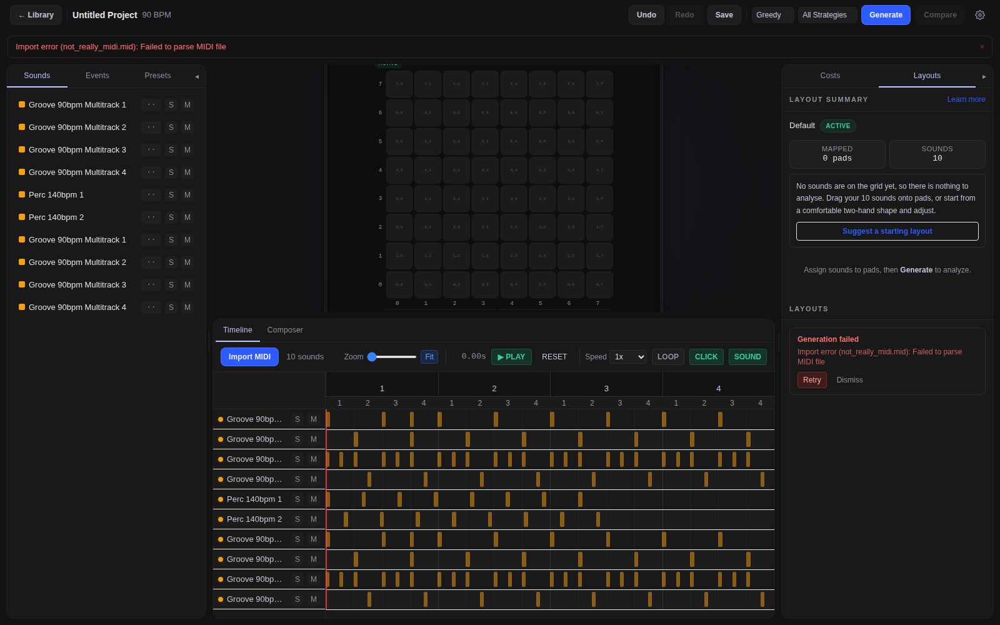

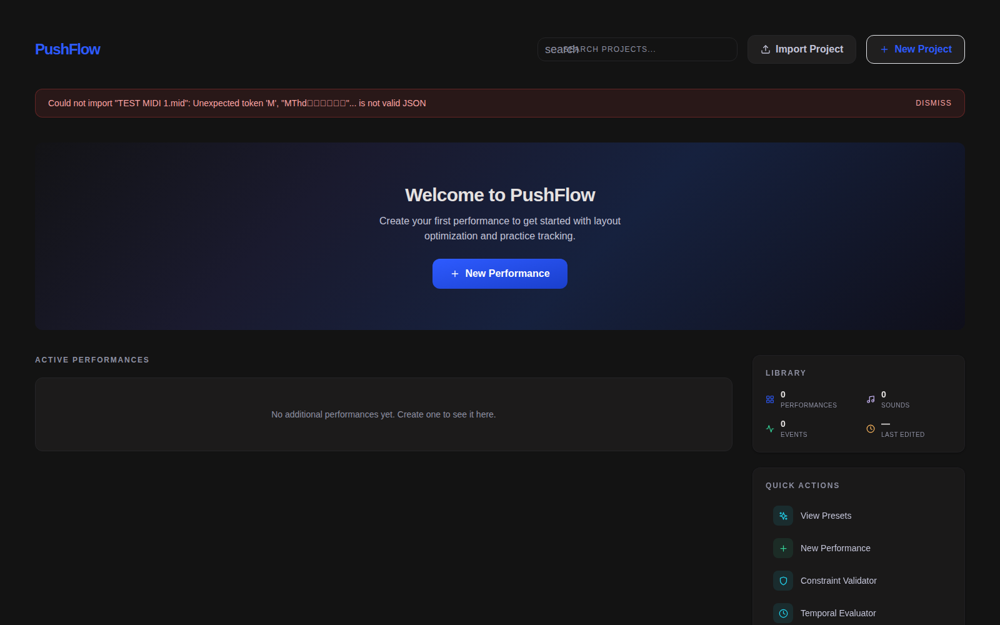

### 3.2 F2 · Manually arranging sounds on the grid

**Health: Rough** — Dragging and swapping sounds works. The things that make experimenting safe do not: Undo, locks, and protection for the draft.

**What the user is trying to do.** Place and rearrange sounds by hand until the layout suits their hands. They want to pin some sounds and note finger preferences, trusting Undo and Discard to get them back.

**How it works today.**
1. After import, the Sounds tab lists the sounds (on the test file, all "TEST MIDI 1 N" in one orange). Empty pads print "r,c" coordinates.
2. Drag a Sounds row onto a pad. The only cue is a thin blue border.
3. The first edit silently creates a Working/Test Layout. Promote, Save Variant and Discard then appear.
4. About a second later, auto-analysis adds finger codes, dimmed suggestion chips and a verdict.
5. Pad-to-pad drags move or swap. A row dropped on an occupied pad replaces that pad's sound.
6. The right-click menu holds Remove, "Lock to this pad" and "Finger Constraint". Finger preference can also be set via the "··" chip or the Hand buttons.

#### What works well
- Drags place and swap sounds reliably. A sound can occupy only one pad, so re-dropping it moves it rather than duplicating it.
- Edits start a Working/Test Layout automatically, and the commit buttons appear only then, as the canon requires.
- Fingerings appear on the pads, the Sounds rows and the timeline about a second after each drop, with no button press.
- "Suggest a starting layout" runs only on request, so there is no automatic layout.

#### What doesn't work well
- **Critical** — The right-click menu is drawn *inside* the shrunken grid, so it shrinks and crops with the grid, like a sticky note on a photo that gets resized. At 1600 and 1920 px it opens 430–700 px from the cursor and is cut off for every pad except the top-left one; only 1 of 7 pads could be locked. At 1366 px it is half-size. It is the only way to lock a pad, and it takes two Escape presses to close. Fix: render it at page level with a React "portal" (a component drawn outside its parent box), as Learn More does, and add a lock toggle in each Sounds row. [T06](UI_ISSUE_REGISTER.md#t06)
- **Critical** — Generate, "Preview", a click on a candidate card, Load Draft, and Promote on a candidate or variant all overwrite a hand-made draft without warning. Autosave saves the replacement within about 2.5 s. Fix: show candidates read-only, and ask before replacing unsaved work. [T01](UI_ISSUE_REGISTER.md#t01)
- **High** — Undo is unreliable: auto-analysis records each result as an undo step, so presses more than a second apart never bring the layout back, and Redo keeps getting wiped. Suggest is never recorded, and undoing Discard takes two presses. A quick Undo after Generate can freeze the app on "Analyzing…". Fix: Undo should record layout changes only. [T02](UI_ISSUE_REGISTER.md#t02)
- **High** — Locks are fragile:
  - Locking a pad blanks the analysis until the next edit.
  - Discard leaves an invisible "ghost" lock, and the next Generate uses it to pull the sound back to the abandoned pad.
  - Dropping a row on a locked pad silently deletes the lock.
  - Beam and Annealing delete all locks.

  Fix: locks should refuse edits, re-run analysis, be listed visibly, and be pruned on Discard. [T14](UI_ISSUE_REGISTER.md#t14), [T12](UI_ISSUE_REGISTER.md#t12), [T11](UI_ISSUE_REGISTER.md#t11)
- **High** — The grid is cropped. At 1366x768 pads are about 28 px and the top and bottom rows are cut off. At 1600 px the state badge is cut off, while the timeline keeps about 110 px of empty space. Fix: size the pads to the space available, and add a draggable divider. [T04](UI_ISSUE_REGISTER.md#t04)
- **High** — Pads are indistinguishable: every sound is the same orange and every name is truncated to "TEST M…". Fix: distinct colours and short labels. [T17](UI_ISSUE_REGISTER.md#t17)
- **High** — Clicking a dimmed suggestion chip and then clicking away saves the solver's guess as the user's own preference, and Discard doesn't undo it. Fix: commit only real edits. [T19](UI_ISSUE_REGISTER.md#t19)
- **Medium** — A row dropped on an occupied pad silently evicts its sound, with no preview or notice. Pressing Backspace while stepping through events deletes the selected event's pad. Fix: show a drag hint and an Undo toast. [T46](UI_ISSUE_REGISTER.md#t46), [T28](UI_ISSUE_REGISTER.md#t28)
- **Medium** — Discard and toolbar Promote act instantly (Promote accepts a 1-of-7 layout), while card Promote asks first. Fix: make both act at once and show a toast that says what changed, with Undo. [T31](UI_ISSUE_REGISTER.md#t31)
- **Medium** — Muting a sound freezes its pad, and Solo freezes every other pad. Fix: keep muted pads fully editable; mute affects only what you hear, and "Exclude from analysis" is a separate action. [T16](UI_ISSUE_REGISTER.md#t16)
- **Low** — Dropping a pad onto the list reorders the list, and a drag that ends where it started still creates a draft. [T46](UI_ISSUE_REGISTER.md#t46), [T14](UI_ISSUE_REGISTER.md#t14)

#### What's confusing
- **High** — Clicking a pad selects its first *event*. The grid dims, and a green "Feasible · All events playable" appears under "UNPLAY 22". That verdict is wrong whenever an event is selected. Fix: separate pad selection from event selection. [T28](UI_ISSUE_REGISTER.md#t28), [T07](UI_ISSUE_REGISTER.md#t07)
- **High** — Partly placed layouts look like failures. Unplaced sounds show as "cannot be played", in unplayable red, under "Infeasible". Fix: a neutral "not placed" style and a "3 of 7 placed" indicator. [T25](UI_ISSUE_REGISTER.md#t25)
- **Medium** — The draft state has three different labels, nothing shows what changed compared with Active, and a promoted layout is still named "Default (draft)". Fix: one persistent state bar. [T03](UI_ISSUE_REGISTER.md#t03), [T32](UI_ISSUE_REGISTER.md#t32)
- **Medium** — There are three finger-preference controls, each with its own notation. None can express "left hand, any finger". Fix: one shared, soft control. [T19](UI_ISSUE_REGISTER.md#t19)
- **Low** — The copy says "Generate to analyze", but analysis is already automatic. [T44](UI_ISSUE_REGISTER.md#t44)

#### What's missing
- **Medium** — Click-to-place (select a row, then click a pad) and keyboard access to the pads are both missing. [T62](UI_ISSUE_REGISTER.md#t62)
- **Medium** — The Sounds list has no hit counts, no "n of 7 placed", and no Unplaced/Placed/Locked filters, though the canon lists them. [T45](UI_ISSUE_REGISTER.md#t45)
- **Low** — Multi-pad select, group move and left↔right mirroring are missing. [T46](UI_ISSUE_REGISTER.md#t46)

#### What's unnecessary (remove, hide, or demote)
- **Low** — A dead "Organize by 4x4 Banks" toggle and cost-model controls sit among the view toggles. [T39](UI_ISSUE_REGISTER.md#t39)
- **Low** — Every empty pad prints a coordinate, and pad positions appear in four 0-indexed formats. [T43](UI_ISSUE_REGISTER.md#t43)

#### What good looks like
It should feel like building a Drum Rack in Ableton: every pad has its own colour and name, you drag or click a sound onto a pad, and Cmd+Z undoes exactly your last move. A bar above a properly sized grid says "Working/Test Layout · 3 changes vs Active", and Promote and Discard act at once and show a toast with Undo. Clicking a pad opens a small inspector with a soft finger preference, a lock that holds, and Remove, without dimming the grid. Generate and Preview never touch your draft.

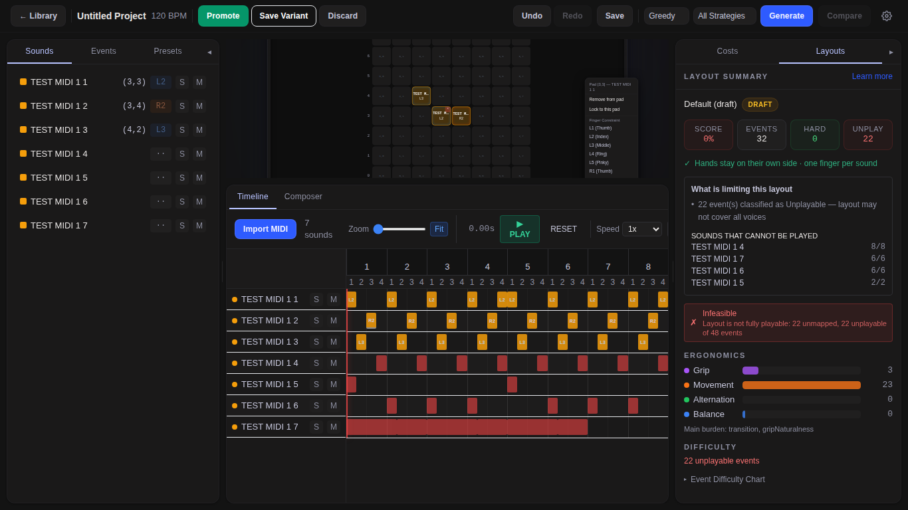

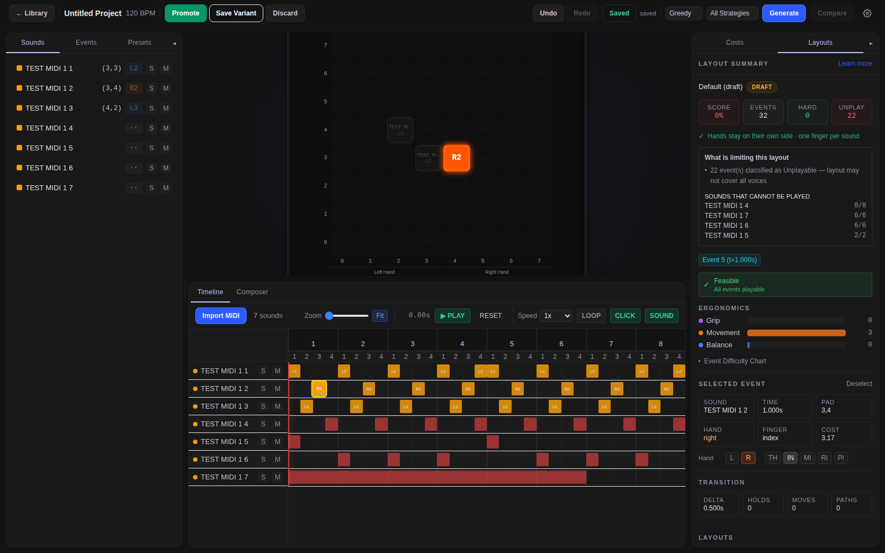

### 3.3 F3 · Automatically arranging sounds (Suggest + Generate)
**Health: Broken** — Suggest and Greedy produce sensible layouts, but Generate overwrites the user's draft without asking, Beam and Annealing ignore locks, and Undo can't recover the lost work.

**What the user is trying to do.** Get sounds onto the grid fast, or improve an existing arrangement: see genuinely different alternatives, keep pinned sounds in place, and choose deliberately, always knowing what is theirs, what is proposed and what is committed.

**How it works today.**
1. On an empty grid, **Suggest a starting layout** places every sound as a DRAFT in one click.
2. Optionally, right-click a pad → **Lock to this pad**.
3. Choose a method in the unlabeled toolbar select (Greedy + strategy, Beam, or Annealing + Quick/Thorough/Auto).
4. Click **Generate**. A run takes from 0.4 s (Beam) to about 23 min (Thorough).
5. 3–4 cards appear, and candidate #1 is copied into the Working/Test Layout automatically.
6. Cards show a mini grid, Score, Best for / Why / Tradeoff, **Preview** and **Promote**; Greedy adds an OPTIMIZATION TRACE.
7. Commit with card **Promote → Confirm?** or toolbar **Promote**, or tick two cards → **Compare (2)**.

#### What works well
- Greedy, the default, keeps locked sounds and their lock icons in place (independently confirmed).
- Suggest is a fast one-click start: on TEST MIDI 1 it scored 79%, with nothing hard or unplayable.
- Cards flag deal-breakers up front ("Rules relaxed", "N unplayable"). Delete and card Promote need a second click, and card Promote auto-saves the Active Layout it replaces.
- The Greedy trace is plain English ("Swap TEST MIDI 1 3 at (3,4) with …"), and each step replays on the grid with the alternatives considered.

#### What doesn't work well
- **Critical** — Generate silently replaces the Working/Test Layout with candidate #1. So do Preview, any click on a card, Load Draft, and card or variant Promote. Autosave stores it within about 2.5 s, so the hand-made layout is gone after a reload; edits made during a run are lost too. Fix: Generate only lists candidates, and Preview is read-only. [T01](UI_ISSUE_REGISTER.md#t01)
- **Critical** — Beam and Annealing ignore placement locks. A locked sound moved from (7,0) to (3,3), every lock was deleted, and nothing said so. Beam starts from a fixed template, not the current grid, so its output never depended on the user's arrangement. Thorough also appears to drop finger preferences (code reading only). Fix: start every method from the displayed layout and reject any candidate that breaks a lock. [T11](UI_ISSUE_REGISTER.md#t11)
- **Critical** — Pressed at a normal pace, Undo can't reverse Generate, Preview, Suggest or Promote. The automatic re-analysis after each change counts as its own undo step, so every Undo is re-recorded a second later, like a looper that overdubs whatever you just erased. Two fast presses after Generate leave the app stuck on "Analyzing…" until reload. Fix: keep analysis out of the undo history. [T02](UI_ISSUE_REGISTER.md#t02)
- **High** — Generating with a sound muted removes that sound from the layout, and the score looks better without it. Fix: keep muted sounds on their pads. [T15](UI_ISSUE_REGISTER.md#t15)
- **High** — The optimization trace, which CLAUDE.md requires, exists only for Greedy. It never gives a stop reason and vanishes after a promote, and its figures contradict themselves (a −44 step reads 86.51 → 88.22). Fix: a consistent trace and stop reason for every candidate. [T33](UI_ISSUE_REGISTER.md#t33)
- **High** — There's no progress, ETA or Cancel. Discard and Promote stay live and are overwritten when the run ends. The work also shares the thread that draws the screen, so the app lags. Fix: show "candidate 2 of 4 · ~8 s left", add Cancel, and lock conflicting actions. [T35](UI_ISSUE_REGISTER.md#t35)
- **Medium** — Toolbar Promote re-analyses the layout (4 of 7 fingers changed, 95% became 94%); card Promote keeps the reviewed fingering. Fix: one Promote action. [T13](UI_ISSUE_REGISTER.md#t13)
- **Medium** — After Generate, comparing Active with a candidate shows Active as an empty grid scoring 0 and labelled "easier". Stale ticks can also produce a self-compare, or a screen with no close button. Fix: evaluate Active properly. [T08](UI_ISSUE_REGISTER.md#t08)
- **Medium** — Candidates are buried in one long column; at 1366x768 only card #1's header is visible. Fix: give them their own tab. [T38](UI_ISSUE_REGISTER.md#t38), [T04](UI_ISSUE_REGISTER.md#t04)
- **Low** — Cards can't be reached by keyboard, targets are 16 px, and Beam/Annealing ignore the gear menu's cost toggles. Fix: real buttons, 24 px targets. [T63](UI_ISSUE_REGISTER.md#t63), [T34](UI_ISSUE_REGISTER.md#t34)

#### What's confusing
- **High** — The screen doesn't say what it's showing. Clicking the highlighted ACTIVE card leaves a candidate on the grid, and a promoted layout keeps "(draft)" in its name. Fix: add an Active | My draft | Candidate switcher. [T01](UI_ISSUE_REGISTER.md#t01), [T03](UI_ISSUE_REGISTER.md#t03)
- **High** — Different engines score before and after. The same layout reads "7 events need attention" as Greedy candidate #1 and "29" after promotion. On the cards, Score % and raw cost rank #3 and #4 in opposite orders, and every Tradeoff reads "balanced across all dimensions". Fix: use one scoring engine and one score relative to Active. [T21](UI_ISSUE_REGISTER.md#t21)
- **High** — The method choice is partly fake. Beam and Annealing/Quick run the same code and give identical results, and Quick claims "3000 iterations" that never ran. Thorough took about 23 min and still scored worse than a 20 s Greedy run (93% vs 95%). Fix: lead with outcomes (Quick / Deep); Greedy, Beam and Annealing stay available under Advanced. [T34](UI_ISSUE_REGISTER.md#t34)
- **Medium** — Every error, even a failed MIDI import, shows as "Generation failed" with a Retry that runs Generate. Fix: label errors by source. [T48](UI_ISSUE_REGISTER.md#t48)
- **Low** — An empty grid shows Suggest next to "Assign sounds to pads, then Generate to analyze", which mixes up Generate with Analyze. Fix: one next-step message. [T37](UI_ISSUE_REGISTER.md#t37), [T44](UI_ISSUE_REGISTER.md#t44)

#### What's missing
- **High** — Cards don't show what changed. The mini grid is colour-only (all orange here), with no names or lock marks. The engine computes what moved, but nothing displays it, and it compares against the draft, not Active. Fix: mark moved sounds and locks. [T26](UI_ISSUE_REGISTER.md#t26)
- **Medium** — Each Generate discards the previous candidates, and cards have no "Save as variant". Fix: add a Keep action. [T30](UI_ISSUE_REGISTER.md#t30)
- **Medium** — Suggest disappears once one sound is placed, so "fill in the rest around my kick and snare" isn't possible. Fix: "Place remaining N sounds". [T37](UI_ISSUE_REGISTER.md#t37)
- **Medium** — Beam/Annealing's three "alternatives" are one shape shifted up a row each time. Fix: drop near-copies and explain why. [T36](UI_ISSUE_REGISTER.md#t36)

#### What's unnecessary (remove, hide, or demote)
- **High** — Optimizer internals as the main UI: three unlabeled selects, names like "pose0-offset-0" or "Clustered M…" (cut off at 80 px), subtitles like "Greedy Motif-Preserving Greedy: 6 moves, cost 25.87", and always-zero trace counters. Fix: move them behind "Advanced"; demote, don't delete, since CLAUDE.md requires every method to stay available. [T34](UI_ISSUE_REGISTER.md#t34), [T33](UI_ISSUE_REGISTER.md#t33)

#### What good looks like
Generate should work like take lanes in a DAW: you can audition every take, and your comp stays untouched until you commit one. The draft stays on the grid while a cancellable "Find alternatives" (Quick / Deep) shows progress. Each card has a musician-facing name, one score against Active ("+16 vs Active, 0 hard moments"), highlighted moved sounds and "Keeps your 2 locks". Selecting a card previews it read-only under a banner ("Use as draft / Keep / Promote / Back to my draft"). Locks hold for every method, and each commit is one Undo step.

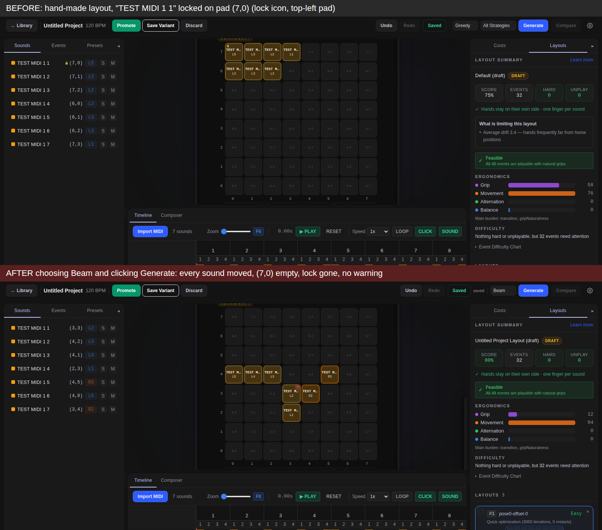

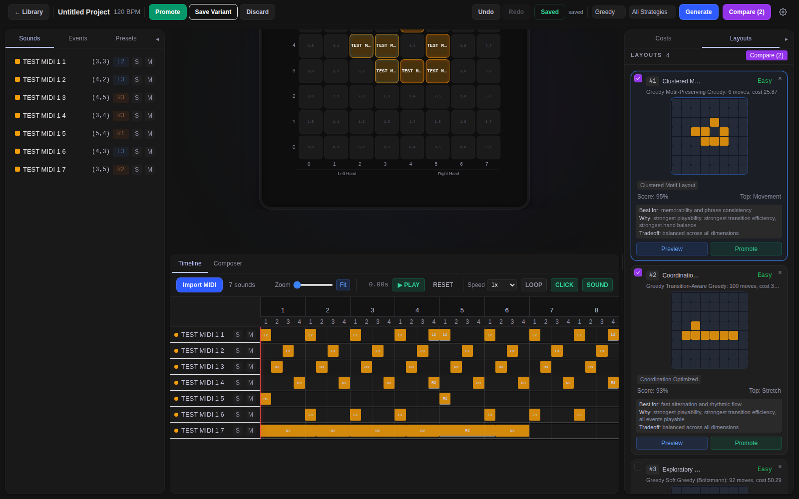

### 3.4 F4 · Viewing the performance on a layout (events, onion skin, transitions)

**Health: Rough** — You can step through moments and see which finger strikes which pad, but onion skin does nothing, "what comes next" is barely visible, and several inspector numbers are wrong.

**What the user is trying to do.** Step through the performance one moment at a time, see which pads each hand and finger strike and what moves next, and understand why a hard moment is hard.

**How it works today.**
1. Place sounds (or Generate / **Preview** a candidate); analysis runs automatically.
2. Open the left panel's **Events** tab: one row per moment (# / BEAT / COST / NOTES).
3. Select a moment: click a row or timeline note, or press ←/→ (↑/↓ in the list).
4. The grid colours struck pads by hand with a finger label ("L3") and greys everything else to 20%. Below it: "Transition preview: 0.500s to next event · 0 shared pads · 0 finger moves" and an **Arrows On/Off** toggle.
5. The timeline rings the notes at that time; the playhead stays put.
6. The right panel's **Layouts** tab shows a feasibility badge, factor bars, and **Selected Event** and **Transition** cards.
7. A 12px unlabelled icon in the Events header toggles onion skin; Esc deselects.

#### What works well
- Struck pads read instantly: bold "L3"/"R2", azure for left, orange-red for right.
- The timeline is honest: pills show hand+finger, and unplayable strikes are solid red, never hidden.
- Keyboard stepping works, and list and timeline scroll to follow.
- "Show Finger Assignment" shows the solver's fingering on every placed pad by default.
- Clicking a bar in the Event Difficulty Chart selects the correct moment.

#### What doesn't work well
- **Critical** — The onion skin toggle changes nothing: 0 pixels differ on all 32 moments at both window sizes. The 20% grey-out overrides the onion styling, yet Learn More still promises it. Exempt previous/next pads from the grey-out. [T09](UI_ISSUE_REGISTER.md#t09)
- **Critical** — **Preview** copies the candidate into the Working/Test Layout, silently overwriting the user's draft; autosave makes it stick and Undo can't reliably recover it. Make Preview read-only. [T01](UI_ISSUE_REGISTER.md#t01)
- **High** — An unplayable moment shows a green "Feasible · All events playable" badge above "Hand: Unplayable · Cost: Infinity". The per-moment view also drops Alternation (fast same-finger repeats, the commonest drum-layout problem). Show the real verdict and all five factors. [T07](UI_ISSUE_REGISTER.md#t07)
- **High** — Chord costs are multiplied by note count: row 01 reads 26.7 while its card says 8.89, because the list and chart add the moment cost once per note. Downbeat chords look hardest, sending players to the wrong spots. Count each moment once. [T22](UI_ISSUE_REGISTER.md#t22)
- **High** — The inspected moment silently jumps after re-analysis. Background analysis numbers each note, Generate numbers each moment, so after Generate one finger-preference click swaps plans and the same number points elsewhere (row 06 at 2.5 s became row 04 at 1.5 s). Select by moment start time. [T24](UI_ISSUE_REGISTER.md#t24)
- **High** — Played-in (unquantized) chords break selection: the list groups notes within 25 ms but the grid, timeline and ←/→ match exact times, so a 17 ms spread lights 1 of 3 pads. Group moments one way everywhere. [T24](UI_ISSUE_REGISTER.md#t24)
- **High** — With a moment selected, Play keeps the grid frozen on it, so strikes show as faint grey blips or not at all, even after Stop. Selecting doesn't move the playhead. Release the grey-out while playing and seek to the selection. [T10](UI_ISSUE_REGISTER.md#t10)
- **High** — At 1366x768 the grid gets ~210 px: rows are clipped (part of a selected chord can vanish) and the transition line falls off-screen. Make the drawer resizable (keeping the Composer tab) and size the grid to fit. [T04](UI_ISSUE_REGISTER.md#t04)
- **Medium** — Pad actions hijack inspection: Backspace removes the selected sound from the grid (a silent layout edit), and clicking a placed pad jumps to that sound's first hit. Keep inspection read-only. [T28](UI_ISSUE_REGISTER.md#t28)
- **Medium** — With a track muted, its notes reuse moment numbers, so clicking one jumps to an unrelated moment. Resolve every timeline click by moment time, so clicking any note, muted or not, selects its whole moment. [T24](UI_ISSUE_REGISTER.md#t24)
- **Medium** — Off-beat moments share labels (four 16th hats all read "1.1"); show bar.beat.16th. [T43](UI_ISSUE_REGISTER.md#t43)
- **Medium** — ←/→ wraps silently from the end to bar 1 while ↑/↓ stops; keys fire while the Speed dropdown has focus. Use one stepping rule and a shortcut sheet. [T61](UI_ISSUE_REGISTER.md#t61)
- **Low** — Clicks inside an expanded row don't select it; timeline finger labels are 7 px; hand is shown by colour only; pads aren't Tab-reachable. [T27](UI_ISSUE_REGISTER.md#t27), [T64](UI_ISSUE_REGISTER.md#t64)

#### What's confusing
- **Medium** — Struck pads lose their sound colour and name, leaving only "L3", so you can't link "L3" to "the snare". Keep a short name, add a hand ring, and dim the rest to about 45% without greying. [T09](UI_ISSUE_REGISTER.md#t09)
- **Medium** — List row 08 is labelled "Event 12 (t=3.500s)" in the right panel; gaps are in seconds while the list uses bars. Use "Event 8 · bar 2 beat 4" (label wording is decision Q7) and note values ("1/16"). [T24](UI_ISSUE_REGISTER.md#t24), [T43](UI_ISSUE_REGISTER.md#t43)
- **Medium** — Five finger notations ("L3", "L-1", "left/thumb", "TH IN MI", "L-MI") and three hand-colour schemes. Pick one of each. [T42](UI_ISSUE_REGISTER.md#t42)
- **Medium** — List colours use their own thresholds (a timeline "Medium" is green), and the moment card covers only a chord's first note, on the Layouts tab only. Use the plan's difficulty classes and list every strike. [T27](UI_ISSUE_REGISTER.md#t27)
- **Low** — The Events tab never names the layout it analyses; add a subject chip. [T03](UI_ISSUE_REGISTER.md#t03)

#### What's missing
- **High** — A usable "what comes next" view. Next pads get only a faint dashed border; arcs need one finger to move between pads, which the one-finger-per-sound rule almost never allows (0 of 32 moments). The Transition card uses developer notation ("L-MI — → 4,2 new"). Ghost next pads with finger labels and say it in words ("R2 repeats after 1/16"). [T09](UI_ISSUE_REGISTER.md#t09)
- **High** — No "why is this hard" and no jump to the next hard moment. The engine already writes plain-English explanations and ranks the hardest moments, but no screen uses them. Add a one-line verdict and Prev/Next hard. [T27](UI_ISSUE_REGISTER.md#t27)
- **Medium** — Rows don't say which sounds play; the names are computed but never shown. Add sound and finger chips. [T27](UI_ISSUE_REGISTER.md#t27)

#### What's unnecessary (remove, hide, or demote)
- The separate "Arrows On/Off" toggle: merge it with onion skin into one labelled "Now | Now + Next | Prev · Now · Next" control. [T09](UI_ISSUE_REGISTER.md#t09)
- The raw COST column and "Infinity" text: replace with the difficulty badge. [T27](UI_ISSUE_REGISTER.md#t27)

#### What good looks like
"Onion skin" comes from animation: the current drawing in full, the frames either side faintly underneath. The grid should do the same. Struck pads keep their sound name, with a hand ring and a finger badge. Next pads are ghosted with finger labels and arrows ("R2 · 1/8"), and the rest of the grid dims but stays readable. One moment number drives every panel. An inspector beside the grid names the layout, lists every strike, and gives a one-line verdict with all five factors. Selecting a moment moves the playhead, and pressing Play turns the grid into a live "now + next" view.

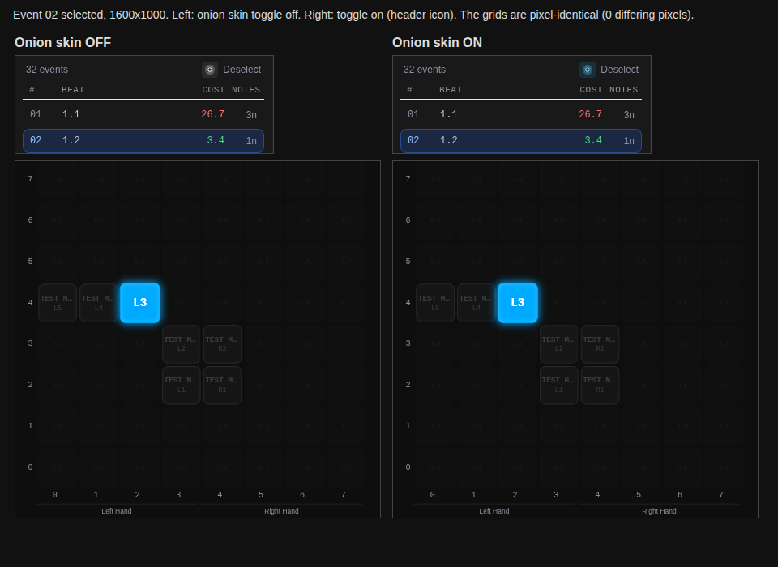

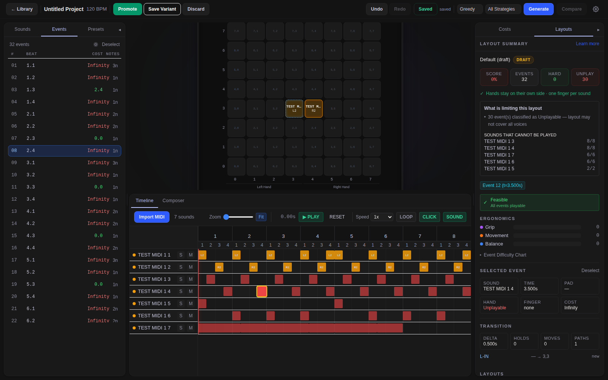

### 3.5 F5 · Analyzing costs and comparing layouts
**Health: Rough** — The analysis is layered well, but two key answers are wrong in common cases: the verdict turns green when you inspect a moment, and Compare shows the Active Layout as empty and zero-scored after every Generate.

**What the user is trying to do.** Learn whether the layout is playable and, if not, which sounds, moments and strains are to blame; then weigh it against the Active Layout, their draft or candidates before promoting or saving.

**How it works today.**
1. Place sounds. Analysis runs by itself about 1 s after the last edit; there is no Analyze button.
2. **Costs** tab: SCORE / EVENTS / HARD / UNPLAY tiles, a Feasibility banner, ERGONOMICS bars, "Main burden", a Difficulty line and a collapsed "Event Difficulty Chart".
3. **Layouts** tab: the same block plus "What is limiting this layout", then the Active card, candidate cards and the Optimization Trace.
4. **Generate** makes 4 candidates and applies #1 as the draft; **Preview** applies another.
5. Selecting an event switches the bars to that moment and adds an "Event N (t=…s)" chip.
6. **Compare**: tick the small box on 2+ cards, click "Compare (N)" to see two mini grids, tradeoff bars, "Affected sounds" and score cards with "Promote to Active".

#### What works well
- Verdict first, then ergonomics, then difficulty, in readable sentences ("All 32 events are playable with natural grips").
- No false all-clear: "Nothing hard or unplayable, but 7 events need attention".
- An empty grid reads as unfinished, and "Suggest a starting layout" waits for the user's click.
- "What is limiting this layout" names the unplayable sounds and where rules were relaxed.
- Candidate-vs-candidate Compare is correct, with shared diff outlines.

#### What doesn't work well
- **Critical** — Selecting any event turns the banner into a green "Feasible · All events playable" right under "UNPLAY 22". An unplayable moment shows Grip, Movement and Balance at 0, so it looks like the easiest hit in the song. Keep the layout verdict fixed; show the moment in its own card. [T07](UI_ISSUE_REGISTER.md#t07)
- **Critical** — Compare against Active, whenever the on-screen draft differs from it (every Generate does this), shows an empty grid, SCORE 0.0, "Easy", a green "UNPLAYABLE 0" and "Candidate A is 13% easier", A being Active. The true result is reversed (the candidate is 8% easier). Active is never analysed, so the modal fills in a placeholder of zeros (a "stub"). Analyse each side on demand. [T08](UI_ISSUE_REGISTER.md#t08)
- **High** — A chord's cost is counted once for every note in it, so a 3-note hit reads triple. Red Events rows and chart spikes mostly mark chords, like a meter reading hotter because more channels feed it; one moment reads "COST 4.04" in the chip but "Total 12.12" in the chart. Count each moment once. [T22](UI_ISSUE_REGISTER.md#t22)
- **High** — "Promote to Active" inside Compare ends on a "Not enough candidates to compare." panel with no × or Escape. Close with a confirmation. [T08](UI_ISSUE_REGISTER.md#t08)
- **High** — Clicking the Active card highlights it but keeps the draft on screen, and the numbers shift (95% → 94%) because a different solver re-scores the same pads. Show Active read-only. [T01](UI_ISSUE_REGISTER.md#t01)
- **Medium** — After Generate, muting, soloing or a tempo change leaves the panel on the old plan, and the "outdated" cue disappears. [T14](UI_ISSUE_REGISTER.md#t14)
- **Medium** — "Enlarge" opens the chart inside the narrow side panel and ignores Escape. [T06](UI_ISSUE_REGISTER.md#t06)
- **Low** — Overlays lack keyboard and dialog behaviour; Compare's grids are small, with Promote below the fold even at 1600 px. [T63](UI_ISSUE_REGISTER.md#t63), [T26](UI_ISSUE_REGISTER.md#t26)

#### What's confusing
- **High** — Four-plus score systems: "95%" and "95.1", "Easy", "Playability 87", "cost 25.87" (lower is better), "Per moment 0.374". Pick one headline, e.g. Playability 0–100, higher = easier. [T21](UI_ISSUE_REGISTER.md#t21)
- **High** — The five factors have 3–7 names each ("Stretch", "Grip", "gripNaturalness", "Grip Quality") and two colour schemes. Drive every surface, Learn More included, from one table. [T20](UI_ISSUE_REGISTER.md#t20)
- **High** — Compare lists sounds as raw ids (lane_1790…) and says "11 voices moved" for 7 sounds, because it counts pads. Use names and a per-sound move list. [T20](UI_ISSUE_REGISTER.md#t20)
- **Medium** — "Events" means notes in one line and moments in the next ("EVENTS 32" beside "37 events need attention"), and one moment is Event 10 or 16 depending on the surface. Label moments by bar and beat. [T23](UI_ISSUE_REGISTER.md#t23), [T24](UI_ISSUE_REGISTER.md#t24)
- **Medium** — A half-built layout (3 of 7 sounds) shows red "Infeasible, Score 0%". Say "3 of 7 sounds placed". [T25](UI_ISSUE_REGISTER.md#t25)
- **Medium** — The Costs tab never names the layout it describes, and Generate or Preview silently changes it. [T03](UI_ISSUE_REGISTER.md#t03)
- **Medium** — Bars scale to the layout's own largest factor (Movement 3, 14 and 92 all draw full width); the chart has no y values, no Hard/Medium lines and an axis of 0 / 16 / 31. Event rows turn red past a fixed number, even when the summary says "Nothing hard". [T40](UI_ISSUE_REGISTER.md#t40), [T27](UI_ISSUE_REGISTER.md#t27)
- **Medium** — In testing, all four candidate cards said "Easy" and "balanced across all dimensions", under headers like "Greedy Soft Greedy (Boltzmann): 92 moves", so they don't help you choose. [T34](UI_ISSUE_REGISTER.md#t34)
- **Low** — In Compare, blue/purple mean both "layout A/B" and "left/right hand". [T42](UI_ISSUE_REGISTER.md#t42)

#### What's missing
- **High** — No baseline deltas outside Compare: cards never say "+16 vs Active" or "3 sounds moved", and Compare can't include the draft or Saved Variants. [T26](UI_ISSUE_REGISTER.md#t26)
- **Medium** — Compare omits the five canonical factors and Hard/Unplayable deltas. [T26](UI_ISSUE_REGISTER.md#t26)
- **Medium** — "N events need attention" is plain text, with no way to step through those moments. [T27](UI_ISSUE_REGISTER.md#t27)
- **Medium** — Learn More doesn't explain SCORE %, HARD or UNPLAY, uses terms like "Fitts's Law", and opens only from Layouts. [T41](UI_ISSUE_REGISTER.md#t41)

#### What's unnecessary (remove, hide, or demote)
- **Medium** — Costs and Layouts duplicate the analysis in two code copies, each missing parts of the other. Merge them. [T38](UI_ISSUE_REGISTER.md#t38)
- **Medium** — The gear's cost toggles don't affect the main panel, and "Calculate Cost" adds yet another number system. Move them to the Analysis header as "Custom weighting" with Re-analyse, and mark the analysis stale when they change. [T39](UI_ISSUE_REGISTER.md#t39)
- **Low** — Optimizer figures on cards belong behind a link to the trace (which stays). [T34](UI_ISSUE_REGISTER.md#t34)

#### What good looks like
One Analysis panel names its subject ("Candidate #2 vs Active") and leads with one Playability score plus Hard/Unplayable counts, counted in moments. Below it sit a plain verdict, the sounds that limit the layout, and five consistently named factors on a fixed "lower = easier" scale. Selecting a moment opens its own card and never touches the layout verdict. Every layout shows its change versus Active, and Compare takes any two layouts, always analysed, with a "moved / better / worse" table. Think of a mastering plugin's A/B switch: the same meters on both sides, and the reference is never a muted channel.

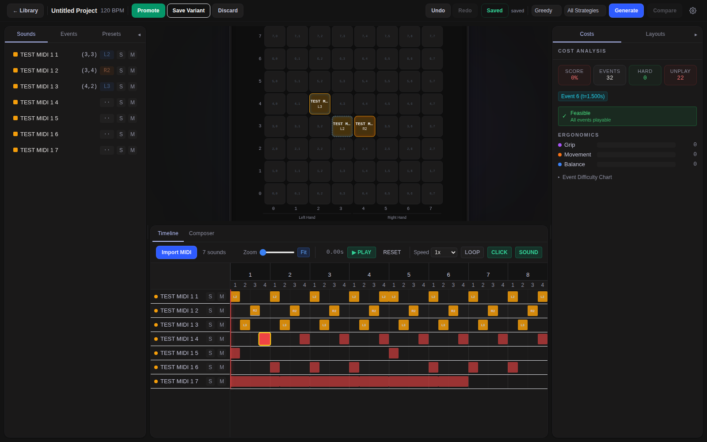


### 3.6 F6 · Saving and loading performances
**Health: Rough** — Autosave keeps work safe in normal use, but the Library misrepresents what's saved, every project is "Untitled", and there's no safety net when a save fails, Undo misfires or a project is deleted.

**What the user is trying to do.** Trust that a song's work is kept automatically, find it again, see its state at a glance, and back it up or recover from mistakes.

**How it works today.**
1. **New Project** (or **New Performance**) immediately saves an empty "Untitled Project" and opens the editor.
2. **Import MIDI** (Timeline) adopts the file's tempo, not its name. To rename, click the title text.
3. Each change flips the toolbar button to **Save**, then **Saving...** after 2 s idle, then green **Saved**. **← Library** and closing the tab also save.
4. Layouts, Sounds, lanes and finger preferences are saved; analysis, candidates and the optimization trace are not.
5. The Library shows the last-written project in a big **CURRENT SESSION** banner, the "hero" (**Resume Session** and **Open Layout Editor** do the same thing) with a mini grid of the Active Layout. Other projects are cards.
6. Hovering a card reveals Export (`.pushflow.json`) and an X (browser confirm, permanent delete). **Import Project** accepts `.json` only.

#### What works well
- **Autosave is dependable in normal use.** A rename survived closing the tab 300 ms later.
- **The draft has its own saved slot.** Reopening restores the Working/Test Layout without touching the Active Layout. (CLAUDE.md's default says drafts are session-only; reviewers suggest updating the default, not the code.)
- **Promote keeps the old baseline** as a "(replaced <date>)" variant.
- **Robust basics.** A corrupt record becomes a placeholder; import never overwrites an existing project.
- **Analysis isn't saved as truth** (per canon), so reopened projects never show old figures as current.

#### What doesn't work well
- **Critical** (cross-flow) — Autosave makes silent draft overwrites permanent. When Generate, **Preview** or a candidate-card click replaces a hand-made draft, "Saved" appears within ~2.5 s. A reload then brings back the candidate, not the user's layout. Snapshot the draft before replacing it. [T01](UI_ISSUE_REGISTER.md#t01)
- **High** — Undo turns on by itself ~3 s after a project opens. Pressing it wipes the analysis with 7 pads still mapped. A second later analysis re-runs, re-records itself and clears Redo, so at normal pace Undo can't revert edits anywhere. Keep automatic analysis out of the undo history. [T02](UI_ISSUE_REGISTER.md#t02)
- **High** — Every project is "Untitled Project". Rename is plain title text hinted only by a hover underline, search matches names only, and every export is `Untitled_Project.pushflow.json`. Name the project after the first MIDI file, as already happens for tempo. [T51](UI_ISSUE_REGISTER.md#t51)
- **Medium** — Storage problems are invisible. With storage full (simulated), clicking Save still flashed a green "Saved". With storage blocked, the Library looks as if every project were deleted and **New Project** silently does nothing. Show a red "Couldn't save — Retry / Export a copy". [T57](UI_ISSUE_REGISTER.md#t57)
- **Medium** — Edits can be silently lost. A rename or pad drop in the ~2 s before a reload reverts, with no unsaved-changes warning. Two tabs on one project overwrite each other (like two people handing in edited copies of one setlist: the last one in wins), and both say "Saved". Save one-off actions (rename, promote) immediately; detect tab conflicts. [T57](UI_ISSUE_REGISTER.md#t57)
- **Medium** — Delete is a hover-only X 6 px from Export, and it's permanent. Neither is on the hero and the editor has no Export, so the current project is the hardest to back up. Icons come from a font downloaded from the web and render as words ("downloclose") when it fails. Use a "..." menu everywhere and make delete undoable briefly. [T53](UI_ISSUE_REGISTER.md#t53)
- **Medium** — Cards can't be opened from the keyboard, Tab stops on invisible buttons, and title and BPM need a mouse. [T63](UI_ISSUE_REGISTER.md#t63)
- **Low** — Re-importing a backup piles up identical "(imported)" copies; the hero fills a 1366x768 screen, with no sort or list view; BPM silently clamps (5 becomes 20). [T53](UI_ISSUE_REGISTER.md#t53), [T55](UI_ISSUE_REGISTER.md#t55), [T49](UI_ISSUE_REGISTER.md#t49)

#### What's confusing
- **High** — Draft work looks empty in the Library. Edits, Suggest and Generate write to the Working/Test Layout, but thumbnails draw only the Active Layout. A 7-pad draft shows as a blank grid, so users conclude their work was lost; previews also clip the bottom pad row, where Push's drum layout starts. Show the layout they'll land on, with a "Draft — not promoted" badge. [T52](UI_ISSUE_REGISTER.md#t52), [T55](UI_ISSUE_REGISTER.md#t55)
- **Medium** — "Current Session" just means "last written". Importing, or just viewing a project and clicking **← Library** (which re-saves unchanged work), makes it the hero, "Last edited Just now". An abandoned New Project does too, and then can't be deleted. Track "last opened" separately; skip unchanged saves. [T52](UI_ISSUE_REGISTER.md#t52)
- **Medium** — One object has five names (Project, Performance, Add Performance, ACTIVE PERFORMANCES, Session). "Active" collides with "Active Layout", and the copy promises "practice tracking", which doesn't exist. Use "Project" everywhere, per canon. [T56](UI_ISSUE_REGISTER.md#t56)
- **Medium** — Candidates and the trace vanish on leaving, without warning. The top candidate survives as the draft; the alternatives don't. Label them temporary and ask "Keep any as variants?" on leave. [T30](UI_ISSUE_REGISTER.md#t30)

#### What's missing
- **Medium** — Cards break the CLAUDE.md Library rule. There's no bar length, created date or last-visited date, and no layout status (draft badge, variant count, last-known playability). [T52](UI_ISSUE_REGISTER.md#t52)
- **Medium** — The Library can't start from MIDI or open a demo, both canon features. Picking a `.mid` in **Import Project** gives "Unexpected token 'M'... is not valid JSON". [T51](UI_ISSUE_REGISTER.md#t51)
- **Medium** — Saved Layout Variants can't be named or renamed. **Save Variant** always makes "Default variant". Ask for a name on save. [T29](UI_ISSUE_REGISTER.md#t29)

#### What's unnecessary (remove, hide, or demote)
- **Medium** — The Library sidebar is mostly developer tools and vanity stats: **Constraint Validator**, **Temporal Evaluator**, a duplicate **New Performance**, and totals such as "175 sounds, 1200 events". Move the tools behind a developer link, keeping their routes. [T54](UI_ISSUE_REGISTER.md#t54)
- **Medium** — The doubled save indicator (a **Saved** button plus a "saved" label) flickers on every edit and looks like something to press. Cmd/Ctrl+S opens the browser's "Save page as". Use one quiet status and map Cmd+S. [T57](UI_ISSUE_REGISTER.md#t57)

#### What good looks like
The Library should work like a record crate where every sleeve shows what's inside. A slim **Continue** strip shows the last-opened project, named after its MIDI file, with the layout you'll land on and a status such as "Draft pending · 7 pads". Cards list bars, events, BPM, dates and variants, with a "..." menu for Rename, Export and an undoable Delete. Dropping a `.mid` starts a project, which is saved only once it has content. In the editor, a quiet "All changes saved" turns red with Retry on failure, and Undo steps only through your own actions.

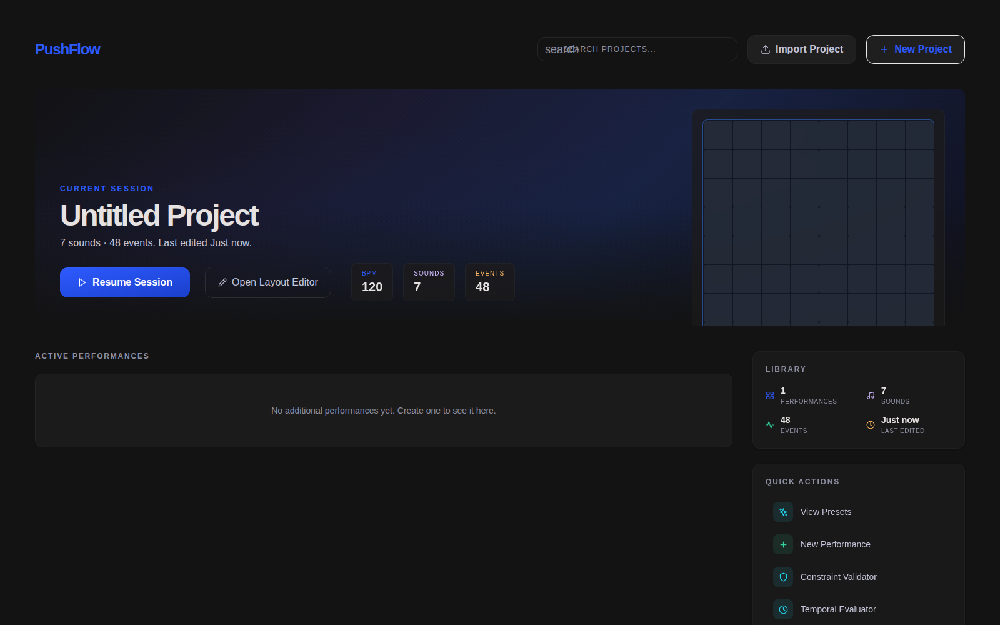

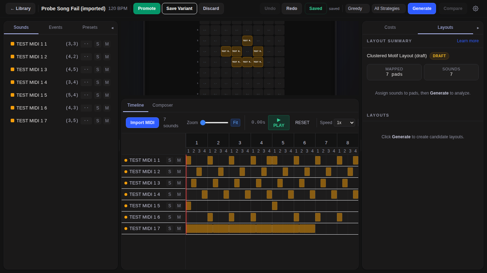

### 3.7 F7 · Rehearsing a performance
**Health: Rough** — Play, click, speed and loop exist, but the grid often shows the wrong moment, the toggles fall off-screen on a laptop, and nothing links a hard passage to practising it.

**What the user is trying to do.** Practise a layout: hear the groove with a click, slow down and loop a hard passage until it is clean, and watch the grid to see which pad and finger comes next, without changing the analysis by accident.

**How it works today.**
1. Get Sounds onto the grid (drag, "Suggest a starting layout" or Generate).
2. Keep the bottom drawer on the **Timeline** tab; the transport lives only there.
3. Use **▶ PLAY / ⏹ STOP**, **RESET** (back to 0.00s) and a seconds readout.
4. Set **Speed** (0.25x–1.5x) and the **LOOP**, **CLICK** and **SOUND** pills.
5. Drag across the bar-number ruler to set a loop region; a plain click seeks.
6. While playing, struck pads flash for about 90 ms in their hand colour, labelled with a fixed finger ("L2").
7. Optionally press **S**/**M** on a lane to solo or mute, which also re-runs the analysis.

#### What works well
- Real rehearsal audio by default: an accented metronome and a distinct voice per Sound.
- Speed is rehearsal-only and says so; the project tempo is untouched.
- The timeline follows the playhead when zoomed, and ruler clicks seek without stopping.
- Pad flashes track the strike, not the note length, so the grid shows rhythm.
- Muted lanes stay drawn, dimmed, in the timeline.

#### What doesn't work well
- **Critical** — With any event selected (the normal state after using the Events tab or a timeline note), PLAY leaves the grid frozen on that moment: other pads grey out, strikes become faint grey blips or vanish, and the Costs panel keeps describing the selected event. It is a karaoke screen stuck on one line while the song plays on. Reproduced live: the playhead ran 0–1.84 s while the grid stayed on the 4.0 s moment, and the freeze survives STOP and RESET; only Escape or "Deselect" clears it. Fix: while playing, follow the playhead, not the selection. [T10](UI_ISSUE_REGISTER.md#t10)
- **High** — At 1366×768, LOOP, CLICK and SOUND sit past the panel edge and can't be clicked; at 1600×1000 an active loop clips "✕ REGION" to "REGIC". Fix: a compact transport row in priority order. [T05](UI_ISSUE_REGISTER.md#t05)
- **High** — The grid is too small to follow. At 1366×768 pads are 28 px, the top and bottom rows are clipped and finger labels are about 5 px, while the timeline wastes about 100 px under its lanes. Even at 1600 the Working Draft/Active badge is cut off. Fix: fit the whole grid, add a draggable divider and a Practice view. [T04](UI_ISSUE_REGISTER.md#t04)
- **High** — Audio is fired on each screen redraw (about every 16 ms) instead of being booked ahead on the audio clock. Clicks wobble by 15–35 ms, and after a stall the skipped hits fire at once: an 806 ms silence, then a cluster, when Generate ran mid-take. Fix: schedule sounds about 100 ms ahead, and skip missed ones. [T58](UI_ISSUE_REGISTER.md#t58)
- **High** — Loop regions don't snap. A drag from the bar-2 line gave "Loop 2.03s – 5.95s", missing the downbeat and not a whole number of beats, so every repeat stumbles. Fix: snap to bars by default. [T58](UI_ISSUE_REGISTER.md#t58)
- **High** — Space doesn't play or stop. On the page it does nothing; after clicking LOOP it switches LOOP off. Fix: a global Space shortcut. [T61](UI_ISSUE_REGISTER.md#t61)
- **Medium** — The loop isn't DAW-like. LOOP off still loops forever; after a wrap the opening chord at 0.00 s is silent while its pads flash; and the drag ends if the pointer leaves the 40 px ruler (the tooltip also wrongly says "shift-drag"). Fix: LOOP off plays once, include the loop start, keep the drag alive. [T58](UI_ISSUE_REGISTER.md#t58)
- **Medium** — Opening the Composer tab silently freezes playback, and the Composer has its own separate Play. Fix: one transport above the drawer, keeping the Composer tab. [T60](UI_ISSUE_REGISTER.md#t60)
- **Low** — Position shows in seconds (sometimes "-0.00s") while the ruler uses bar.beat; RESET ignores the loop start; loop and speed are forgotten between sessions. [T43](UI_ISSUE_REGISTER.md#t43), [T58](UI_ISSUE_REGISTER.md#t58)

#### What's confusing
- **Medium** — Mute and Solo change the analysis, not just what you hear. Soloing one sound re-analyses a one-sound performance ("Score 100%", "Comfortable throughout"), and each press is an undo step and an autosaved change. It is deliberate in the code, but nothing on screen says "analysing 1 of 7 sounds". Fix: audio-only mute/solo, plus a labelled "Exclude from analysis". [T15](UI_ISSUE_REGISTER.md#t15)
- **Medium** — On/off states are unclear: idle PLAY is the same green as CLICK/SOUND when on, off is grey on grey, and an engaged Solo has no style. Fix: one icon-toggle style. [T64](UI_ISSUE_REGISTER.md#t64)
- **Medium** — The key information is the smallest text: 7 px timeline finger labels, pad names cut to "TEST M…", hand colours that differ between grid and timeline, and one orange for every imported Sound. [T64](UI_ISSUE_REGISTER.md#t64)
- **Low** — The "SOUND" pill collides with the canonical noun Sound, and rehearsal voices are random blips unrelated to the part. [T56](UI_ISSUE_REGISTER.md#t56), [T59](UI_ISSUE_REGISTER.md#t59)

#### What's missing
- **High** — No path from a hard event to practising it. Selecting an event doesn't move the playhead, and no Events row, selected-event card or difficulty chart offers "Rehearse" or "Loop this". Fix: a Rehearse action that sets a bar-snapped loop, a practice speed and a count-in. [T10](UI_ISSUE_REGISTER.md#t10)
- **Medium** — No look-ahead: the grid flashes only at the moment of the hit, too late to guide your hands. Fix: ghost the next moments with finger labels. [T09](UI_ISSUE_REGISTER.md#t09)
- **Medium** — Pausing leaves the grid blank, so "stop and check your hands" doesn't work. Fix: when stopped, show the moment at the playhead. [T10](UI_ISSUE_REGISTER.md#t10)
- **Medium** — No count-in, although the project data already holds an unused count-in setting. [T59](UI_ISSUE_REGISTER.md#t59)
- **Low** — No volume or click balance, no pad audition, no hands-separate practice, no speed trainer. [T59](UI_ISSUE_REGISTER.md#t59), [T58](UI_ISSUE_REGISTER.md#t58)

#### What's unnecessary (remove, hide, or demote)
- Import MIDI and Zoom crowd the transport row and push the rehearsal toggles off-screen. [T05](UI_ISSUE_REGISTER.md#t05)
- The Composer's second Play: drive the one transport or relabel it "Preview pattern". [T60](UI_ISSUE_REGISTER.md#t60)

#### What good looks like
A persistent transport bar sits above the drawer at every window size, with Play/Stop on Space, a bar.beat position, Speed, Count-in and clear icon toggles. From any hard moment the player clicks Rehearse, and PushFlow loops that bar at a practice speed after a count-in. While playing, the grid follows the playhead: the struck pad lights with a large "L2", and the next moments show as ghost outlines, like a rhythm game's note highway. LOOP off plays once, and listening never changes the analysis.

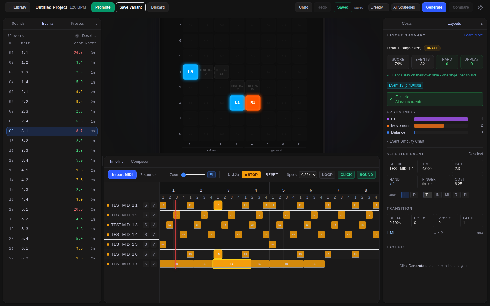

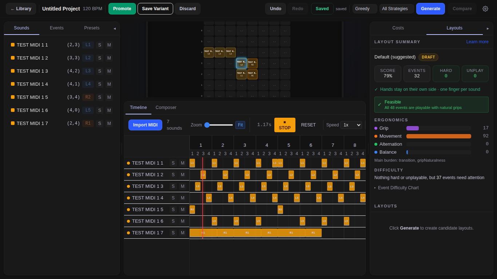

### 3.8 F8 · Managing Sound identity
**Health: Rough** — Rename, recolor and select-to-highlight work. But identity isn't stable: every imported sound looks the same, muting changes what gets analyzed, sounds that share a pitch get merged, and finger preferences drift out of sync.

**What the user is trying to do.** Turn an imported file's raw pitches into sounds they recognize at a glance (Kick, Snare, Hat). Each gets a name and a distinct color, and optionally a group and a finger preference. They want to audition with mute/solo without secretly changing what gets analyzed, generated or placed.

**How it works today.**
1. **Import MIDI** creates one Sound per pitch. The sounds are named 'TEST MIDI 1 1'…'7', and all are amber.
2. Each **Sounds** row has a 10px swatch, the name, the pad position '(r,c)', a finger chip, and **S**/**M** buttons.
3. Double-click a name to rename it. Click the swatch to choose from 16 unlabeled colors.
4. Clicking a row highlights its pad and lane. Ctrl/Shift-click selects several rows, then **Ctrl/Cmd+G** groups them.
5. To set a finger preference, type L1–R5 into the chip, or right-click a pad and use **Finger Constraint**.
6. **S**/**M** solo and mute. Muted sounds also drop out of analysis, **Suggest** and **Generate**.
7. Placing, unplacing and locking are done only on the grid. There is no search, filter or delete.

#### What works well
- Selecting a row highlights that sound's pad and its timeline lane.
- Placing a sound is a direct drag from the row to a pad, and the row shows the position immediately.
- Muted sounds stay visible and really go silent, so the timeline keeps every stream.
- The optimization trace names sounds, not internal IDs.

#### What doesn't work well
- **High** — Sounds that share a MIDI pitch are merged. When a sound has no pad, the engine falls back to any pad with the same pitch (a *fallback* is a second-choice lookup). After TEST MIDI 1 was imported twice, only 7 of 14 sounds were placed, yet the result read 'All 96 events are playable'. This breaks Invariant #5. Match sounds to pads by identity only. [T18](UI_ISSUE_REGISTER.md#t18)
- **High** — Mute and Solo silently narrow the analysis. Muting one sound raised the score from 79% to 80%, and soloing one reported 'All 2 events are playable'. Generate then leaves muted sounds out, so Promote can commit a layout that is missing a sound. Split listen-only S/M from an explicit "Exclude from analysis". [T15](UI_ISSUE_REGISTER.md#t15)
- **High** — The finger preference on screen isn't the one being analyzed. Set L5 in a draft and press **Discard**: the chip and pad still show L5, but the plan uses R2, because Discard doesn't refresh the layout's copy of the preferences. Refresh on every layout switch, and show 'R2 · pref L5'. [T12](UI_ISSUE_REGISTER.md#t12)
- **High** — Clicking a faded suggestion chip and then clicking away pins the suggestion as your preference. On an Active Layout it even forks a Working/Test draft. Save only on Enter or an explicit pick. [T19](UI_ISSUE_REGISTER.md#t19)
- **High** — Undo takes 2–3 presses per rename, recolor or mute, and the first presses do nothing visible. Redo is then wiped. Row clicks also use up undo steps (live repro C4 confirms undo is unreliable). [T02](UI_ISSUE_REGISTER.md#t02)
- **High** — Imported sounds are indistinguishable: all amber, all 'TEST MIDI 1 n', every pad 'TEST M…'. The code has a distinct color palette that import ignores. Assign distinct colors and add a quick rename pass. [T17](UI_ISSUE_REGISTER.md#t17)
- **High** — Compare lists 'Affected sounds' as internal IDs ('lane_1790132122139_xv1rsk…'), and says '9 voices moved' in a 7-sound project, just as the user decides between layouts. Show 'Kick (3,3) → (4,2)'. [T20](UI_ISSUE_REGISTER.md#t20)
- **Medium** — Grouping overwrites colors the user picked: blue and green both turned red on Ctrl+G. [T45](UI_ISSUE_REGISTER.md#t45)
- **Medium** — Solo isn't DAW-like. S never lights up, M does nothing during a solo, and un-soloing wipes earlier mutes. A muted sound's pad can't be moved, locked or removed, and nothing says why. [T16](UI_ISSUE_REGISTER.md#t16)
- **Medium** — Dragging a pad onto the Sounds list reorders the list instead of unplacing the sound. [T46](UI_ISSUE_REGISTER.md#t46)
- **Medium** — Pad labels cut off the end of names ('Closed Hat 1' and 'Closed Hat 2' both read 'Closed…'). Rename is double-click only, and rows can't be reached by keyboard. [T17](UI_ISSUE_REGISTER.md#t17)
- **Low** — Controls are tiny and unlabeled (10px swatch, unnamed colors, S/M with no pressed state) [T64](UI_ISSUE_REGISTER.md#t64). Sound selection uses the same blue as the 'next event' marker [T42](UI_ISSUE_REGISTER.md#t42).

#### What's confusing
- **Medium** — Renaming, recoloring or grouping shows 'ANALYSIS OUTDATED' and re-runs the solver, although none of them can affect playability. Users learn to ignore the warning. [T14](UI_ISSUE_REGISTER.md#t14)
- **Medium** — The list mixes grouping with placement. 'Not placed' shows only as a missing '(r,c)'. Once groups exist, the remaining sounds split into 'Unassigned' (unplaced) and 'Ungrouped' (placed). Add a 'Not on grid' pill and a count header. [T45](UI_ISSUE_REGISTER.md#t45)
- **Medium** — The finger chip shows only the sound's first assignment, accepts only typed L1–R5, and silently ignores 'R6'. Offer a two-hand picker with 'Auto'. [T19](UI_ISSUE_REGISTER.md#t19)
- **Low** — Pad positions start at 0 and are written four ways: '(3,3)', '3,3', '[3,3]', 'Pad [3,3]'. [T43](UI_ISSUE_REGISTER.md#t43)

#### What's missing
- **Medium** — The canon's assigned/unassigned/locked filter, a search box, and row actions to lock or unplace a sound. Locking only exists in the pad's right-click menu. [T45](UI_ISSUE_REGISTER.md#t45)
- **Medium** — No way to delete a sound or remove an imported file. Import only appends, so an accidental re-import doubles the kit with identical copies. [T47](UI_ISSUE_REGISTER.md#t47)
- **Medium** — The Events list and candidate mini-grids never name their sounds, though that data already exists. [T27](UI_ISSUE_REGISTER.md#t27)
- **Medium** — Grouping is half-built: it can only be done by multi-select plus Ctrl+G, the delete × never appears, and the timeline ignores groups entirely. [T45](UI_ISSUE_REGISTER.md#t45)

#### What's unnecessary (remove, hide, or demote)
- **Low** — S/M appear twice per sound (Sounds row and timeline header); keep them only in the Sounds row, and let lane headers select their Sound. Unused lane components (*dead code*: code nothing calls) already contain the missing search and filter. Reuse that logic, then delete them. [T45](UI_ISSUE_REGISTER.md#t45)

#### What good looks like
After import, each sound gets its own high-contrast color and you land in a quick rename pass: type 'Kick', Tab, 'Snare'. The Sounds header reads '7 sounds · 3 on grid · 1 locked', with search and filters. Each row works from the keyboard and has a clear 'Auto L2' or 'Pinned L2' chip, a lock toggle, and Unplace, Exclude and Delete actions. S/M affect listening only; excluding a sound from analysis is deliberate and badged. The same name and color show up everywhere, and one Undo reverses one edit. Like a DAW track list: name and color a track once and it looks the same in every view. Muting it changes what you hear, not what's in the arrangement.

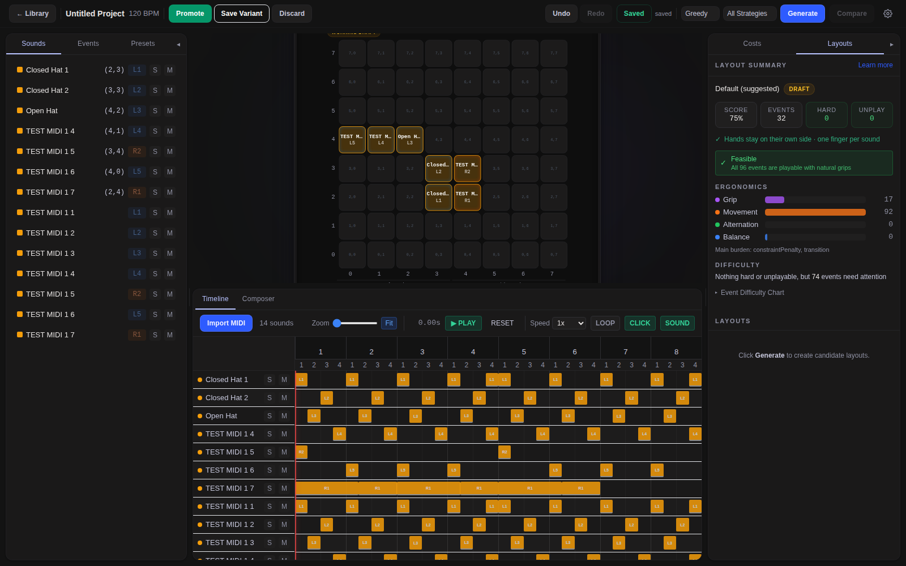

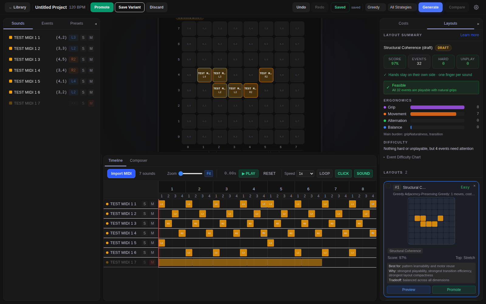

### 3.9 F9 · Composing patterns (Pattern Composer + presets)
**Health: Broken** — You can sketch a simple groove, but dropping a saved preset on the grid, the step the feature exists for, does nothing, and composed work is easy to lose.

**What the user is trying to do.** Sketch a groove without a DAW, hear it at project tempo and check it's playable. Then save good pad shapes and fingerings as presets and drop them into any project, mirrored if needed.

**How it works today.**
1. Open the bottom-drawer **Composer** tab. It starts empty, even when the project has imported MIDI.
2. Click **+** to add "Lane N", then click step cells. The finest grid is 1/8 and velocity is fixed.
3. Lanes appear as new sounds and as timeline rows from bar 1, on top of the song.
4. **Play** moves a silent playhead inside the Composer only.
5. Drag lanes onto pads from **Sounds**, then click **Save Preset** and name it in a browser prompt.
6. In the left **Presets** tab, clicking a card swaps the **Costs** tab for a preset inspector.
7. Drag a card onto the grid. A coloured ghost previews the spot, but releasing does nothing.

#### What works well
- The Composer is always a drawer tab and uses the project tempo, with no BPM control of its own (Invariants 3 and 8).
- Changing the grid subdivision asks first and says how many notes it will clear.
- Preset cards show a mini pad shape, a rhythm strip, counts, the hand and a mirror toggle. The list is searchable.
- Presets store pad positions relative to their own corner, so in principle they can be placed anywhere and mirrored.

#### What doesn't work well
- **Critical** — Dropping a preset does nothing, although the ghost shows blue ("valid"). This was reproduced live at both viewports, and there is no other way to place a preset. The card allows only a "copy" drag and the grid accepts only "move", so the browser cancels the drop, like a plug that doesn't fit the socket. Make the two match. [T65](UI_ISSUE_REGISTER.md#t65)
- **High** — The drop code has a second problem: it is "stale", meaning it holds an old copy of the grid, like working from yesterday's printout. With the drop forced on, it ignored the red ghost and overwrote hand-placed sounds, and the overwrite survived a reload. It also accepted a duplicate drop and ignored mirroring. Ship this fix together with the drop fix. [T65](UI_ISSUE_REGISTER.md#t65)
- **High** — Placing a preset adds look-alike copies of its sounds that have no notes. The next Composer edit deletes those pads, plus any hand placements they replaced, while "Placed (n)" stays listed. Make placement one undoable "insert pattern" step that maps preset sounds to project sounds. [T66](UI_ISSUE_REGISTER.md#t66)
- **High** — Composer lanes aren't the project's sounds. Just reopening the tab turns a "Kick" rename back into "Lane 1". A finger typed in **Fgr** for an unplaced lane never reaches the Sounds panel, vanishes on the next edit and can't be cleared, which breaks Invariant 6. Bind lanes to sound IDs. [T66](UI_ISSUE_REGISTER.md#t66)
- **High** — Work is easy to lose. A quick tab switch drops the last notes. During Composer playback nothing syncs, so every edit made while playing is lost on a tab switch. **Clear** acts instantly, removes the pads too and can't be undone, and lowering **Bars** silently hides notes. Keep both tabs mounted, save immediately, and ask before Clear or offer Undo. [T67](UI_ISSUE_REGISTER.md#t67) [T31](UI_ISSUE_REGISTER.md#t31)
- **High** — Bar lines and the playhead drift up to 84 px away from the cells. At 1366 px, notes in a 16-bar pattern are invisible and the grid can't scroll. The toolbar also reflows during entry, so clicks land on the wrong lane. Draw everything from one set of measurements and fix the toolbar layout. [T69](UI_ISSUE_REGISTER.md#t69)
- **Medium** — Each Composer sync becomes a project Undo step. Undo then changes the timeline but not the Composer, and a composing session pushes earlier layout edits out of history. Share one undo history. [T67](UI_ISSUE_REGISTER.md#t67) [T02](UI_ISSUE_REGISTER.md#t02)
- **Medium** — Save Preset records made-up data. Without explicit constraints, every pad gets the index finger, even for simultaneous hits, and placement turns these into constraints. It saves presets with no pads, which can never be placed, without saying so, and it doesn't refresh the list. The tag editor also copies one preset's tags onto another. Show what will be saved and confirm it. [T65](UI_ISSUE_REGISTER.md#t65) [T31](UI_ISSUE_REGISTER.md#t31)
- **Medium** — Lanes fall back to matching sounds by MIDI pitch, so a new "Lane 1" could latch onto an imported kick. This is inferred, not observed. Bind by sound ID only. [T18](UI_ISSUE_REGISTER.md#t18)
- **Medium** — A BPM change re-times composed notes only if the Composer tab is open. Visiting the tab and coming back flips "Saved" to "ANALYSIS OUTDATED". Store notes in beats and skip syncs that change nothing. [T49](UI_ISSUE_REGISTER.md#t49) [T14](UI_ISSUE_REGISTER.md#t14)
- **Medium** — Step cells, lane rename and preset actions work only with a mouse, and some appear only on hover. Add keyboard navigation to the step grid. [T63](UI_ISSUE_REGISTER.md#t63)
- **Low** — Browser pop-ups, preset styling that doesn't match the app's theme, and an "L+R" badge on presets with no pads. Use in-app popovers and the theme tokens. [T31](UI_ISSUE_REGISTER.md#t31) [T65](UI_ISSUE_REGISTER.md#t65)

#### What's confusing
- **High** — The header says "Changes sync directly into the shared performance timeline", yet the imported song isn't shown and new sounds are stacked at bar 1. Costs then reports "48 unplayable… Infeasible" for a 3-lane sketch, because the song's sounds aren't placed. Pick one model and state it on screen. [T68](UI_ISSUE_REGISTER.md#t68)
- **Medium** — The preset inspector takes over **Costs** with no close button, and it stays after you leave Presets. Show it in the Presets area. [T68](UI_ISSUE_REGISTER.md#t68)
- **Medium** — The inspector's "Metric Breakdown" is a second score that ignores rhythm. Use the five canonical cost factors instead. [T21](UI_ISSUE_REGISTER.md#t21)
- **Medium** — The flow spans three panels, the M key for mirroring is mentioned nowhere, and Learn More never mentions the Composer. Put a preset shelf in the drawer. [T68](UI_ISSUE_REGISTER.md#t68)
- **Low** — Terms vary (Lane, Workspace Pattern, sound), and mute/solo reads "M S" here but "S M" everywhere else. Say "sound" and use one order. [T68](UI_ISSUE_REGISTER.md#t68)

#### What's missing
- **High** — No 1/16, triplets, velocity, bar duplication or swing. Some of this already exists in code without a UI. Any rudiment tool must add notes only, never place pads (Invariant 7). [T70](UI_ISSUE_REGISTER.md#t70)
- **Medium** — A preset can't be opened in the Composer or added to the timeline. Add both actions. [T68](UI_ISSUE_REGISTER.md#t68)
- **Medium** — Composer playback is silent, lights no pads and runs its own transport. Use the main transport. [T60](UI_ISSUE_REGISTER.md#t60)
- **Medium** — Composer work isn't saved in the project or its export. In a simulated move to another browser, the first edit wiped three composed sounds. Store the pattern in the project. [T67](UI_ISSUE_REGISTER.md#t67)

#### What's unnecessary (remove, hide, or demote)
- **Medium** — Move the "Metric Breakdown" and its "may need recalibration" note to the debug pages. [T21](UI_ISSUE_REGISTER.md#t21)
- **Low** — Hide the drag-to-place hint until dropping works. [T65](UI_ISSUE_REGISTER.md#t65)

#### What good looks like
The Composer stays a drawer tab, but it can be enlarged and has a preset shelf beside it. Its lanes are project sounds, each pattern has a start bar, and every edit is one undo step. Play uses the shared transport, with sound and pad lighting. Placing a preset works like dragging a clip in from Ableton's browser: you map its sounds, and its notes and pads land as one undoable Working/Test Layout edit.

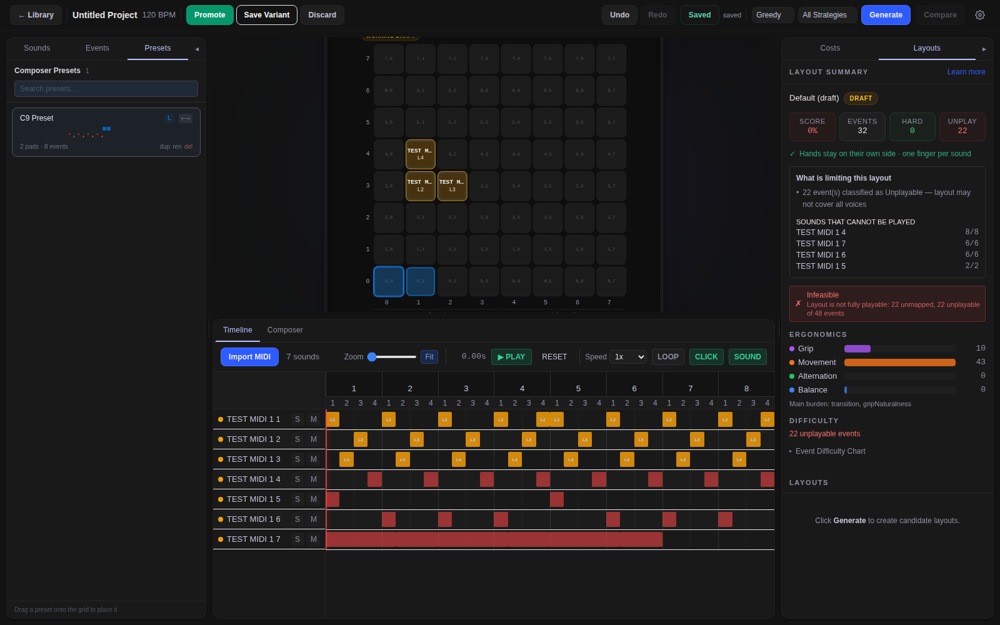

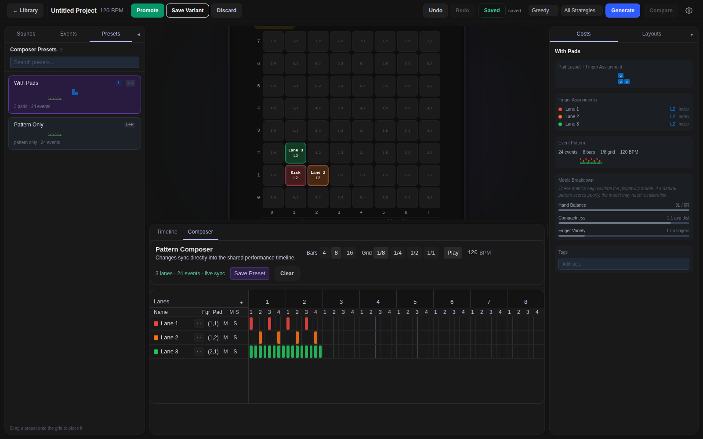

### 3.10 F10 · Layout state and lifecycle (Active / Working / Variant / Candidate)

**Health: Broken** — The Active-vs-draft split exists, but looking at a suggestion silently replaces your draft, Undo can't get it back at normal speed, and Compare misreports the Active Layout.

**What the user is trying to do.** Experiment freely: tweak a draft, look at suggestions, keep the good ones, and deliberately commit one layout as "the one I practise". All the while they need to know which layout the grid and the numbers describe.

**How it works today.**
1. The first drag onto a pad silently creates "Default (draft)" from the Active Layout, and **Promote**, **Save Variant** and **Discard** appear in the toolbar.
2. **Discard** and toolbar **Promote** act at once, with no confirmation. Promote auto-saves the old Active as "<name> (replaced <date>)".
3. **Save Variant** adds "<Active name> variant" under **Saved Variants**, where only the last 3 are shown. Each card has **Load Draft**, a two-click **Promote** and **×**.
4. **Generate** makes 4 candidates, selects #1 and copies it into the draft.
5. A click on a candidate card or its **Preview** copies that candidate into the draft. The card's **Promote** commits it.
6. **Compare (n)** opens the ticked Active and/or candidate cards side by side.
7. On reload the draft returns; candidates are gone.

#### What works well
- Manual edits never touch the Active Layout, and the amber-draft / green-active colours are the same everywhere.
- Promote never loses the *previous* Active Layout: it is auto-saved as a variant.
- The candidate card's Promote keeps the fingering the user previewed.
- "Suggest a starting layout" runs only on click and can be discarded. Whether that is explicit enough for the rule against automatic layout is decision Q4.

#### What doesn't work well
- **Critical** — Looking at a suggestion destroys your draft. Generate, Preview, any click on a card, and Load Draft all overwrite the Working/Test Layout with no warning, including edits made while Generate runs. Autosave saves over it within seconds. Make preview read-only, and ask before replacing a changed draft. [T01](UI_ISSUE_REGISTER.md#t01)
- **Critical** — Undo is no safety net. The automatic analysis adds its own step to the undo history (the list of steps Undo walks back through) about 1 s after each edit. So at normal pace each Undo lands on a copy of the current layout, and Redo is wiped. Undo looked stuck after drags, Suggest, Generate, Preview and Promote alike. Two quick Ctrl+Z presses after Generate can leave the app stuck on "Analyzing…" until a reload. Keep analysis results out of undo history. [T02](UI_ISSUE_REGISTER.md#t02)
- **Critical** — Compare gets the Active Layout wrong. Whenever the draft differs from Active (always the case after Generate), Active shows an empty grid, score 0 and "Easy", and is called 13–20% easier. In fact the candidate was 2–8% easier. The app keeps only one analysis, the draft's, and gives Active a zero placeholder. Keep one analysis per layout. [T08](UI_ISSUE_REGISTER.md#t08)
- **High** — The two Promotes behave differently, and both can lose work. After a preview, toolbar Promote re-computes the fingering (4 of 7 sounds changed) and leaves a duplicate card. Card and variant Promote silently throw away an unsaved draft. Use one path that keeps the previewed plan and protects the draft. [T13](UI_ISSUE_REGISTER.md#t13)
- **High** — Discard copies the draft's placement locks into Active. There they are invisible, and the next Generate pulls the sound back to the discarded pad. Drop or show locks that don't match Active. [T12](UI_ISSUE_REGISTER.md#t12)
- **High** — Freshness signals are backwards. For about 1 s after every edit, the scores are replaced by "Assign sounds to pads, then Generate to analyze", although analysis is automatic. Meanwhile a previewed candidate keeps its old score after a mute or tempo change, with no stale mark. Dim the old numbers while updating, and flag stale candidates. [T14](UI_ISSUE_REGISTER.md#t14)
- **High** — Every Saved Variant gets the same name ("Default variant"), can't be renamed, shows no score, and only 3 are listed. Ask for a name and show scores. [T29](UI_ISSUE_REGISTER.md#t29)
- **Medium** — After a promote or delete, stale compare ticks make Compare compare a candidate with itself, and the candidates renumber. Clear the ticks and keep labels stable. [T08](UI_ISSUE_REGISTER.md#t08)
- **Medium** — Confirmation is inconsistent: none, a 3-second "Confirm?", a browser dialog, or two prompts. Nothing reports the result, and the green Promote is offered even at Score 0% with 22 unplayable events. Use one small pop-up with warnings, followed by a brief "Undo" message. [T31](UI_ISSUE_REGISTER.md#t31)
- **Low** — Promote is the loudest control on the page and sits far from the grid [T38](UI_ISSUE_REGISTER.md#t38). The Active card's compare tick can't be reached by keyboard [T63](UI_ISSUE_REGISTER.md#t63).

#### What's confusing
- **High** — The grid's state chip is clipped: only a sliver shows at 1600×1000, and nothing at 1366×768. Put a fixed state bar above the grid. [T03](UI_ISSUE_REGISTER.md#t03)
- **Medium** — While a candidate is previewed, every label still says "Working Draft", although the score and fingering come from the candidate. Add a "Previewing candidate" state. [T03](UI_ISSUE_REGISTER.md#t03)
- **Medium** — The Active Layout can't be viewed while a draft exists. Clicking its card highlights it, but the grid keeps showing the draft. Add a read-only "View Active" mode. [T01](UI_ISSUE_REGISTER.md#t01)
- **Medium** — Role words are baked into names, for example an Active called "Coordination-Optimized (draft)". The same concept is also called Draft, Load Draft and Duplicate Layout, and Learn More never explains the lifecycle. Keep names clean and use one vocabulary. [T32](UI_ISSUE_REGISTER.md#t32)
- **Medium** — Reopening a project silently restores the draft, and the library shows a blank grid for it. Add a "Draft restored" banner. (Keeping drafts contradicts the CLAUDE.md "session-scoped" default; the reviewer judged keeping them better and suggests updating the default.) [T52](UI_ISSUE_REGISTER.md#t52)

#### What's missing
- **High** — Compare can't include the draft or Saved Variants, so "is my draft better than Active?" can't be answered, although canon workflow step 7 requires it. Put every layout in one comparable list. [T26](UI_ISSUE_REGISTER.md#t26)
- **Medium** — Candidate cards show no diff against Active, and the engine measures the difference from the draft instead. Measure from Active and show "4 pads differ". [T26](UI_ISSUE_REGISTER.md#t26)
- **Medium** — There is no Keep button on candidates, and they vanish on the next Generate or on reload without notice. Add Keep, and label suggestions as temporary. [T30](UI_ISSUE_REGISTER.md#t30)

#### What's unnecessary (remove, hide, or demote)
- **Low** — "Duplicate Layout" in the settings gear is a hidden second Save Variant that also clears the current selection. Remove it. [T39](UI_ISSUE_REGISTER.md#t39)

#### What good looks like
A fixed bar above the grid always names what you're seeing: green "Active Layout", amber "Working/Test Layout · 3 pads differ", or violet "Inspecting Candidate B · read-only". The Layouts tab is one list (Active Layout, your Working/Test Layout, Candidates, Saved Layout Variants), and any two entries can be compared on real scores. Inspecting never writes to the draft. Promote acts at once and shows a toast that says what was replaced, with Undo. It should work like take lanes in a DAW (digital audio workstation): audition any take freely, and your comp changes only when you commit.

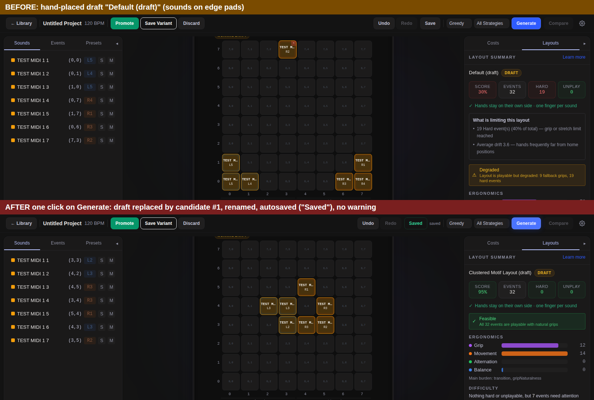

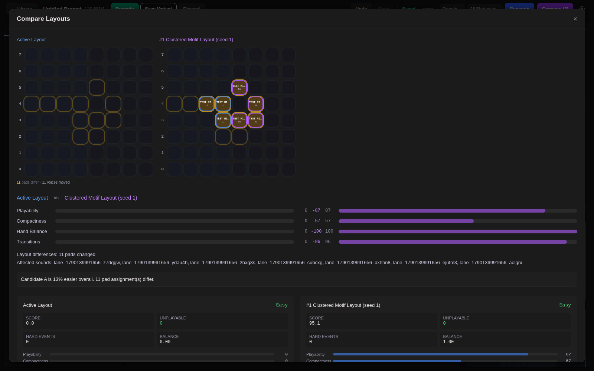

### 3.11 X1 · Cross-cutting: visual design, layout and information architecture
**Health: Rough** — The layout is sound in principle, but the grid gets only leftover space, you can rarely read which layout state is on screen, and colours and names change meaning between panels.

**What the user is trying to do.** Arrange and rehearse on one screen where the 8x8 grid is big, readable and labelled with its state, and each colour means one thing. This should work on a 1366x768 laptop and on a studio monitor.

**How it works today.**
1. The Library (`/`) is a marketing-style page with a 'Current Session' hero, 'Active Performances' and Quick Actions.
2. The workspace toolbar has Undo, Redo, 'Saved', method and strategy selects, Generate, Compare and a gear. While a draft exists it also shows Promote, Save Variant and Discard.
3. Below the toolbar are three columns: Sounds | Events | Presets, the grid, and Costs | Layouts.
4. The grid is drawn at a fixed size and then shrunk to fit, like a page reduced on a photocopier (a CSS "scale" transform). It sits in a Push-style frame with a state badge.
5. Under the grid is a Timeline | Composer panel that is always 480px tall. Its toolbar is one row that ends with PLAY, RESET, Speed, LOOP, CLICK and SOUND.

#### What works well
- Selecting a moment is the clearest visual in the app. Other pads fade, struck pads show a large 'L2', and the matching pills get a ring.
- Promote, Save Variant and Discard appear only while a draft exists.
- Side panels resize and collapse. At 1366px, collapsing them brings back LOOP, CLICK and SOUND.
- Unplayable notes stay on the timeline as red pills.
- The Library hero shows the real Active Layout and its real counts.

#### What doesn't work well
- **High** — The grid gets the leftovers. At 1366x768 the timeline takes 480px, though 7 sounds need about 300px, so the grid gets only 209px. Pads come out at 28px, sound names at 5.5px, and rows 7 and 0 are cut off. At 1600x1000 and 1920x1080 all the rows fit, but the state badge and hand labels are clipped. Fix: size pads from the measured space, and add a splitter that keeps every lane visible. [T04](UI_ISSUE_REGISTER.md#t04)
- **High** — The timeline toolbar can't wrap. SOUND is off-screen at 1440x900. LOOP, CLICK and SOUND are all off-screen at 1366x768, and none of them has a keyboard shortcut. Fix: pin the transport controls, and move Zoom and Import into a '⋯' menu. [T05](UI_ISSUE_REGISTER.md#t05)
- **High** — Every sound from one MIDI file gets the same amber, and pad names cut off at 'TEST M…', so candidate mini-grids show identical blocks. Fix: a distinct colour and a short label for each sound. [T17](UI_ISSUE_REGISTER.md#t17)
- **High** — Text is too small and too faint. The type scale starts at 11px, yet the code uses 6–10px sizes 128 times, and finger labels are 7px. Link text is below the 4.5:1 contrast minimum. The Hard marker is amber on the default amber pills, so it's invisible. Fix: enforce the type scale and contrast, and give pills a minimum width so the 'L2' label still fits. [T64](UI_ISSUE_REGISTER.md#t64)
- **Medium** — Keyboard focus (the outline showing where a key press will land) is invisible. In the grid, Tab lands only on hidden '×' Remove buttons, so Enter can clear a pad with no visible cue. Fix: show focus, or skip those buttons. [T63](UI_ISSUE_REGISTER.md#t63)
- **Medium** — The Library feels like a separate product. Its web icon font has no fallback, so 'search' overlaps the search box. Two resume buttons do the same thing, and the newest project can't be exported or deleted. Fix: reuse the workspace components and list every project. [T55](UI_ISSUE_REGISTER.md#t55)
- **Low** — Side panels are wide and mostly empty, resize handles are a 1px line, and dropdowns have no arrow. The blur and glow effects are invisible, the Push frame leaves about 60px of empty plate, and first-run hints are spread over four panels. [T38](UI_ISSUE_REGISTER.md#t38), [T34](UI_ISSUE_REGISTER.md#t34), [T04](UI_ISSUE_REGISTER.md#t04), [T44](UI_ISSUE_REGISTER.md#t44)

#### What's confusing
- **High** — Nothing reliably says which layout is on screen. The grid's state badge is clipped on every tested screen up to 1080px tall. A previewed candidate is labelled 'Working Draft', and the Costs tab never names its layout. Fix: an always-visible state strip above the grid, e.g. 'CANDIDATE #2'. [T03](UI_ISSUE_REGISTER.md#t03)
- **High** — Related information is scattered and duplicated. One moment is split across four panels. The Layouts summary nearly repeats the Costs tab. S/M and Compare each appear twice. No button reads as the primary one. Save Variant ends up with the brightest outline, because its 'accent at 80%' style silently does nothing. 25 other styles fail the same way. Fix: keep the Events tab (canon), pin the moment card, and use one primary button per region. [T38](UI_ISSUE_REGISTER.md#t38)
- **Medium** — Colours have several meanings. The right hand is orange-red on the grid and purple in Compare. Green means Promote, Saved and Feasible. The Costs bars colour Alternation green and Balance blue, and the chart swaps those two colours. Fix: named colour roles and one shared factor table. [T42](UI_ISSUE_REGISTER.md#t42), [T20](UI_ISSUE_REGISTER.md#t20)
- **Medium** — 'Events' means 32 moments in one place and 48 notes in another, and list row '05' is 'Event 7' in the right panel. Fix: canon terms and one moment ID. [T23](UI_ISSUE_REGISTER.md#t23)
- **Medium** — The gear mixes view and cost toggles. Changing a cost toggle never marks the analysis outdated, and 'Calculate Cost' shows a separate card with its own units. Fix: move the cost toggles to the Analysis header as "Custom weighting", and mark the analysis stale when they change. [T39](UI_ISSUE_REGISTER.md#t39)

#### What's missing
- **Medium** — Sounds can be placed only by mouse drag. There's no keyboard grid navigation and no click-to-place. Fix: arrow-key focus on pads and select-then-click placement. [T62](UI_ISSUE_REGISTER.md#t62)
- **Medium** — Disabled Generate and Compare can't explain themselves, because their tooltips never appear. Fix: show the reason as helper text. [T31](UI_ISSUE_REGISTER.md#t31)

#### What's unnecessary (remove, hide, or demote)
- **Medium** — Engine internals sit in the main UI: method and strategy selects, 'Greedy Soft Greedy (Boltzmann)', raw 'lane_…' ids, and dev tools in the Library. Fix: keep every method and the trace, but behind a 'Generate ▾' menu and a collapsed 'How this was found'. [T34](UI_ISSUE_REGISTER.md#t34)
- **Medium** — 'Organize by 4x4 Banks' does nothing. Fix: remove it until it's built. [T39](UI_ISSUE_REGISTER.md#t39)

#### What good looks like
The grid gets its space first: 64 pads at 40–72px with labels that don't shrink, while the timeline sizes to its lanes. A strip above the grid always names what's shown (Active, Working/Test with pads moved, or Candidate #2) and holds Promote, Save as variant and Discard. One colour language runs everywhere, the way a red meter means the same thing on every channel of a mixing desk. On laptops the side panels fold to rails based on measured space, not phone-style breakpoints, so the desktop-only rule holds.

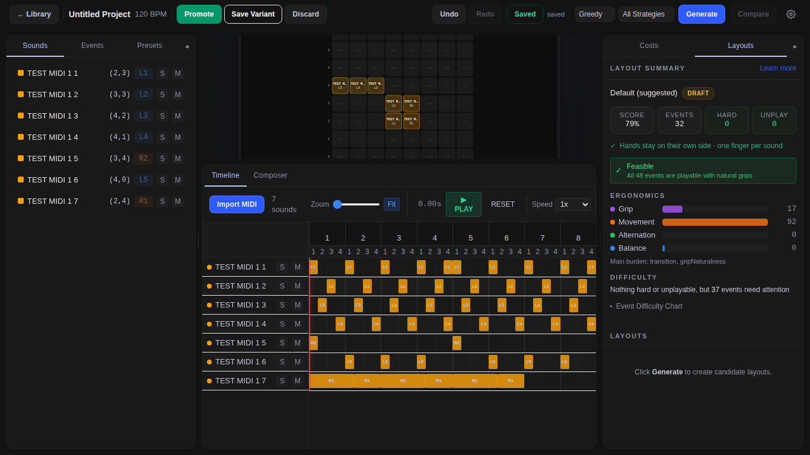

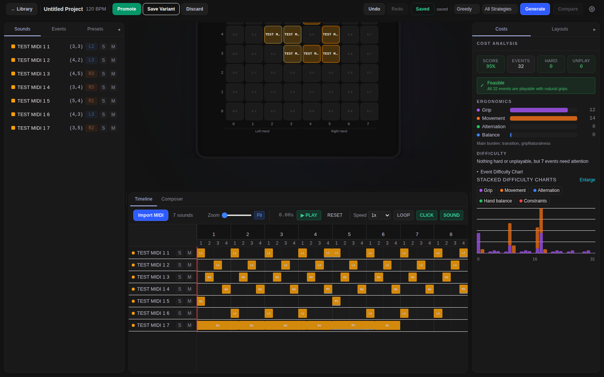

### 3.12 X2 · Cross-cutting: accessibility, keyboard, feedback and terminology
**Health: Rough** — Mouse users can finish every flow, but feedback is often wrong or missing, labels use engine code names, and the keyboard barely works.

**What the user is trying to do.** Always know which layout is on screen and whether it is playable. Get a confirmation when something is committed. Read musician terms. Use keys for repetitive work, as in Ableton.

**How it works today.**
1. Toolbar: Promote / Save Variant / Discard, Undo / Redo, a "Saved" button next to a "saved" label, optimizer selects, Generate, Compare (n), and a gear menu.
2. Keys: Ctrl/Cmd+Z, ←/→ (step through moments), Escape (deselect), Delete (remove the selected pad). Space does nothing. Tab skips all 64 pads, so sounds can only be placed by dragging.
3. Right-clicking a pad offers Remove, "Lock to this pad" and Finger L1–R5. This menu is the only way to lock a pad.
4. Generate turns into pulsing text for about 22 s. Learn More, Compare and View All close only with × or a click on the backdrop.
5. Toolbar Promote is silent. Card Promote shows "Confirm?" for 3 s, and other actions use browser popups. There are no toasts (short pop-up notices) anywhere.

#### What works well
- Inline editors (project name, BPM, layout, sound, finger) save on Enter and cancel on Escape. The finger field accepts L1–R5.
- Shortcuts are ignored while you are typing. ←/→ steps by moment, so a chord is one stop.
- The "⌘+G / Ctrl+G" grouping hint appears only when it applies, and the rehearsal tooltips are written for musicians.

#### What doesn't work well
- **Critical** — The pad right-click menu opens 430–700 px to the right of the cursor. At 1600 and 1920 px wide it is clipped out of view, and only 1 of 7 pads could be locked. The first Escape press doesn't close it. Render the menu at page level (a "portal") and give it its own Escape handling. [T06](UI_ISSUE_REGISTER.md#t06)
- **Critical** — On a layout that isn't fully playable, selecting any moment turns the verdict into a green "✓ Feasible · All events playable", right under "SCORE 0% · UNPLAY 22". Show a verdict for the selected moment, and never fall back to Feasible. [T07](UI_ISSUE_REGISTER.md#t07)
- **High** — Undo stalls:
  - Every auto-analysis is saved as an undo step. It runs again about 1 s after each Undo and clears Redo, so Undo pressed at a normal pace never gets past it.
  - Suggest is not recorded at all.
  - A fast double Undo after Generate freezes the app on "Analyzing…".

  Treat analysis results as a by-product, not an edit. [T02](UI_ISSUE_REGISTER.md#t02)
- **High** — Generate, Preview, clicking a card, Load Draft and Promote all overwrite the hand-built Working/Test Layout without warning. Autosave then makes the loss permanent. Make Preview read-only, and snapshot the draft before anything replaces it. [T01](UI_ISSUE_REGISTER.md#t01)
- **High** — Mute silently removes sounds from the analysis. Muting 5 unplaced sounds changed Score 0% / Unplay 30 to 75% / 0 with a green "Feasible". Show "Analyzing 2 of 7 sounds · 5 muted". [T15](UI_ISSUE_REGISTER.md#t15)
- **High** — Nothing confirms success:
  - There are no toasts and no screen-reader announcements.
  - Promote, Discard and Backspace-remove are all silent.
  - Generate shows no progress and has no Cancel.
  - Confirmations come in five different styles.

  Add one toast system with Undo, a Generate button that shows progress and becomes Cancel, and one themed dialog for actions that can't be undone. [T31](UI_ISSUE_REGISTER.md#t31), [T35](UI_ISSUE_REGISTER.md#t35)
- **Medium** — The overlays ignore Escape and leave keyboard focus behind them, so Tab reaches hidden Promote and Delete buttons. View All is squeezed into the 274 px side panel. Use one shared dialog component. [T06](UI_ISSUE_REGISTER.md#t06)
- **Medium** — Global key handlers take keys meant for other controls. In the Events tab, ↓ on the Speed dropdown changes the moment, and Backspace on a focused button silently removes a pad. Route all shortcuts through one handler that skips form controls. [T61](UI_ISSUE_REGISTER.md#t61)
- **Medium** — Hard to read and hard to hit:
  - 84 targets are under 24 px; the colour swatch is 10 px.
  - Timeline finger text is 7 px, and grid text drops to about 6 px at 1366x768.
  - LOOP/CLICK and unplayable notes are shown by colour alone.

  Use a 24 px minimum target, fixed text sizes, and a second cue besides colour. [T64](UI_ISSUE_REGISTER.md#t64)

#### What's confusing
- **High** — Engine names leak into the UI, for example "Main burden: transition, gripNaturalness" and "Affected sounds: lane_1790…". Each cost factor has 3–7 names. The Alternation and Balance colours swap between the bars and the chart below them. Keep one list of factor names and colours that every panel and Learn More read from. [T20](UI_ISSUE_REGISTER.md#t20)
- **High** — The only "Active / Working Draft" badge is clipped off above the grid, and there is no Candidate state. Put a permanent state label in the toolbar. [T03](UI_ISSUE_REGISTER.md#t03)
- **High** — Every imported sound gets the same amber colour, so every pad reads "TEST M…". [T17](UI_ISSUE_REGISTER.md#t17)
- **Medium** — "Events" means 32 moments on the tile but 48 notes in the sentence beside it. Compare says "9 voices moved" in a 7-sound project. [T23](UI_ISSUE_REGISTER.md#t23), [T20](UI_ISSUE_REGISTER.md#t20)
- **Medium** — The copy says "then Generate to analyze", but analysis already runs automatically after edits. [T44](UI_ISSUE_REGISTER.md#t44)
- **Medium** — "Suggest a starting layout", and Generate on an empty grid, place all 7 sounds in one click. Suggest is an explicit click, but invariant 7 forbids "auto-layout on empty grids", so whether Suggest may stay one-click is decision Q4. Generate becomes proposal-only in P1a either way, and the Suggest button should say that it places sounds. [T37](UI_ISSUE_REGISTER.md#t37)
- **Low** — The wording drifts:
  - A layout can read "ACTIVE … (draft)".
  - Project, Performance and Session are used for the same thing.
  - Fingers appear as "L2", "L-2", "L2 (Index)" and "IN".

  [T32](UI_ISSUE_REGISTER.md#t32), [T56](UI_ISSUE_REGISTER.md#t56)

#### What's missing
- **Medium** — Space doesn't play or stop, and there is no shortcut list and there are no key hints. [T61](UI_ISSUE_REGISTER.md#t61)
- **Medium** — Pads, sound rows and project cards can't be reached from the keyboard. Add an arrow-key grid with Enter to pick up and drop a sound; that is still an explicit user action. [T62](UI_ISSUE_REGISTER.md#t62)
- **Medium** — Tabs, toggles and checkboxes don't tell screen readers what they are or whether they're on. The workspace has 0 tab roles, and 35 buttons are named just "S" or "M". [T63](UI_ISSUE_REGISTER.md#t63)
- **Low** — Disabled buttons never show their "why" tooltip. The hover-only Delete takes keyboard focus while invisible. The search box has no label. [T31](UI_ISSUE_REGISTER.md#t31), [T63](UI_ISSUE_REGISTER.md#t63)

#### What's unnecessary (remove, hide, or demote)
- **Medium** — Optimizer internals crowd the toolbar and cards ("Greedy Motif-Preserving Greedy: 6 moves, cost 25.87", "(seed 1)"). Each card shows Score % (higher is better) next to cost (lower is better). Move the methods into a "Generation options" popover with friendly names, keep every method and the trace, and show one score. [T34](UI_ISSUE_REGISTER.md#t34)
- **Low** — The save status appears twice, and Learn More shows constraint code names such as "thumbDelta". [T31](UI_ISSUE_REGISTER.md#t31), [T20](UI_ISSUE_REGISTER.md#t20)

#### What good looks like
Think of Ableton's Session View. You always know what's playing, Space starts and stops, Cmd+Z reliably steps back, and a clip keeps its name and colour everywhere. In PushFlow, a bar above the grid would always read "Active Layout · Default", "Working/Test Layout (unsaved)" or "Inspecting Candidate B · read-only", with Promote, Save as variant and Discard next to it. Every commit would show a toast with an Undo that works, and every surface would use the same words. Menus would open where you click and close on Escape, and no state would rely on colour or hover alone.

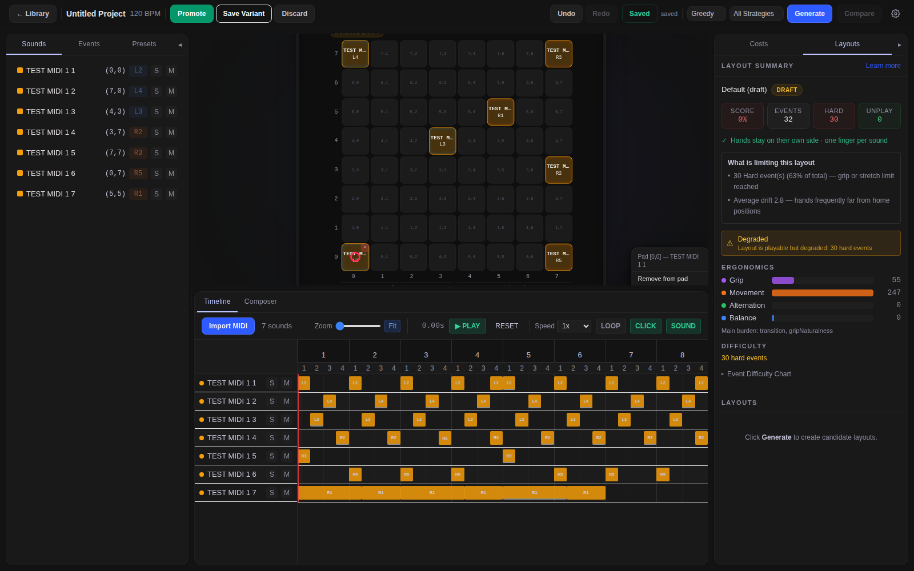

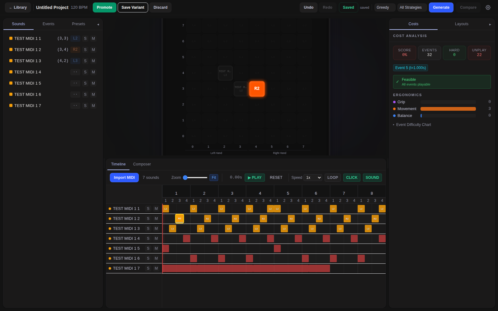

## 4. The path forward

The plan is sequenced like renovating a house you are living in: first fix the leaks (anything that loses or misreports work), then the lighting (see and read everything), then make the rooms work for how you actually live (the practice loop and your sounds), and only then move the walls (the workspace re-layout). Each phase ships on its own and leaves the app better; nothing waits on a big-bang redesign.

### Principles every change follows

- **Never destroy work silently.** Looking is read-only. Anything that changes a draft, lock, Active Layout, Sound or pattern is a named action, exactly one Undo step, confirmed by a toast with Undo.
- **Undo covers your document, never the session.** Analysis, candidates, playback and selection never enter the undo history.
- **Every number names its subject.** A chip (Active / Working-Test / Candidate B / Saved variant), a scope line ("5 of 7 Sounds placed") and a freshness state sit next to every verdict and score (canon §8).
- **Missing data reads "Unknown", "Unfinished" or "Analysing…"** — never "Feasible", 0 or "Easy".
- **Locks are hard and visibly enforced** by every optimizer and every gesture; preferences are soft and labelled soft.
- **Proposals stay proposals.** Nothing lands on the grid without a click (invariant 7).
- **The grid is the hero.** Sized by measurement, never CSS-scaled or clipped; overlays render above it, not inside it.
- **Musician language first, engine detail one click away.** Analyze and Generate stay visibly distinct (canon §9); Greedy, Beam, Annealing and the optimization trace all stay.

### Where it ends up

```text
+----------------------------------------------------------------------------------------------------------+
| < Projects | Groove Study (edit) | Saved 14:02 | Tempo [120] BPM | Undo: Move Kick  Redo | ?  Learn more |
+---------------------+------------------------------------------------------------+-----------------------+
| [Sounds]  Events    | [WORKING/TEST] Draft of Default . 3 pads vs Active         | [Analysis]  Trace     |
| Search sounds...    | Up to date       [Promote] [Save as variant] [Discard]     | WORKING/TEST . fresh  |
| All 7 |To place 2|  | View: (Now) Now+Next Prev.Now.Next   Fingers   Labels      | Weights: default  [v] |
| On grid 5|Locked 1  |       1      2      3      4      5      6      7      8   | [Re-analyse]          |
| [#####--] 5/7 placed| R8 [     ][     ][     ][     ][     ][     ][     ][     ]| Scope: 5 of 7 placed  |
| [Place remaining 2] | R7 [     ][     ][Ht+1 ][     ][     ][Ride ][     ][     ]| UNFINISHED, not failed|
| DRUMS               | R6 [     ][Sn L3][     ][Tom ~][     ][     ][     ][     ]| Playability 82/100 (i)|
| o Kick  R5C3 [#] S M| R5 [     ][     ][Kk#L2][     ][     ][     ][     ][     ]| Hard 2   Unplayable 0 |
| o Snare R6C2 [ ] S M| R4 [     ][     ][     ][     ][     ][     ][     ][     ]| vs Active: +4  Hard -1|
| o Hat   R7C3 [ ] S M| R3 [     ][     ][     ][     ][     ][     ][     ][     ]| Movement  #####-  41% |
| UNGROUPED           | R2 [     ][     ][     ][     ][     ][     ][     ][     ]| Grip      ###---  24% |
| o Ride  R7C6 (x) S M| R1 [     ][     ][     ][     ][     ][     ][     ][     ]| Alternation ##--  18% |
| o Shaker [to place] |       Left hand zone          |      Right hand zone       | Hand bal.  #---   12% |
| o Clap   [to place] | ---------------------------------------------------------- | Constraints #---    5%|
| SOURCE FILES        | MOMENT 12 . bar 3.2.3 . HARD . Kick L2 + Snare L3          | Limits: Hat->Ride     |
| groove.mid . 7 snd  | Why: R hand reaches 3 pads from Hat (Movement)             | ._.-^-._.-^^-._ Hard--|
| [Replace] [Remove]  | [< Prev hard] [Next hard >]    [Rehearse bars 3-4]         | 1   2   3   4   5 bars|
| -- Events tab --    | ---------------------------------------------------------- | LAYOUTS  [Generate v] |
| All|Med+|Hard|Unpl. | [> Play] |< 3.2.3  Loop 3-4  Metro  Hits  0.75x=90 BPM     | [x] ACTIVE Default  78|
| 3.2.3 Kk+Sn   HARD  | Count-in 1 | Hands: Both | Vol  ||  [Timeline]  Composer   | [x] DRAFT (yours) 82+4|
| 3.3.1 Hat     Easy  | Timeline shows: WORKING/TEST . Draft of Default            | Run 2 . Quick . 1m ago|
|                     | Sound |1          |2          |3 [==loop==|4 ====]         | [ ] B Comfort 86 +8   |
|                     | Kick  |L2    L2   |L2    L2   |L2    L2   |L2    L2        |  Keep  Use  Promote   |
|                     | Snare |   L3      |   L3      |   L3      |   L3           | [ ] C Altern. 80 +2   |
|                     | Hat   |R1 R1 R1 R1|R1 R1 R1 R1|R1 R1 R1 R1|R1 R1 R1        | VARIANTS              |
|                     | Shaker|::: not on grid yet - outlined, still shown :::     | [ ] Default 23Sep 78  |
|                     | Ride  |ooo excluded from analysis - dimmed, shown ooo      | RECOVERED DRAFTS (1)  |
|                     | === drag splitter: timeline / grid (remembered) ===        | [Compare 2]           |
+---------------------+------------------------------------------------------------+-----------------------+
Kk#L2 = current strike, locked, finger | Ht+1 = next | ~ = moved vs Active | (x) = excluded | S M = audition
Pad click: Sound armed = place . moment selected = show its hits . Alt-click = audition | Enter picks up/drops
Primary Promote only in the state bar; rows and Compare keep a secondary Promote | Compare = portaled dialog
```

### Phases

| Stage | Phase | What changes for the user | Done when | Size* |
|-------|-------|---------------------------|-----------|-------|
| A · Stop the harm | **P0 · Safety net** | Nothing visible — CI starts running the unit tests plus browser checks at 1366×768 and 1600×1000, and the 9 reproduced critical bugs become automated tests that must flip to passing. | A deliberately broken commit turns CI red; the 9 reproduced bugs (C1–C9 in the register) exist as tests marked "expected to fail" until each fix lands. | ~1 wk |
| A · Stop the harm | **P1a · Stop losing work** | Undo covers only your edits (one step per action). Generate **only proposes** and never touches your draft; Preview, card clicks and Load Draft still replace it, but the replaced draft is auto-kept in "Recovered drafts" (read-only inspection arrives in P3). Locks hold for every method and for manual drags. Sounds are matched by identity, not MIDI pitch. "Saved" only appears when it's true. Composer edits survive tab switches. | Place 3 sounds → Undo ×3 → empty grid. After Generate, the draft is unchanged. A lock at [7,0] survives Greedy, Beam and Annealing. | 3–4 wks |
| A · Stop the harm | **P1b · Stop false verdicts & broken overlays** | The verdict is never falsely green (the selected moment gets its own card). The pad menu opens at the cursor and closes on Escape. Compare evaluates Active properly. Onion skin actually shows previous/next. Pads flash during playback even with a moment selected. Preset drops either work or say why not. Chords count once per moment. | An unplayable layout with a moment selected never shows "Feasible"; the menu is fully clickable on all 64 pads at three screen sizes. | ~3 wks (overlaps P1a) |
| B · Make it legible | **P2 · Quick-win sprint** | The grid is sized by measurement (no clipping, pads ≥32 px at 1366). Transport controls are always reachable. Distinct colours and sensible names for Sounds. Readable text (≥11 px) and musical notation (bar.beat, "Row 4 · Col 4"). The Library imports MIDI, opens a demo, and shows real project data. Named, scored variants. Click-a-Sound-then-a-pad placement. Space plays. | All 64 pads and every transport button are inside the viewport at both sizes; 7 imported Sounds get 7 visibly distinct colours and labels. | 3–4 wks |
| B · Make it legible | **P3 · One inspected layout** | You can **inspect** Active, any candidate or any variant read-only without touching your draft. A layout-state bar above the grid names what you're seeing, how it differs from Active, and offers only the actions that fit (Use as my draft / Keep / Promote / Back to my draft). One Promote. Partly placed layouts read "Unfinished · 5 of 7 placed", not "Infeasible". Generate shows progress, an ETA and Cancel. One scoring yardstick everywhere. | Inspecting every layout 20× leaves the draft unchanged; the bar, Costs, Events and timeline headers always name the same subject. | 3–4 wks |
| C · Make it musical | **P4 · The moment loop** | Find a hard moment (filters, Prev/Next hard), understand it (inspector: every strike, fingers, one-sentence "why"), then press **Rehearse** to loop its bars at 75% after a count-in. The grid shows Now / Now+Next / Prev·Now·Next with finger badges. A DAW-grade transport (tight timing, bar-snapped loops). Mute/Solo become audio-only; "Exclude from analysis" is separate. A "Rehearse view" that collapses side panels. | "Rehearse" on a Hard row starts a bar-aligned loop containing the moment after a 1-bar count-in; muting changes no score. | 4–6 wks |
| C · Make it musical | **P5 · Sounds, import & projects you can trust** | An import review sheet (names, colours, include). Replace/Remove source files (re-import keeps placements). Notes stored in beats, so tempo changes keep every hit on its bar. A Sounds panel with filters, placement status, lock toggle and an actions menu. Drag hints ("Swap with Snare"). Presets placeable by mapping to your Sounds. Drop-a-MIDI-anywhere import; developer tools moved to a footer link. | Re-importing the same file offers Replace and creates no duplicates; 120→90 BPM keeps every note's bar.beat. | 4–5 wks |
| D · Make it coherent | **P6 · One cost story & baseline-aware compare** | One headline ("Playability 0–100") in every place a layout appears, with deltas against Active on every row. Compare answers "what changed, is it worth keeping" in words (per-Sound moves, re-fingerings). Generate options in musician terms (Comfort / Fast alternation / Memorable shapes) with Greedy/Beam/Annealing under Advanced. Weighting toggles move to the Analyze side. Honest charts with bands and bar ticks. | The same layout shows the same integer in the state bar, Analysis, its row and Compare. | 4–5 wks |
| D · Make it coherent | **P7 · Workspace by job + accessibility** | Each region gets one job and one primary action: Left = Sounds / Events; Centre = state bar, grid, moment inspector, transport, Timeline / Composer drawer; Right = Analysis / Trace above a pinned Layouts list. Duplicate panels deleted. Full keyboard, focus, contrast and 24 px target sweep. | At 1440×900 pads are ≥56 px and the first candidate row is visible without scrolling; an automated accessibility checker (axe) finds 0 serious problems. | 3–4 wks |
| D · Make it coherent | **P8 · The Composer joins the project** | Composer patterns are saved, exported and undoable with the project, bound to real Sounds, inserted into the one timeline at a chosen bar, and played through the shared transport. Sequencer basics (1/16, velocity, copy). Full keyboard placement on the grid. | Composer edits survive reload + export/import; one Ctrl+Z reverts one note toggle. | 5–7 wks (overlaps P7) |

\* *Sizes are the planners' estimates for two engineers working conventionally; treat them as relative weights, not a schedule.* A **solo "trust release"** — P0 + P1a + P1b + the core of P2 (measured grid, reachable transport, full-width timeline, distinct Sounds, truthful Library cards) + the core of P3 (read-only inspection, state bar, single Promote) — removes every critical harm and fixes the CLAUDE.md UI-rule violations found (timeline width, Library cards), and is the recommended first milestone. Whole-moment selection for played-in chords follows in P4.

Every phase is gated by the same checks: typecheck, unit tests, browser checks at both laptop sizes, the C1–C9 regression tests, TEST MIDI 1 with 0 unplayable events for all three optimizer methods on any optimizer change, and a Learn More update whenever a metric, verdict or constraint changes (invariant 2).

### Decisions needed from you

These are the only genuinely blocking product questions. Each has a recommended default the plan assumes unless you say otherwise.

| # | Needed | Question | Context and recommendation |
|---|--------|----------|----------------------------|
| Q1 | before P1a | Should the Working/Test Layout survive a reload? | CLAUDE.md's default is "session-scoped", but the app persists it today, and dropping it would create a new way to lose work. **Recommendation: keep persisting it.** |
| Q2 | before P1a | Do finger preferences survive Discard? | They live in `voiceConstraints` (Sound-level truth, invariant 6), so the plan keeps them and the Discard toast says so. **Recommendation: keep them.** |
| Q3 | before P2 | May default Sound names ever use MIDI pitch? | Canon §10 says pitch "is stripped from the sound"; invariant 5 keeps it as metadata. **Recommendation:** default names from track/file name + a letter; pitch only as provenance; an opt-in "Name from GM drum map" action. |
| Q4 | before P3 | Which one-click placements count as "explicit" under invariant 7? | Invariant 7 forbids auto-layout on empty grids. Open cases: may **Suggest a starting layout** keep placing every Sound in one click (today it does, as a discardable draft), and may **Place remaining N** place directly? Also, is auto-inspecting candidate A read-only after an empty-grid Generate acceptable, since nothing is written? **Recommendation:** keep one-click Suggest (a deliberate, undoable click), make Place remaining N produce a candidate you apply with one click, and allow read-only auto-inspect. |
| Q5 | before P3 | Confirm the single headline score and evaluator. | **Recommendation:** "Playability 0–100, higher = easier" from the canonical evaluator, plus Hard/Unplayable counts and each factor's share of the burden. |
| Q7 | before P2 | Is "moment" a UI word, or only "event"? | The canon term is Performance Event, and the app has an Events tab. **Recommendation:** labels say "Event 12 · 3.2.3", single hits are "notes", and "moment" appears only in explanations; adopting "moment" as a label would need a PUSHFLOW_TERMINOLOGY.md update. |
| Q6 | before P5 | What is the Pattern Composer's model? | (a) a quantised editor of the whole project timeline, or (b) named pattern sections inserted into the timeline at a chosen bar. **Recommendation: (b).** Either way it stays a bottom-drawer tab using the project tempo. |

The full plan — deliverables, exit criteria and risks per phase, what is deliberately deferred, and how each of the 70 problems maps to a phase — is in **[UI_ENHANCEMENT_ROADMAP.md](UI_ENHANCEMENT_ROADMAP.md)**.

## Appendix A — How this review was done

1. **Live capture.** A scripted browser walked every flow in the running app (library → new project → import TEST MIDI 1 → manual placement → context menu → Suggest → Generate → candidates → Compare → Learn More → events + onion skin → playback → Promote → Composer → Presets → back to Library) and screenshotted each step at 1600×1000 and 1366×768.
2. **Critique.** Twelve reviewers — one per flow (F1–F10) and two cross-cutting (X1 visual/IA, X2 accessibility/feedback/terminology) — each read the canon, the relevant code and the screenshots, and wrote their own browser probes to test behaviour.
3. **Adversarial verification.** A separate skeptic re-checked every finding against the code and screenshots, adjusted 94 severities or descriptions, disputed overstated strengths, and added 54 missed issues: 307 findings in total.
4. **Consolidation.** The 307 findings were merged into 70 distinct problems ("themes"); every finding maps to exactly one theme.
5. **Independent reproduction.** Each of the 9 critical problems was reproduced from scratch by a fresh agent with its own browser script. All 9 reproduced; the root cause of each is recorded in the register.
6. **Planning.** Three planners drafted roadmaps from different angles (trust-first, journey-first, impact-per-effort). A judge scored them (impact-per-effort 8.2, trust-first 7.7, journey-first 6.3), took impact-per-effort as the base and grafted the best of the others; a completeness critic found 23 gaps (missing test infrastructure, foundations arriving late, canon conflicts), and the plan was revised to close them.

**Limits.** Chromium only; screenshots at two desktop viewports (1600×1000, 1366×768), with spot measurements at 1280×800, 1440×900 and 1920×1080; one reference file (a 7-sound drum groove). Audio timing was judged from code and frame sampling, not by ear. No real users were observed, so severity reflects expected impact rather than measured behaviour.

## Appendix B — Jargon, briefly

- **Working/Test Layout, Active Layout, Candidate Solution, Saved Layout Variant** — The canon's four layout states: your editable draft, your committed baseline, a machine-generated proposal, and a kept alternative.
- **Undo history** — The list of snapshots Undo steps back through. If background work adds snapshots, Undo "wastes" presses on them.
- **Read-only inspection** — Showing a layout without making it editable, like soloing a take without recording over your comp.
- **CSS `transform: scale`** — Shrinking something visually without changing the space it occupies — why the grid gets clipped.
- **ResizeObserver / "sized by measurement"** — The browser reports a panel's real size so the grid can be drawn to fit it exactly.
- **Portal (for menus and dialogs)** — Rendering a popup at the top of the page instead of inside its panel, so a scaled or clipped parent can't hide or displace it.
- **Look-ahead audio scheduler** — Queuing sounds slightly ahead on the audio clock (as DAWs do) instead of firing them from screen refreshes, which jitter.
- **Cache per layout (LRU)** — Remembering the analysis of recently viewed layouts so switching between them is instant and consistent; the oldest entries are dropped first.
- **CI / regression test / "expected to fail"** — Automated checks that run on every change; a regression test fails if a fixed bug comes back. A test marked "expected to fail" documents a known bug and becomes a normal test when the fix lands.
- **Greedy / Beam / Annealing (optimizers)** — The app's three ways of searching for a better layout: improving one step at a time (Greedy), keeping the best few partial answers at each step (Beam), and trying random changes while gradually settling down, like metal cooling (Annealing).
- **Evaluator / scoring engine** — The part of the engine that scores a layout. Two evaluators are like two meters with different calibration: the same signal reads differently on each.
- **Stub** — A placeholder standing in for real data; here, a layout full of zeros that Compare shows when it has no real analysis.
- **State logic ("reducer")** — The code that decides how the app's memory changes in response to each action; many fixes are a single rule there.
- **axe** — An automated accessibility checker that scans a page for missing labels, roles and contrast problems.
- **Hero** — Web-design term for the big banner at the top of a page (the Library's "Current Session" card).
- **Migration** — A one-time, backed-up upgrade of saved projects when the storage format changes.
- **Design tokens** — Named colours and sizes (e.g. `--hand-left`) used everywhere instead of raw values, so one meaning keeps one look.
- **ARIA roles / focus** — Labels that tell assistive tech what a control is; "focus" is which control the keyboard is on.
